# Class07_Unsupervised_Machine_Learning1
Krysten Jones (A10553682)

Today we will start with k-means clustering which is one of the most
popular means of clustering along with UMAP and t-SNE. K-means is fast
and computes many things for you. The challenge with this is you have to
define the number of clusters (represented by K) for your data.

Lets try this out on some madeup data using `rnorm(n=x, mean = y)`. This
function will randomly give back a set of numbers (defined by x here)
from a normal distribution with the central mean being y. You don’t can
also code it as `rnorm(x,y)` and r will assume based on the order of
arguments, but for clarity it is often better to write the first form

``` r
rnorm(10,3)
```

     [1] 5.209624 2.518434 2.595314 3.575471 2.448911 0.395894 3.419926 1.611411
     [9] 3.332067 2.358529

``` r
hist(rnorm(n=1000, mean =3))
```

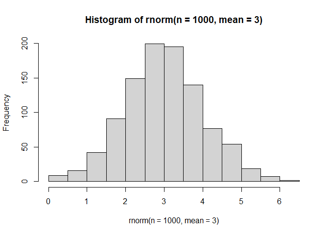

We can also combine multiple vectors in the rnorm function. The code
below should give you 60 datapoints

``` r
tmp <- c(rnorm(30,3), rnorm(30,-3))
tmp
```

     [1]  3.241910  2.774910  2.966377  3.013448  2.507547  2.339777  3.928810
     [8]  3.675727  3.034716  1.560482  4.364750  2.102164  1.672283  4.423412
    [15]  3.487514  3.274217  3.498736  3.907943  2.677835  2.825867  2.155360
    [22]  4.015760  3.149457  3.122973  1.391048  3.734846  4.095379  3.584453
    [29]  3.895195  4.149974 -4.913724 -5.112367 -2.448755 -2.466150 -3.577220
    [36] -3.259874 -3.847189 -2.352631 -2.187112 -4.004945 -2.740376 -2.676993
    [43] -4.614078 -2.320388 -3.946546 -3.202340 -3.115924 -1.543053 -3.522286
    [50] -3.637987 -2.446594 -3.853345 -4.536498 -2.237065 -2.013154 -1.116379
    [57] -1.748201 -2.084979 -2.210539 -3.512794

We can also make matrices using the `cbind()` function which will put
the arguments in the ( ) as columns as compared to `rbind()` which will
add them as rows. The “x” and “y” labels here are arbitrary and whatever
you write here will be added as labels at the top of the columns or rows
respectively. The `rev` here is asking for the reverse of the vector in
the ( ).

``` r
x <- cbind(x=tmp, y=rev(tmp))
x
```

                  x         y
     [1,]  3.241910 -3.512794
     [2,]  2.774910 -2.210539
     [3,]  2.966377 -2.084979
     [4,]  3.013448 -1.748201
     [5,]  2.507547 -1.116379
     [6,]  2.339777 -2.013154
     [7,]  3.928810 -2.237065
     [8,]  3.675727 -4.536498
     [9,]  3.034716 -3.853345
    [10,]  1.560482 -2.446594
    [11,]  4.364750 -3.637987
    [12,]  2.102164 -3.522286
    [13,]  1.672283 -1.543053
    [14,]  4.423412 -3.115924
    [15,]  3.487514 -3.202340
    [16,]  3.274217 -3.946546
    [17,]  3.498736 -2.320388
    [18,]  3.907943 -4.614078
    [19,]  2.677835 -2.676993
    [20,]  2.825867 -2.740376
    [21,]  2.155360 -4.004945
    [22,]  4.015760 -2.187112
    [23,]  3.149457 -2.352631
    [24,]  3.122973 -3.847189
    [25,]  1.391048 -3.259874
    [26,]  3.734846 -3.577220
    [27,]  4.095379 -2.466150
    [28,]  3.584453 -2.448755
    [29,]  3.895195 -5.112367
    [30,]  4.149974 -4.913724
    [31,] -4.913724  4.149974
    [32,] -5.112367  3.895195
    [33,] -2.448755  3.584453
    [34,] -2.466150  4.095379
    [35,] -3.577220  3.734846
    [36,] -3.259874  1.391048
    [37,] -3.847189  3.122973
    [38,] -2.352631  3.149457
    [39,] -2.187112  4.015760
    [40,] -4.004945  2.155360
    [41,] -2.740376  2.825867
    [42,] -2.676993  2.677835
    [43,] -4.614078  3.907943
    [44,] -2.320388  3.498736
    [45,] -3.946546  3.274217
    [46,] -3.202340  3.487514
    [47,] -3.115924  4.423412
    [48,] -1.543053  1.672283
    [49,] -3.522286  2.102164
    [50,] -3.637987  4.364750
    [51,] -2.446594  1.560482
    [52,] -3.853345  3.034716
    [53,] -4.536498  3.675727
    [54,] -2.237065  3.928810
    [55,] -2.013154  2.339777
    [56,] -1.116379  2.507547
    [57,] -1.748201  3.013448
    [58,] -2.084979  2.966377
    [59,] -2.210539  2.774910
    [60,] -3.512794  3.241910

``` r
plot(x)
```

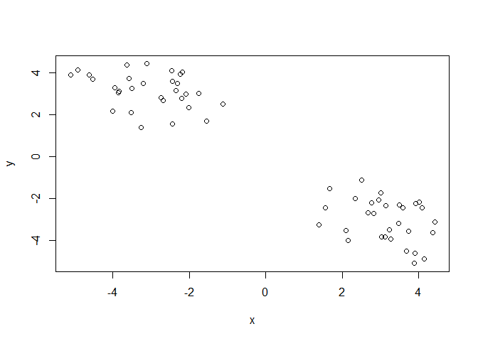

The main function in R for k-means clustering is called `kmeans()`. It
requires 3 arguments the first being what dataset to use (here
represented by x), the number of clusters assigned by `centers=`, and
the number of iterations to run it which is defined by the `nstart=`

``` r
k <- kmeans(x, centers=2, nstart =20)
k
```

    K-means clustering with 2 clusters of sizes 30, 30

    Cluster means:
              x         y
    1  3.152429 -3.041650
    2 -3.041650  3.152429

    Clustering vector:
     [1] 1 1 1 1 1 1 1 1 1 1 1 1 1 1 1 1 1 1 1 1 1 1 1 1 1 1 1 1 1 1 2 2 2 2 2 2 2 2
    [39] 2 2 2 2 2 2 2 2 2 2 2 2 2 2 2 2 2 2 2 2 2 2

    Within cluster sum of squares by cluster:
    [1] 50.68977 50.68977
     (between_SS / total_SS =  91.9 %)

    Available components:

    [1] "cluster"      "centers"      "totss"        "withinss"     "tot.withinss"
    [6] "betweenss"    "size"         "iter"         "ifault"      

Looking at the readouts, it will give you a variety of pieces of
information

The center location for the mean of the values in each cluster (you can
also do complete, single, or average by changing the arguments).

Then the clustering vector will tell you which group each value is in
(here we told it to make 2 clusters so it will be either 1 or 2).

It will then give you the within cluster sum of squares. This is the
Euclidian distance between the center of a cluster and a point in the
cluster, squared and then repeated and summed for all points in the
cluster. The more clusters you have then, the smaller these numbers will
be.

You can also ask it to just give you specific portions as indicated in
the questions below. Don’t forget you can always check the options using
the `?kmeans` command.

> Q1. How many points are in each cluster

``` r
k$size
```

    [1] 30 30

> Q2. What is the clustering result (i.e. membership vector)?

``` r
k$cluster
```

     [1] 1 1 1 1 1 1 1 1 1 1 1 1 1 1 1 1 1 1 1 1 1 1 1 1 1 1 1 1 1 1 2 2 2 2 2 2 2 2
    [39] 2 2 2 2 2 2 2 2 2 2 2 2 2 2 2 2 2 2 2 2 2 2

> Q3.What are the cluster centers?

``` r
k$centers
```

              x         y
    1  3.152429 -3.041650
    2 -3.041650  3.152429

> Q4. Make a plot of our data colored by clustering results with
> optionally the cluster centers shown.

``` r
plot(x, col=c("red", "blue"))
```

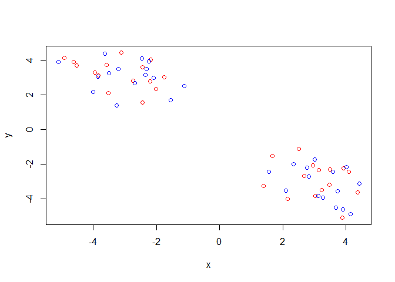

This will color by data points in the vector order, but we want to color
by cluster. How do we do this?

``` r
plot(x, col=k$cluster)
```

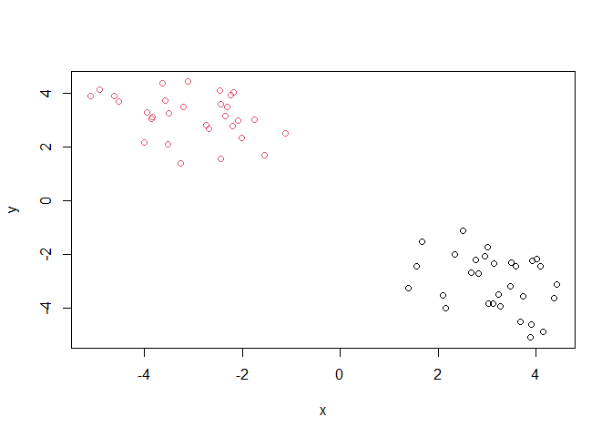

Now we have 2 clusters. What if we want solid circles? We would use the
point character or `pch` argument

``` r
plot(x, col=k$cluster, pch=16)
```

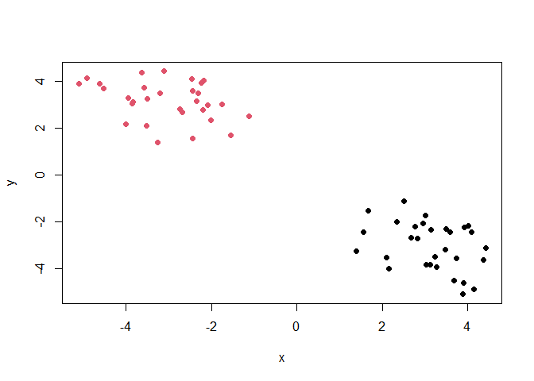

Now we want to include the centers on our graph. Here we’ll use the
`points` function which will add points to our graph in the same format
as the `plot` function, but with an additional argument `cex=` this will
determine the size of the point shape that you defined in `pch=`, just
like how we had to define it in the kmeans function.

``` r
plot(x, col=k$cluster, pch=16)
points(k$centers, col="blue", pch=15, cex=2)
```

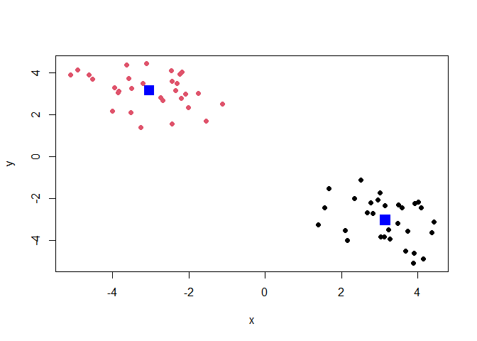

> Q5. Run kmeans again, but cluster into 3 groups and plot the results

``` r
k3 <- kmeans(x, centers=3, nstart =20)
plot(x, col=k3$cluster, pch=16)
points(k3$centers, col="blue", pch=15, cex=1)
```

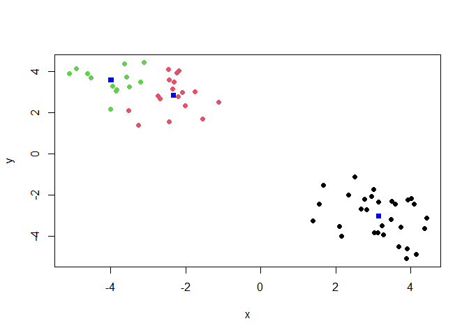

The challenge here is that even if there aren’t really the number of
clusters you assigned in k, it will make that number of clusters anyway.

> How do you know how many iterations to call?

Until you stop getting different answers or get impatient. You won’t
know ahead of time how many iterations will be sufficient for your
dataset.

### Scree Plots

Scree plots are used to determine your desired number of clusters. If
this is a straight line, this means that there are no clear groupings.
These measure the total sum of squares on the y-axis and the number of
clusters on the x-axis. At a certain point the sum of squares doesn’t
drastically decrease with increasing number of clusters. This point is
often called the “elbow” point and is usually the number of clusters you
want to define the kmeans.

# Hierarchical Clustering

Has an advantage in that it can help visualize structure in your data
rather than imposing a structure as you do with `kmeans`.

The main function in “R base” is called `hclust()` for hierarchical
clustering. As always, its helpful to check the help file `?hclust`.
This shows you the arguments that you can use in the clustering.

``` r
?hclust
```

    starting httpd help server ... done

The first argument required is `d` which is a measure of dissimilarity
that you must calculate, but can be based on a variety of things. Two
optional arguments include the `method=` which can be “complete” which
is the maximum, “single” which is the minimum, or “average”.

``` r
#by default, if you make a distance matrix it will be based on Euclidian distance, but can also be differences between protein structure or other values you can think of
dist(x)
```

                 1           2           3           4           5           6
    2   1.38345878                                                            
    3   1.45415812  0.22896442                                                
    4   1.77932163  0.52024664  0.34005164                                    
    5   2.50641034  1.12635143  1.07177854  0.80940334                        
    6   1.75007509  0.47780893  0.63070258  0.72390102  0.91233334            
    7   1.44890182  1.15420427  0.97437545  1.03772627  1.80995144  1.60473064
    8   1.11183099  2.49430569  2.55208311  2.86587151  3.61411958  2.85517569
    9   0.39862751  1.66322328  1.76968630  2.10525172  2.78727245  1.96703875
    10  1.99097521  1.23715776  1.45165664  1.61209948  1.63291300  0.89172406
    11  1.12979819  2.13663311  2.08980494  2.32321164  3.13172653  2.59626619
    12  1.13978556  1.47420120  1.67711556  1.99444671  2.43982009  1.52772323
    13  2.51865222  1.28892342  1.40298300  1.35676365  0.93793126  0.81642122
    14  1.24637626  1.88076631  1.78488137  1.96434920  2.76924535  2.35746402
    15  0.39585708  1.22125933  1.23291567  1.52946427  2.30468395  1.65271364
    16  0.43495326  1.80638567  1.88684891  2.21375767  2.93217094  2.14736620
    17  1.21975077  0.73211382  0.58208599  0.75026879  1.55951692  1.19899054
    18  1.28702195  2.65720965  2.69868283  3.00222799  3.76762556  3.03709498
    19  1.00833701  0.47644847  0.65858709  0.98756811  1.56987668  0.74495976
    20  0.87733781  0.53228220  0.67029022  1.00975193  1.65489963  0.87471959
    21  1.19281331  1.89835158  2.08423152  2.41437617  2.90995697  2.00031029
    22  1.53501712  1.24107116  1.05434208  1.09420006  1.84964225  1.68498693
    23  1.16384061  0.40059391  0.32427828  0.61954436  1.39297081  0.87796688
    24  0.35491620  1.67325163  1.76915417  2.10184357  2.79929785  1.99426113
    25  1.86806270  1.73671533  1.96520745  2.21750722  2.41684497  1.56665159
    26  0.49712869  1.67011796  1.67848998  1.96614503  2.74990877  2.09583340
    27  1.35050847  1.34498120  1.19161131  1.29847076  2.08400850  1.81310298
    28  1.11781714  0.84386453  0.71718360  0.90378331  1.71317050  1.31869908
    29  1.72783540  3.11057016  3.16666773  3.47780021  4.23006917  3.46762808
    30  1.66948662  3.03282260  3.06638296  3.36336616  4.13731735  3.41908145
    31 11.19072728  9.97853778 10.04841381  9.88071431  9.09998564  9.51826819
    32 11.16567261  9.97442357 10.05129724  9.89326941  9.12025027  9.51015484
    33  9.09695491  7.80183381  7.84003255  7.63366608  6.83101435  7.36635954
    34  9.51137428  8.19959178  8.22855774  8.01083083  7.20417120  7.77245855
    35  9.95132215  8.70041094  8.75722614  8.57325465  7.78195152  8.24926408
    36  8.14376189  7.02780514  7.13084544  7.01494448  6.28890563  6.55321942
    37  9.71023793  8.50285469  8.57597986  8.41407524  7.63902939  8.04104149
    38  8.69968257  7.41762982  7.46265095  7.26511197  6.46673716  6.97647836
    39  9.28188603  7.96168709  7.98607910  7.76331539  6.95547830  7.53926629
    40  9.20026505  8.06396363  8.15964456  8.03091679  7.28812945  7.59157510
    41  8.71586836  7.46885251  7.52883955  7.35041338  6.56368769  7.01598732
    42  8.56488773  7.32253008  7.38457961  7.20908511  6.42460248  6.86828693
    43 10.80665882  9.59338083  9.66324965  9.49584651  8.71558075  9.13320794
    44  8.94990002  7.65231203  7.68945696  7.48198813  6.67894033  7.21789952
    45  9.88622372  8.67528210  8.74696970  8.58290118  7.80593696  8.21426540
    46  9.51486551  8.25804584  8.31298603  8.12703652  7.33475564  7.80848334
    47 10.16884565  8.87193504  8.90805998  8.69816090  7.89384035  8.43765751
    48  7.05555749  5.80698780  5.86957986  5.69749102  4.91772244  5.35339295
    49  8.79102345  7.63243599  7.72236372  7.58558623  6.83504949  7.16237562
    50 10.45890463  9.18475231  9.23128499  9.03381167  8.23470517  8.74135756
    51  7.62215230  6.44086200  6.52607350  6.38431184  5.63108335  5.97329271
    52  9.65466356  8.45260090  8.52759492  8.36834107  7.59556030  7.98972814
    53 10.59143387  9.38641678  9.45932685  9.29627229  8.51955737  8.92449087
    54  9.24102965  7.92537002  7.95244942  7.73280847  6.92569647  7.50029452
    55  7.86563966  6.60537158  6.66139554  6.47906542  5.69049695  6.15597460
    56  7.43230704  6.11575531  6.14493165  5.93016496  5.12500545  5.69049695
    57  8.21541432  6.91003348  6.94414774  6.73398751  5.93016496  6.47906542
    58  8.38781210  7.10063158  7.14369497  6.94414774  6.14493165  6.66139554
    59  8.32252469  7.05048918  7.10063158  6.91003348  6.11575531  6.60537158
    60  9.55259375  8.32252469  8.38781210  8.21541432  7.43230704  7.86563966
                 7           8           9          10          11          12
    2                                                                         
    3                                                                         
    4                                                                         
    5                                                                         
    6                                                                         
    7                                                                         
    8   2.31331914                                                            
    9   1.84709599  0.93679980                                                
    10  2.37757868  2.97354377  2.03772286                                    
    11  1.46718358  1.13228752  1.34735628  3.04685724                        
    12  2.23347900  1.87209216  0.98957279  1.20438018  2.26554282            
    13  2.36083970  3.60201414  2.68210253  0.91043271  3.41147025  2.02537948
    14  1.00847673  1.60532371  1.57234394  2.94013160  0.52534858  2.35654926
    15  1.06136647  1.34736869  0.79298944  2.06992852  0.97945510  1.42181558
    16  1.83052338  0.71362042  0.25699664  2.27744263  1.13334452  1.24647769
    17  0.43807088  2.22316694  1.60164623  1.94235891  1.57672074  1.84254516
    18  2.37710420  0.24483204  1.15811884  3.19508342  1.07769423  2.11017723
    19  1.32607425  2.11034333  1.22929567  1.14086070  1.94144056  1.02270153
    20  1.21235538  1.98703772  1.13239467  1.29904067  1.78153551  1.06542428
    21  2.50410176  1.61061030  0.89232872  1.66803407  2.23965710  0.48558209
    22  0.10027811  2.37386584  1.93359220  2.46895210  1.49225764  2.33335404
    23  0.78787473  2.24638280  1.50509332  1.59175092  1.76891994  1.57000454
    24  1.80051948  0.88356391  0.08847135  2.09834307  1.25927566  1.07126733
    25  2.73612379  2.61716056  1.74752781  0.83074153  2.99764491  0.75798795
    26  1.35411827  0.96109891  0.75261341  2.45074973  0.63282841  1.63360633
    27  0.28324069  2.11245116  1.74622852  2.53497260  1.20239902  2.25573252
    28  0.40422017  2.08973758  1.50833785  2.02397299  1.42236990  1.83020524
    29  2.87549847  0.61627164  1.52497897  3.54361835  1.54734512  2.39652248
    30  2.68578082  0.60597788  1.53889699  3.57661842  1.29368989  2.47580834
    31 10.90800937 12.21611538 11.27966377  9.24283796 12.11372876 10.39645383
    32 10.92462760 12.17883642 11.24343532  9.20571584 12.10638622 10.34738996
    33  8.63501058 10.17148673  9.24063313  7.24206581  9.92912401  8.43899317
    34  8.99974179 10.59395865  9.66652659  7.68187319 10.31824346  8.88247181
    35  9.59188173 11.00092616 10.06470746  8.03779697 10.83667637  9.21527856
    36  8.05235213  9.12350638  8.19301660  6.16143867  9.13378826  7.27270905
    37  9.44437159 10.73600321  9.79947066  7.76292335 10.63703541  8.91931944
    38  8.27472761  9.76806092  8.83531234  6.82848754  9.54948226  8.02230323
    39  8.74656050 10.36889640  9.44406191  7.47037391 10.07505582  8.67294796
    40  9.06850941 10.18693755  9.25534259  7.22163138 10.17912929  8.33861148
    41  8.37324978  9.76579735  8.82969731  6.80413262  9.60542679  7.98431149
    42  8.23364268  9.61268251  8.67640112  6.64950910  9.45916281  7.82827197
    43 10.52340454 11.83340412 10.89686353  8.86032316 11.72861502 10.01579741
    44  8.48244559 10.02588598  9.09561618  7.09986639  9.77874693  8.29781369
    45  9.61225557 10.91358459  9.97698173  7.94072037 10.81000534  9.09831551
    46  9.14462125 10.56847106  9.63270865  7.60908077 10.39392227  8.79062291
    47  9.69485582 11.24306569 10.31189040  8.31058131 10.99757471  9.50592230
    48  6.72489990  8.11077260  7.17555106  5.15723549  7.94362046  6.34595545
    49  8.62251294  9.79199810  8.85789809  6.82097689  9.75472556  7.95417288
    50 10.04193096 11.52053147 10.58593675  8.56845923 11.31757981  9.75472556
    51  7.42072344  8.64036962  7.70417309  5.66686126  8.56845923  6.82097689
    52  9.39965978 10.67755667  9.74118936  7.70417309 10.58593675  8.85789809
    53 10.32581961 11.61384081 10.67755667  8.64036962 11.52053147  9.79199810
    54  8.71986338 10.32581961  9.39965978  7.42072344 10.04193096  8.62251294
    55  7.50029452  8.92449087  7.98972814  5.97329271  8.74135756  7.16237562
    56  6.92569647  8.51955737  7.59556030  5.63108335  8.23470517  6.83504949
    57  7.73280847  9.29627229  8.36834107  6.38431184  9.03381167  7.58558623
    58  7.95244942  9.45932685  8.52759492  6.52607350  9.23128499  7.72236372
    59  7.92537002  9.38641678  8.45260090  6.44086200  9.18475231  7.63243599
    60  9.24102965 10.59143387  9.65466356  7.62215230 10.45890463  8.79102345
                13          14          15          16          17          18
    2                                                                         
    3                                                                         
    4                                                                         
    5                                                                         
    6                                                                         
    7                                                                         
    8                                                                         
    9                                                                         
    10                                                                        
    11                                                                        
    12                                                                        
    13                                                                        
    14  3.16901170                                                            
    15  2.45932853  0.93987974                                                
    16  2.88842054  1.41794947  0.77416864                                    
    17  1.98498861  1.21979663  0.88202364  1.64158388                        
    18  3.79860092  1.58435218  1.47301151  0.92043827  2.32990596            
    19  1.51557111  1.79991631  0.96517801  1.40265331  0.89501095  2.29465938
    20  1.66262978  1.64109369  0.80696208  1.28680386  0.79318547  2.16371136
    21  2.50884025  2.43606655  1.55525194  1.12038077  2.15462129  1.85542178
    22  2.43036968  1.01433330  1.14443563  1.90931737  0.53392565  2.42935915
    23  1.68447595  1.48511896  0.91448759  1.59878963  0.35076437  2.38525466
    24  2.72278234  1.49194139  0.74075564  0.18096057  1.57236042  1.09740442
    25  1.73970390  3.03577914  2.09725504  2.00445656  2.30759251  2.85808125
    26  2.89689502  0.82880433  0.44911896  0.59040716  1.27881719  1.05120740
    27  2.59297136  0.72788207  0.95471257  1.69289023  0.61418985  2.15609008
    28  2.11581938  1.07189848  0.75979467  1.52958272  0.15435539  2.18935301
    29  4.20491890  2.06513838  1.95305044  1.32089070  2.81998686  0.49845241
    30  4.18334531  1.81847558  1.83512629  1.30475407  2.67385549  0.38518444
    31  8.70551802 11.83111954 11.16410852 11.51503451 10.61296702 12.43504759
    32  8.69517211 11.83583030 11.15046886 11.48162453 10.62000796 12.40055301
    33  6.57831854  9.59800725  9.01664321  9.45877186  8.38091898 10.37417566
    34  6.99417886  9.97341255  9.41821714  9.88050457  8.76024709 10.79276106
    35  7.44402406 10.53295597  9.90126301 10.29300595  9.31316311 11.21303635
    36  5.73891289  8.90761942  8.16250293  8.43707640  7.71061382  9.35088936
    37  7.22747291 10.35985885  9.68542434 10.03456635  9.14290913 10.95463454
    38  6.18219877  9.22874665  8.62859311  9.05619572  8.00985033  9.97332724
    39  6.76722484  9.72419424  9.18163121  9.65528035  8.51326278 10.56521635
    40  6.77563127  9.94100826  9.21096580  9.49839270  8.73713638 10.41340885
    41  6.20959064  9.30724116  8.66751903  9.05764341  8.08767300  9.97762063
    42  6.06070114  9.16424585  8.51924915  8.90501723  7.94492697  9.82513995
    43  8.32055797 11.44600062 10.77923499 11.13185488 10.22789570 12.05195702
    44  6.43125615  9.44629929  8.86770231  9.31299265  8.22948411 10.22789570
    45  7.40117094 10.53043719  9.85956590 10.21170141  9.31299265 11.13185488
    46  7.00489475 10.08749180  9.46088207  9.85956590  8.86770231 10.77923499
    47  7.65020469 10.66223172 10.08749180 10.53043719  9.44629929 11.44600062
    48  4.54717154  7.65020469  7.00489475  7.40117094  6.43125615  8.32055797
    49  6.34595545  9.50592230  8.79062291  9.09831551  8.29781369 10.01579741
    50  7.94362046 10.99757471 10.39392227 10.81000534  9.77874693 11.72861502
    51  5.15723549  8.31058131  7.60908077  7.94072037  7.09986639  8.86032316
    52  7.17555106 10.31189040  9.63270865  9.97698173  9.09561618 10.89686353
    53  8.11077260 11.24306569 10.56847106 10.91358459 10.02588598 11.83340412
    54  6.72489990  9.69485582  9.14462125  9.61225557  8.48244559 10.52340454
    55  5.35339295  8.43765751  7.80848334  8.21426540  7.21789952  9.13320794
    56  4.91772244  7.89384035  7.33475564  7.80593696  6.67894033  8.71558075
    57  5.69749102  8.69816090  8.12703652  8.58290118  7.48198813  9.49584651
    58  5.86957986  8.90805998  8.31298603  8.74696970  7.68945696  9.66324965
    59  5.80698780  8.87193504  8.25804584  8.67528210  7.65231203  9.59338083
    60  7.05555749 10.16884565  9.51486551  9.88622372  8.94990002 10.80665882
                19          20          21          22          23          24
    2                                                                         
    3                                                                         
    4                                                                         
    5                                                                         
    6                                                                         
    7                                                                         
    8                                                                         
    9                                                                         
    10                                                                        
    11                                                                        
    12                                                                        
    13                                                                        
    14                                                                        
    15                                                                        
    16                                                                        
    17                                                                        
    18                                                                        
    19                                                                        
    20  0.16102988                                                            
    21  1.42703846  1.43133326                                                
    22  1.42478977  1.31223020  2.60107820                                    
    23  0.57239575  0.50503114  1.92830753  0.88197421                        
    24  1.25200058  1.14599573  0.98038914  1.88491978  1.49479167            
    25  1.41264749  1.52596948  1.06738186  2.83547766  1.97865885  1.82879840
    26  1.38840903  1.23553671  1.63637600  1.41820717  1.35731233  0.66878378
    27  1.43313768  1.29879219  2.47619960  0.29017464  0.95270929  1.68903515
    28  0.93490563  0.81270955  2.11282670  0.50446277  0.44549062  1.47260990
    29  2.72268467  2.60188485  2.06237972  2.92773833  2.85871751  1.48222922
    30  2.67771518  2.54493664  2.19188598  2.72991338  2.74958735  1.48061771
    31 10.20976258 10.36234460 10.79234244 10.94962786 10.35851156 11.33768538
    32 10.19219848 10.34632093 10.73462034 10.96891829 10.35823675 11.30333282
    33  8.09244340  8.23559961  8.87675886  8.66607911  8.16020541  9.28835063
    34  8.50444614  8.64482406  9.32596398  9.02689606  8.55054823  9.71198604
    35  8.95753268  9.10648191  9.63155428  9.62927468  9.07224098 10.11829190
    36  7.19759328  7.35560339  7.64470404  8.10790248  7.42257739  8.25710955
    37  8.73015138  8.88304716  9.31868061  9.48804343  8.88455344  9.85729714
    38  7.69760428  7.84263800  8.45620801  8.30875317  7.78112769  8.88455344
    39  8.27409562  8.41280760  9.12078836  8.77218616  8.30875317  9.48804343
    40  8.24688980  8.40405974  8.71198709  9.12078836  8.45620801  9.31868061
    41  7.72259521  7.87185570  8.40405974  8.41280760  7.84263800  8.88304716
    42  7.57287080  7.72259521  8.24688980  8.27409562  7.69760428  8.73015138
    43  9.82513995  9.97762063 10.41340885 10.56521635  9.97332724 10.95463454
    44  7.94492697  8.08767300  8.73713638  8.51326278  8.00985033  9.14290913
    45  8.90501723  9.05764341  9.49839270  9.65528035  9.05619572 10.03456635
    46  8.51924915  8.66751903  9.21096580  9.18163121  8.62859311  9.68542434
    47  9.16424585  9.30724116  9.94100826  9.72419424  9.22874665 10.35985885
    48  6.06070114  6.20959064  6.77563127  6.76722484  6.18219877  7.22747291
    49  7.82827197  7.98431149  8.33861148  8.67294796  8.02230323  8.91931944
    50  9.45916281  9.60542679 10.17912929 10.07505582  9.54948226 10.63703541
    51  6.64950910  6.80413262  7.22163138  7.47037391  6.82848754  7.76292335
    52  8.67640112  8.82969731  9.25534259  9.44406191  8.83531234  9.79947066
    53  9.61268251  9.76579735 10.18693755 10.36889640  9.76806092 10.73600321
    54  8.23364268  8.37324978  9.06850941  8.74656050  8.27472761  9.44437159
    55  6.86828693  7.01598732  7.59157510  7.53926629  6.97647836  8.04104149
    56  6.42460248  6.56368769  7.28812945  6.95547830  6.46673716  7.63902939
    57  7.20908511  7.35041338  8.03091679  7.76331539  7.26511197  8.41407524
    58  7.38457961  7.52883955  8.15964456  7.98607910  7.46265095  8.57597986
    59  7.32253008  7.46885251  8.06396363  7.96168709  7.41762982  8.50285469
    60  8.56488773  8.71586836  9.20026505  9.28188603  8.69968257  9.71023793
                25          26          27          28          29          30
    2                                                                         
    3                                                                         
    4                                                                         
    5                                                                         
    6                                                                         
    7                                                                         
    8                                                                         
    9                                                                         
    10                                                                        
    11                                                                        
    12                                                                        
    13                                                                        
    14                                                                        
    15                                                                        
    16                                                                        
    17                                                                        
    18                                                                        
    19                                                                        
    20                                                                        
    21                                                                        
    22                                                                        
    23                                                                        
    24                                                                        
    25                                                                        
    26  2.36518467                                                            
    27  2.81840440  1.16810065                                                
    28  2.33857690  1.13844188  0.51122136                                    
    29  3.11488112  1.54349903  2.65377784  2.68167638                        
    30  3.21665867  1.39949124  2.44818294  2.52900888  0.32306502            
    31  9.72913130 11.59772762 11.17752350 10.75928653 12.78233229 12.81800468
    32  9.66899274 11.58059419 11.19148315 10.76477546 12.73861664 12.78233229
    33  7.84785990  9.46184357  8.91265902  8.53224534 10.76477546 10.75928653
    34  8.30528261  9.86514664  9.27940306  8.91265902 11.19148315 11.17752350
    35  8.57961483 10.34082242  9.86514664  9.46184357 11.58059419 11.59772762
    36  6.57739679  8.57961483  8.30528261  7.84785990  9.66899274  9.72913130
    37  8.25710955 10.11829190  9.71198604  9.28835063 11.30333282 11.33768538
    38  7.42257739  9.07224098  8.55054823  8.16020541 10.35823675 10.35851156
    39  8.10790248  9.62927468  9.02689606  8.66607911 10.96891829 10.94962786
    40  7.64470404  9.63155428  9.32596398  8.87675886 10.73462034 10.79234244
    41  7.35560339  9.10648191  8.64482406  8.23559961 10.34632093 10.36234460
    42  7.19759328  8.95753268  8.50444614  8.09244340 10.19219848 10.20976258
    43  9.35088936 11.21303635 10.79276106 10.37417566 12.40055301 12.43504759
    44  7.71061382  9.31316311  8.76024709  8.38091898 10.62000796 10.61296702
    45  8.43707640 10.29300595  9.88050457  9.45877186 11.48162453 11.51503451
    46  8.16250293  9.90126301  9.41821714  9.01664321 11.15046886 11.16410852
    47  8.90761942 10.53295597  9.97341255  9.59800725 11.83583030 11.83111954
    48  5.73891289  7.44402406  6.99417886  6.57831854  8.69517211  8.70551802
    49  7.27270905  9.21527856  8.88247181  8.43899317 10.34738996 10.39645383
    50  9.13378826 10.83667637 10.31824346  9.92912401 12.10638622 12.11372876
    51  6.16143867  8.03779697  7.68187319  7.24206581  9.20571584  9.24283796
    52  8.19301660 10.06470746  9.66652659  9.24063313 11.24343532 11.27966377
    53  9.12350638 11.00092616 10.59395865 10.17148673 12.17883642 12.21611538
    54  8.05235213  9.59188173  8.99974179  8.63501058 10.92462760 10.90800937
    55  6.55321942  8.24926408  7.77245855  7.36635954  9.51015484  9.51826819
    56  6.28890563  7.78195152  7.20417120  6.83101435  9.12025027  9.09998564
    57  7.01494448  8.57325465  8.01083083  7.63366608  9.89326941  9.88071431
    58  7.13084544  8.75722614  8.22855774  7.84003255 10.05129724 10.04841381
    59  7.02780514  8.70041094  8.19959178  7.80183381  9.97442357  9.97853778
    60  8.14376189  9.95132215  9.51137428  9.09695491 11.16567261 11.19072728
                31          32          33          34          35          36
    2                                                                         
    3                                                                         
    4                                                                         
    5                                                                         
    6                                                                         
    7                                                                         
    8                                                                         
    9                                                                         
    10                                                                        
    11                                                                        
    12                                                                        
    13                                                                        
    14                                                                        
    15                                                                        
    16                                                                        
    17                                                                        
    18                                                                        
    19                                                                        
    20                                                                        
    21                                                                        
    22                                                                        
    23                                                                        
    24                                                                        
    25                                                                        
    26                                                                        
    27                                                                        
    28                                                                        
    29                                                                        
    30                                                                        
    31                                                                        
    32  0.32306502                                                            
    33  2.52900888  2.68167638                                                
    34  2.44818294  2.65377784  0.51122136                                    
    35  1.39949124  1.54349903  1.13844188  1.16810065                        
    36  3.21665867  3.11488112  2.33857690  2.81840440  2.36518467            
    37  1.48061771  1.48222922  1.47260990  1.68903515  0.66878378  1.82879840
    38  2.74958735  2.85871751  0.44549062  0.95270929  1.35731233  1.97865885
    39  2.72991338  2.92773833  0.50446277  0.29017464  1.41820717  2.83547766
    40  2.19188598  2.06237972  2.11282670  2.47619960  1.63637600  1.06738186
    41  2.54493664  2.60188485  0.81270955  1.29879219  1.23553671  1.52596948
    42  2.67771518  2.72268467  0.93490563  1.43313768  1.38840903  1.41264749
    43  0.38518444  0.49845241  2.18935301  2.15609008  1.05120740  2.85808125
    44  2.67385549  2.81998686  0.15435539  0.61418985  1.27881719  2.30759251
    45  1.30475407  1.32089070  1.52958272  1.69289023  0.59040716  2.00445656
    46  1.83512629  1.95305044  0.75979467  0.95471257  0.44911896  2.09725504
    47  1.81847558  2.06513838  1.07189848  0.72788207  0.82880433  3.03577914
    48  4.18334531  4.20491890  2.11581938  2.59297136  2.89689502  1.73970390
    49  2.47580834  2.39652248  1.83020524  2.25573252  1.63360633  0.75798795
    50  1.29368989  1.54734512  1.42236990  1.20239902  0.63282841  2.99764491
    51  3.57661842  3.54361835  2.02397299  2.53497260  2.45074973  0.83074153
    52  1.53889699  1.52497897  1.50833785  1.74622852  0.75261341  1.74752781
    53  0.60597788  0.61627164  2.08973758  2.11245116  0.96109891  2.61716056
    54  2.68578082  2.87549847  0.40422017  0.28324069  1.35411827  2.73612379
    55  3.41908145  3.46762808  1.31869908  1.81310298  2.09583340  1.56665159
    56  4.13731735  4.23006917  1.71317050  2.08400850  2.74990877  2.41684497
    57  3.36336616  3.47780021  0.90378331  1.29847076  1.96614503  2.21750722
    58  3.06638296  3.16666773  0.71718360  1.19161131  1.67848998  1.96520745
    59  3.03282260  3.11057016  0.84386453  1.34498120  1.67011796  1.73671533
    60  1.66948662  1.72783540  1.11781714  1.35050847  0.49712869  1.86806270
                37          38          39          40          41          42
    2                                                                         
    3                                                                         
    4                                                                         
    5                                                                         
    6                                                                         
    7                                                                         
    8                                                                         
    9                                                                         
    10                                                                        
    11                                                                        
    12                                                                        
    13                                                                        
    14                                                                        
    15                                                                        
    16                                                                        
    17                                                                        
    18                                                                        
    19                                                                        
    20                                                                        
    21                                                                        
    22                                                                        
    23                                                                        
    24                                                                        
    25                                                                        
    26                                                                        
    27                                                                        
    28                                                                        
    29                                                                        
    30                                                                        
    31                                                                        
    32                                                                        
    33                                                                        
    34                                                                        
    35                                                                        
    36                                                                        
    37                                                                        
    38  1.49479167                                                            
    39  1.88491978  0.88197421                                                
    40  0.98038914  1.92830753  2.60107820                                    
    41  1.14599573  0.50503114  1.31223020  1.43133326                        
    42  1.25200058  0.57239575  1.42478977  1.42703846  0.16102988            
    43  1.09740442  2.38525466  2.42935915  1.85542178  2.16371136  2.29465938
    44  1.57236042  0.35076437  0.53392565  2.15462129  0.79318547  0.89501095
    45  0.18096057  1.59878963  1.90931737  1.12038077  1.28680386  1.40265331
    46  0.74075564  0.91448759  1.14443563  1.55525194  0.80696208  0.96517801
    47  1.49194139  1.48511896  1.01433330  2.43606655  1.64109369  1.79991631
    48  2.72278234  1.68447595  2.43036968  2.50884025  1.66262978  1.51557111
    49  1.07126733  1.57000454  2.33335404  0.48558209  1.06542428  1.02270153
    50  1.25927566  1.76891994  1.49225764  2.23965710  1.78153551  1.94144056
    51  2.09834307  1.59175092  2.46895210  1.66803407  1.29904067  1.14086070
    52  0.08847135  1.50509332  1.93359220  0.89232872  1.13239467  1.22929567
    53  0.88356391  2.24638280  2.37386584  1.61061030  1.98703772  2.11034333
    54  1.80051948  0.78787473  0.10027811  2.50410176  1.21235538  1.32607425
    55  1.99426113  0.87796688  1.68498693  2.00031029  0.87471959  0.74495976
    56  2.79929785  1.39297081  1.84964225  2.90995697  1.65489963  1.56987668
    57  2.10184357  0.61954436  1.09420006  2.41437617  1.00975193  0.98756811
    58  1.76915417  0.32427828  1.05434208  2.08423152  0.67029022  0.65858709
    59  1.67325163  0.40059391  1.24107116  1.89835158  0.53228220  0.47644847
    60  0.35491620  1.16384061  1.53501712  1.19281331  0.87733781  1.00833701
                43          44          45          46          47          48
    2                                                                         
    3                                                                         
    4                                                                         
    5                                                                         
    6                                                                         
    7                                                                         
    8                                                                         
    9                                                                         
    10                                                                        
    11                                                                        
    12                                                                        
    13                                                                        
    14                                                                        
    15                                                                        
    16                                                                        
    17                                                                        
    18                                                                        
    19                                                                        
    20                                                                        
    21                                                                        
    22                                                                        
    23                                                                        
    24                                                                        
    25                                                                        
    26                                                                        
    27                                                                        
    28                                                                        
    29                                                                        
    30                                                                        
    31                                                                        
    32                                                                        
    33                                                                        
    34                                                                        
    35                                                                        
    36                                                                        
    37                                                                        
    38                                                                        
    39                                                                        
    40                                                                        
    41                                                                        
    42                                                                        
    43                                                                        
    44  2.32990596                                                            
    45  0.92043827  1.64158388                                                
    46  1.47301151  0.88202364  0.77416864                                    
    47  1.58435218  1.21979663  1.41794947  0.93987974                        
    48  3.79860092  1.98498861  2.88842054  2.45932853  3.16901170            
    49  2.11017723  1.84254516  1.24647769  1.42181558  2.35654926  2.02537948
    50  1.07769423  1.57672074  1.13334452  0.97945510  0.52534858  3.41147025
    51  3.19508342  1.94235891  2.27744263  2.06992852  2.94013160  0.91043271
    52  1.15811884  1.60164623  0.25699664  0.79298944  1.57234394  2.68210253
    53  0.24483204  2.22316694  0.71362042  1.34736869  1.60532371  3.60201414
    54  2.37710420  0.43807088  1.83052338  1.06136647  1.00847673  2.36083970
    55  3.03709498  1.19899054  2.14736620  1.65271364  2.35746402  0.81642122
    56  3.76762556  1.55951692  2.93217094  2.30468395  2.76924535  0.93793126
    57  3.00222799  0.75026879  2.21375767  1.52946427  1.96434920  1.35676365
    58  2.69868283  0.58208599  1.88684891  1.23291567  1.78488137  1.40298300
    59  2.65720965  0.73211382  1.80638567  1.22125933  1.88076631  1.28892342
    60  1.28702195  1.21975077  0.43495326  0.39585708  1.24637626  2.51865222
                49          50          51          52          53          54
    2                                                                         
    3                                                                         
    4                                                                         
    5                                                                         
    6                                                                         
    7                                                                         
    8                                                                         
    9                                                                         
    10                                                                        
    11                                                                        
    12                                                                        
    13                                                                        
    14                                                                        
    15                                                                        
    16                                                                        
    17                                                                        
    18                                                                        
    19                                                                        
    20                                                                        
    21                                                                        
    22                                                                        
    23                                                                        
    24                                                                        
    25                                                                        
    26                                                                        
    27                                                                        
    28                                                                        
    29                                                                        
    30                                                                        
    31                                                                        
    32                                                                        
    33                                                                        
    34                                                                        
    35                                                                        
    36                                                                        
    37                                                                        
    38                                                                        
    39                                                                        
    40                                                                        
    41                                                                        
    42                                                                        
    43                                                                        
    44                                                                        
    45                                                                        
    46                                                                        
    47                                                                        
    48                                                                        
    49                                                                        
    50  2.26554282                                                            
    51  1.20438018  3.04685724                                                
    52  0.98957279  1.34735628  2.03772286                                    
    53  1.87209216  1.13228752  2.97354377  0.93679980                        
    54  2.23347900  1.46718358  2.37757868  1.84709599  2.31331914            
    55  1.52772323  2.59626619  0.89172406  1.96703875  2.85517569  1.60473064
    56  2.43982009  3.13172653  1.63291300  2.78727245  3.61411958  1.80995144
    57  1.99444671  2.32321164  1.61209948  2.10525172  2.86587151  1.03772627
    58  1.67711556  2.08980494  1.45165664  1.76968630  2.55208311  0.97437545
    59  1.47420120  2.13663311  1.23715776  1.66322328  2.49430569  1.15420427
    60  1.13978556  1.12979819  1.99097521  0.39862751  1.11183099  1.44890182
                55          56          57          58          59
    2                                                             
    3                                                             
    4                                                             
    5                                                             
    6                                                             
    7                                                             
    8                                                             
    9                                                             
    10                                                            
    11                                                            
    12                                                            
    13                                                            
    14                                                            
    15                                                            
    16                                                            
    17                                                            
    18                                                            
    19                                                            
    20                                                            
    21                                                            
    22                                                            
    23                                                            
    24                                                            
    25                                                            
    26                                                            
    27                                                            
    28                                                            
    29                                                            
    30                                                            
    31                                                            
    32                                                            
    33                                                            
    34                                                            
    35                                                            
    36                                                            
    37                                                            
    38                                                            
    39                                                            
    40                                                            
    41                                                            
    42                                                            
    43                                                            
    44                                                            
    45                                                            
    46                                                            
    47                                                            
    48                                                            
    49                                                            
    50                                                            
    51                                                            
    52                                                            
    53                                                            
    54                                                            
    55                                                            
    56  0.91233334                                                
    57  0.72390102  0.80940334                                    
    58  0.63070258  1.07177854  0.34005164                        
    59  0.47780893  1.12635143  0.52024664  0.22896442            
    60  1.75007509  2.50641034  1.77932163  1.45415812  1.38345878

``` r
# there are other arguments you can add to hclust, but only the distance is required
hc <- hclust(dist(x))
plot(hc)
```

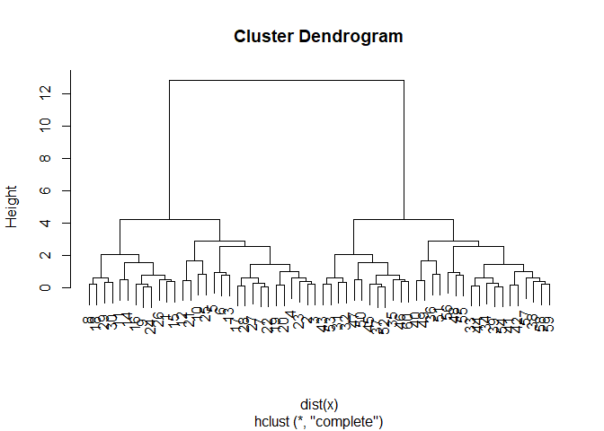

``` r
# you can then make a specific cut line at a height you define
```

There are two different ways of going about this, “bottom up” or “top
down”. For “bottom up” you start as each point being its own cluster,
then group them based on spacing in a stepwise manner until you only
have a single cluster containing all points. The “top down” approach is
similar, but in reverse order starting from a single cluster and parsing
out to each point being its own cluster.

The function to actually cut your group into your desired number of
clusters based on height is called `cutree()`. This will take two
arguments, first being the hierarchal cluster `hclust` and second being
the height at which you want it to cut as represented by `h=`

``` r
grps <- cutree(hc, h=8)
grps
```

     [1] 1 1 1 1 1 1 1 1 1 1 1 1 1 1 1 1 1 1 1 1 1 1 1 1 1 1 1 1 1 1 2 2 2 2 2 2 2 2
    [39] 2 2 2 2 2 2 2 2 2 2 2 2 2 2 2 2 2 2 2 2 2 2

> Q6. Plot our hclust results in terms of our data colored by cluster
> membership

``` r
plot(x,col=grps)
```


# Principal Component Analysis (PCA)

Eiganvector = a principle component. Once you create these, you can get
rid of your original axis and only look at the PCA one. It makes it
easier to visualize your data. The PCA are measurements of variation
(aka spread) of your data. With the highest of amount of variance (or
differences) in PCA1 with decreasing variance in sequential order for
PCA2, ect. These coordinates do a better job of describing the data than
the original coordinates.

> Question 1. How many rows and columns are in your new data frame named
> x? What R functions could you use to answer this questions?

``` r
url <- "https://tinyurl.com/UK-foods"
#make sure to assign the row names here because otherwise it may assume that the first column is more observations and not row names
x <- read.csv(url, row.names=1)
head(x)
```

                   England Wales Scotland N.Ireland
    Cheese             105   103      103        66
    Carcass_meat       245   227      242       267
    Other_meat         685   803      750       586
    Fish               147   160      122        93
    Fats_and_oils      193   235      184       209
    Sugars             156   175      147       139

``` r
str(x)
```

    'data.frame':   17 obs. of  4 variables:
     $ England  : int  105 245 685 147 193 156 720 253 488 198 ...
     $ Wales    : int  103 227 803 160 235 175 874 265 570 203 ...
     $ Scotland : int  103 242 750 122 184 147 566 171 418 220 ...
     $ N.Ireland: int  66 267 586 93 209 139 1033 143 355 187 ...

So there are 17 rows (called objects) and 4 columns (called variables),
but lets double check with less data using the `dim()` function

``` r
dim(x)
```

    [1] 17  4

> Q2. Which approach to solving the ‘row-names problem’ mentioned above
> do you prefer and why? Is one approach more robust than another under
> certain circumstances?

Theoretically, you could use the below as commands

``` r
# rownames(x) <- x[,1]
# x <- x[,-1]
```

but this would overwrite the first column with the row names and each
time you run it, it would overwrite yet another column until you have no
data at all (which is bad, so don’t do this).

> Q3: Changing what optional argument in the below barplot() function
> results in the following plot (a stacked barplot)?

``` r
# original barplot
barplot(as.matrix(x), beside=T, col=rainbow(nrow(x)))
```


``` r
# stacked barplot
barplot(as.matrix(x), main="Stacked Barplot", beside=F, col=rainbow(nrow(x)))
```

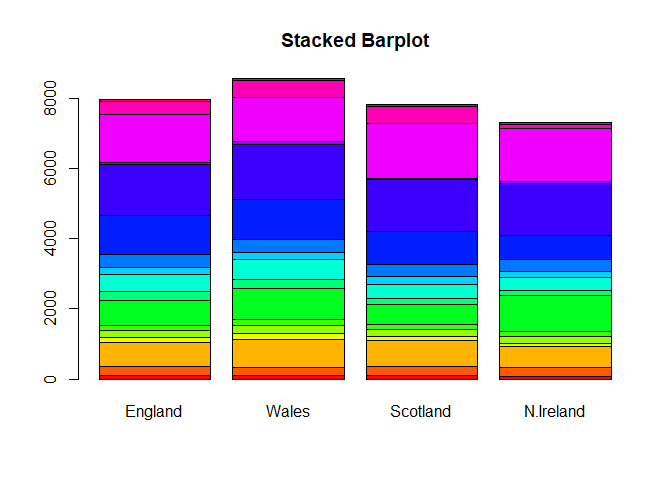

So you would change the `beside=` argument to “FALSE”

> Q5: Generating all pairwise plots may help somewhat. Can you make
> sense of the following code and resulting figure? What does it mean if
> a given point lies on the diagonal for a given plot?

``` r
pairs(x, col=rainbow(10), pch=16)
```


The way that this is read is that for the top row England is on the
y-axis, for the second row, wales is on the y-axis, third row is
Scotland on the y-axis, and bottom row is N. Ireland on the y-axis. For
the columns, the first column is England on the x-axis, the second
column is Wales on the x-axis, Scotland is on the x-axis in the third
column, and N.Ireland is the x-axis for the fourth column.

If a given point lies on the diagonal, that means that there is equal
amounts of that type of food consumption in both countries.

> Q6. What is the main differences between N. Ireland and the other
> countries of the UK in terms of this data-set?

This can be difficult to visualize just looking at the graphs above, but
the graphs containing N.Ireland as compared to the other 3 (fourth
column and row), the points that are most off of the diagonal are those
that are the most different between the two countries. For example, in
N.Ireland vs Scotland, the dark blue datapoint is very different between
the two.

\##PCA to the rescue help me make sense of this data…the main function
for PCA in base R is called `prcomp()`. But weirdly, it wants the food
names in the columns (aka observations) and the countries in the rows.
We can do this by using the transpose function `t()`.

``` r
Tx <- t(x)
head(Tx)
```

              Cheese Carcass_meat  Other_meat  Fish Fats_and_oils  Sugars
    England      105           245         685  147            193    156
    Wales        103           227         803  160            235    175
    Scotland     103           242         750  122            184    147
    N.Ireland     66           267         586   93            209    139
              Fresh_potatoes  Fresh_Veg  Other_Veg  Processed_potatoes 
    England               720        253        488                 198
    Wales                 874        265        570                 203
    Scotland              566        171        418                 220
    N.Ireland            1033        143        355                 187
              Processed_Veg  Fresh_fruit  Cereals  Beverages Soft_drinks 
    England              360         1102     1472        57         1374
    Wales                365         1137     1582        73         1256
    Scotland             337          957     1462        53         1572
    N.Ireland            334          674     1494        47         1506
              Alcoholic_drinks  Confectionery 
    England                 375             54
    Wales                   475             64
    Scotland                458             62
    N.Ireland               135             41

``` r
pca <- prcomp(t(x))
summary(pca)
```

    Importance of components:
                                PC1      PC2      PC3       PC4
    Standard deviation     324.1502 212.7478 73.87622 4.189e-14
    Proportion of Variance   0.6744   0.2905  0.03503 0.000e+00
    Cumulative Proportion    0.6744   0.9650  1.00000 1.000e+00

``` r
?pca
```

    No documentation for 'pca' in specified packages and libraries:
    you could try '??pca'

``` r
# we can look at different ways 
print(pca$x) 
```

                     PC1         PC2         PC3           PC4
    England   -144.99315    2.532999 -105.768945  2.842865e-14
    Wales     -240.52915  224.646925   56.475555  7.804382e-13
    Scotland   -91.86934 -286.081786   44.415495 -9.614462e-13
    N.Ireland  477.39164   58.901862    4.877895  1.448078e-13

``` r
# now making a plot
plot(pca$x[,1], pca$x[,2])
```


We can also add a line such that we can see where the zero lies using
the `abline()` function. This adds a line as opposed to the `point()`
function we used before

``` r
plot(pca$x[,1], pca$x[,2])
abline(h=0, v=0, col ="gray", lty =2)
```

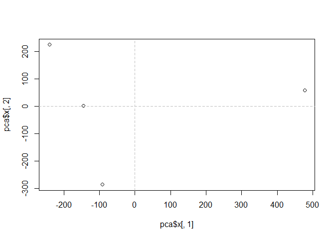

> Q7. Complete the code below to generate a plot of PC1 vs PC2. The
> second line adds text labels over the data points.

``` r
# Plot PC1 vs PC2
plot(pca$x[,1], pca$x[,2], xlab="PC1", ylab="PC2", xlim=c(-270,500))
text(pca$x[,1], pca$x[,2], colnames(x))
```


So here we are telling to plot PCA1 which is in the first column, and
PCA2 which is the second column in the PCA plot

> Q8. Customize your plot so that the colors of the country names match
> the colors in our UK and Ireland map and table at start of this
> document.

``` r
# this colors the points
plot(pca$x[,1], pca$x[,2], xlab="PC1", ylab="PC2", xlim=c(-270,500), col = c("orange", "red","blue","green"))
#this is colors the text
text(pca$x[,1], pca$x[,2], colnames(x), col = c("orange", "red","blue","green"))
```

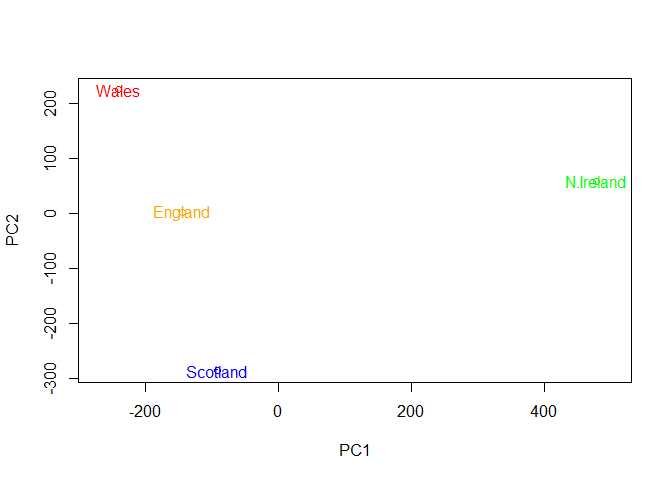

In our data it’s ordered:England, Wales, Scotland, then N. Ireland. We
want England =yellow, Wales=red,Scotland=blue, and N.Ireland=green

\##Loading Plots

``` r
summary(pca)
```

    Importance of components:
                                PC1      PC2      PC3       PC4
    Standard deviation     324.1502 212.7478 73.87622 4.189e-14
    Proportion of Variance   0.6744   0.2905  0.03503 0.000e+00
    Cumulative Proportion    0.6744   0.9650  1.00000 1.000e+00

Looking at the summary, the proportion of variance is represented as a
decimal, so here 67% of the variance in the data is in PC1, while 29% is
in PC2. Together, PC1 and PC2 explain 96.5% of the variance as
indiciated by the “cumulative proportion” row.

One of the main results that folks look for is called a “Score Plot” aka
“PC Plot”. The rotation value includes how much your individual
categories (in this case food), determins the overall variance of your
data (as opposed to potential confounding variables).

> Q9: Generate a similar ‘loadings plot’ for PC2. What two food groups
> feature prominantely and what does PC2 maninly tell us about?

``` r
#PC1
par(mar=c(10, 3, 0.35, 0))
barplot( pca$rotation[,1], las=2 )
```


This plot shows the highest contributes to variation (PC1) with the
largest bars observations/foods with high negative scores that push the
other countries to the left side of the plot primarily being increased
consumption of fresh fruit and alcoholic drinks in other countries. But
also the negative values “push” N. Ireland to right positive side of the
plot (though a bit less) are primarily potatoes and softdrinks.

``` r
#PC2
par(mar=c(10, 3, 0.35, 0))
barplot( pca$rotation[,2], las=2 )
```


PC2 (the second highest level of variance) mainly shows us differences
in fresh potatoes and soft drinks where positive values represent
pushing values in N.Ireland and negative values “pushes” values in
England consumption. For PC2 it seems that fresh potatoes are still
consumed more highly in N.Ireland (highest contribute to the “push”) and
there are more soft drinks consumed in other countries (highest
contribute to it’s “push”).
