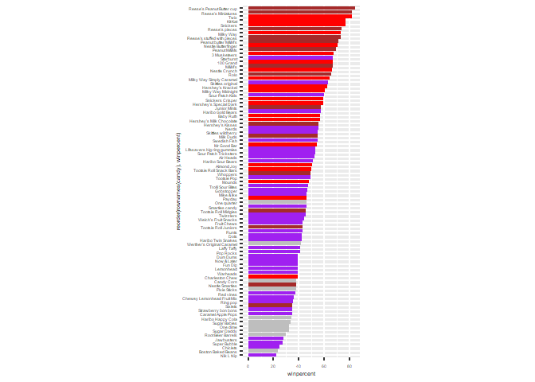
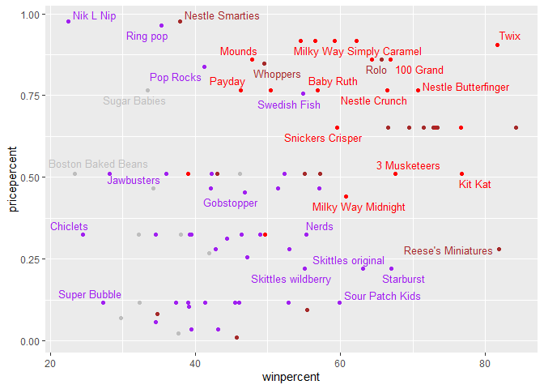
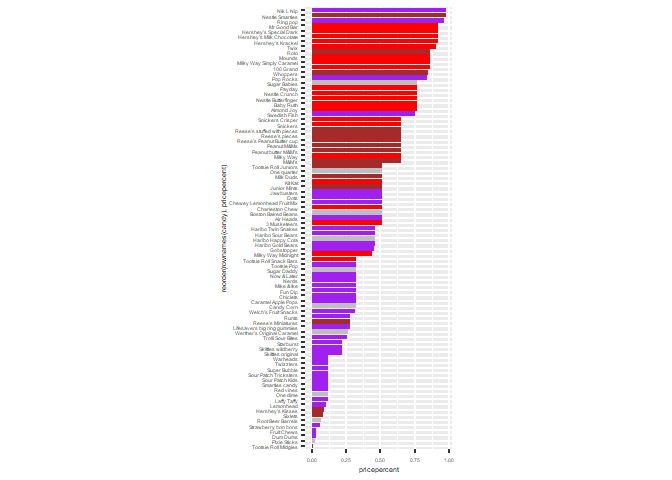
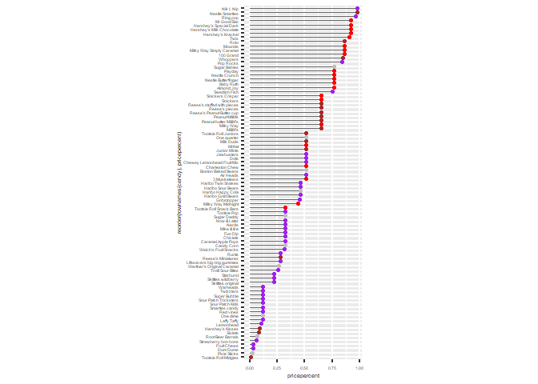
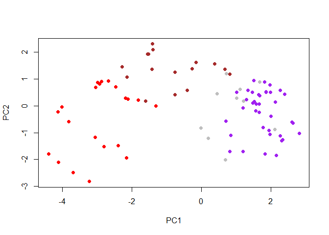
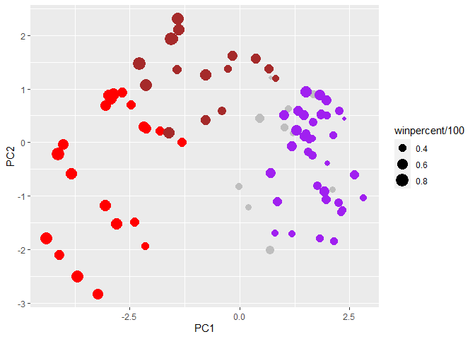
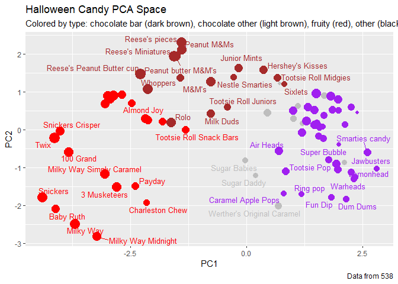

# Class08_Halloween_Candy
Krysten Jones (A10553682)

# Practicing ggPlot and R using Halloween Candy Survey

First of course we need to import our dataset

``` r
candy_file <- "https://raw.githubusercontent.com/fivethirtyeight/data/master/candy-power-ranking/candy-data.csv"

candy = read.csv(candy_file, row.names=1)
head(candy)
```

                 chocolate fruity caramel peanutyalmondy nougat crispedricewafer
    100 Grand            1      0       1              0      0                1
    3 Musketeers         1      0       0              0      1                0
    One dime             0      0       0              0      0                0
    One quarter          0      0       0              0      0                0
    Air Heads            0      1       0              0      0                0
    Almond Joy           1      0       0              1      0                0
                 hard bar pluribus sugarpercent pricepercent winpercent
    100 Grand       0   1        0        0.732        0.860   66.97173
    3 Musketeers    0   1        0        0.604        0.511   67.60294
    One dime        0   0        0        0.011        0.116   32.26109
    One quarter     0   0        0        0.011        0.511   46.11650
    Air Heads       0   0        0        0.906        0.511   52.34146
    Almond Joy      0   1        0        0.465        0.767   50.34755

Another way to do this is to download the file to your project
directory. This can be useful if you’re sharing this data because the
file will come with if you if you send someone your project folder.

> Q1. How many different candy types are in this dataset?

``` r
dim(candy)
```

    [1] 85 12

``` r
nrow(candy)
```

    [1] 85

So there are 85 different types of candy stored in the rows

> Q2. How many fruity candy types are in the dataset?

``` r
fruity<- candy[,"fruity"]
sum(fruity)
```

    [1] 38

So there are 38 different kinds of fruity candy

To get all of the fruity candy listed you can use a logical which is the
`as.logical()` function and ask specifically for the fruity column in
the candy dataset. To get it to print out it for you you can assign the
fruity column =true using the logical for the row value and leave the
column value blank to filter the table

``` r
candy[as.logical(candy$fruity),]
```

                                chocolate fruity caramel peanutyalmondy nougat
    Air Heads                           0      1       0              0      0
    Caramel Apple Pops                  0      1       1              0      0
    Chewey Lemonhead Fruit Mix          0      1       0              0      0
    Chiclets                            0      1       0              0      0
    Dots                                0      1       0              0      0
    Dum Dums                            0      1       0              0      0
    Fruit Chews                         0      1       0              0      0
    Fun Dip                             0      1       0              0      0
    Gobstopper                          0      1       0              0      0
    Haribo Gold Bears                   0      1       0              0      0
    Haribo Sour Bears                   0      1       0              0      0
    Haribo Twin Snakes                  0      1       0              0      0
    Jawbusters                          0      1       0              0      0
    Laffy Taffy                         0      1       0              0      0
    Lemonhead                           0      1       0              0      0
    Lifesavers big ring gummies         0      1       0              0      0
    Mike & Ike                          0      1       0              0      0
    Nerds                               0      1       0              0      0
    Nik L Nip                           0      1       0              0      0
    Now & Later                         0      1       0              0      0
    Pop Rocks                           0      1       0              0      0
    Red vines                           0      1       0              0      0
    Ring pop                            0      1       0              0      0
    Runts                               0      1       0              0      0
    Skittles original                   0      1       0              0      0
    Skittles wildberry                  0      1       0              0      0
    Smarties candy                      0      1       0              0      0
    Sour Patch Kids                     0      1       0              0      0
    Sour Patch Tricksters               0      1       0              0      0
    Starburst                           0      1       0              0      0
    Strawberry bon bons                 0      1       0              0      0
    Super Bubble                        0      1       0              0      0
    Swedish Fish                        0      1       0              0      0
    Tootsie Pop                         1      1       0              0      0
    Trolli Sour Bites                   0      1       0              0      0
    Twizzlers                           0      1       0              0      0
    Warheads                            0      1       0              0      0
    Welch's Fruit Snacks                0      1       0              0      0
                                crispedricewafer hard bar pluribus sugarpercent
    Air Heads                                  0    0   0        0        0.906
    Caramel Apple Pops                         0    0   0        0        0.604
    Chewey Lemonhead Fruit Mix                 0    0   0        1        0.732
    Chiclets                                   0    0   0        1        0.046
    Dots                                       0    0   0        1        0.732
    Dum Dums                                   0    1   0        0        0.732
    Fruit Chews                                0    0   0        1        0.127
    Fun Dip                                    0    1   0        0        0.732
    Gobstopper                                 0    1   0        1        0.906
    Haribo Gold Bears                          0    0   0        1        0.465
    Haribo Sour Bears                          0    0   0        1        0.465
    Haribo Twin Snakes                         0    0   0        1        0.465
    Jawbusters                                 0    1   0        1        0.093
    Laffy Taffy                                0    0   0        0        0.220
    Lemonhead                                  0    1   0        0        0.046
    Lifesavers big ring gummies                0    0   0        0        0.267
    Mike & Ike                                 0    0   0        1        0.872
    Nerds                                      0    1   0        1        0.848
    Nik L Nip                                  0    0   0        1        0.197
    Now & Later                                0    0   0        1        0.220
    Pop Rocks                                  0    1   0        1        0.604
    Red vines                                  0    0   0        1        0.581
    Ring pop                                   0    1   0        0        0.732
    Runts                                      0    1   0        1        0.872
    Skittles original                          0    0   0        1        0.941
    Skittles wildberry                         0    0   0        1        0.941
    Smarties candy                             0    1   0        1        0.267
    Sour Patch Kids                            0    0   0        1        0.069
    Sour Patch Tricksters                      0    0   0        1        0.069
    Starburst                                  0    0   0        1        0.151
    Strawberry bon bons                        0    1   0        1        0.569
    Super Bubble                               0    0   0        0        0.162
    Swedish Fish                               0    0   0        1        0.604
    Tootsie Pop                                0    1   0        0        0.604
    Trolli Sour Bites                          0    0   0        1        0.313
    Twizzlers                                  0    0   0        0        0.220
    Warheads                                   0    1   0        0        0.093
    Welch's Fruit Snacks                       0    0   0        1        0.313
                                pricepercent winpercent
    Air Heads                          0.511   52.34146
    Caramel Apple Pops                 0.325   34.51768
    Chewey Lemonhead Fruit Mix         0.511   36.01763
    Chiclets                           0.325   24.52499
    Dots                               0.511   42.27208
    Dum Dums                           0.034   39.46056
    Fruit Chews                        0.034   43.08892
    Fun Dip                            0.325   39.18550
    Gobstopper                         0.453   46.78335
    Haribo Gold Bears                  0.465   57.11974
    Haribo Sour Bears                  0.465   51.41243
    Haribo Twin Snakes                 0.465   42.17877
    Jawbusters                         0.511   28.12744
    Laffy Taffy                        0.116   41.38956
    Lemonhead                          0.104   39.14106
    Lifesavers big ring gummies        0.279   52.91139
    Mike & Ike                         0.325   46.41172
    Nerds                              0.325   55.35405
    Nik L Nip                          0.976   22.44534
    Now & Later                        0.325   39.44680
    Pop Rocks                          0.837   41.26551
    Red vines                          0.116   37.34852
    Ring pop                           0.965   35.29076
    Runts                              0.279   42.84914
    Skittles original                  0.220   63.08514
    Skittles wildberry                 0.220   55.10370
    Smarties candy                     0.116   45.99583
    Sour Patch Kids                    0.116   59.86400
    Sour Patch Tricksters              0.116   52.82595
    Starburst                          0.220   67.03763
    Strawberry bon bons                0.058   34.57899
    Super Bubble                       0.116   27.30386
    Swedish Fish                       0.755   54.86111
    Tootsie Pop                        0.325   48.98265
    Trolli Sour Bites                  0.255   47.17323
    Twizzlers                          0.116   45.46628
    Warheads                           0.116   39.01190
    Welch's Fruit Snacks               0.313   44.37552

> Q3. What is your favorite candy in the dataset and what is it’s
> winpercent value?

``` r
candy["Peanut butter M&M's", ]$winpercent
```

    [1] 71.46505

> Q4. What is the winpercent value for “Kit Kat”?

``` r
candy["Kit Kat", ]$winpercent
```

    [1] 76.7686

> Q5. What is the winpercent value for “Tootsie Roll Snack Bars”?

``` r
candy["Tootsie Roll Snack Bars", ]$winpercent
```

    [1] 49.6535

## Using SkimR package

First download the package using the console below by typing
\$install.packages(“skimr”)

``` r
library("skimr")
skim(candy)
```

|                                                  |       |
|:-------------------------------------------------|:------|
| Name                                             | candy |
| Number of rows                                   | 85    |
| Number of columns                                | 12    |
| \_\_\_\_\_\_\_\_\_\_\_\_\_\_\_\_\_\_\_\_\_\_\_   |       |
| Column type frequency:                           |       |
| numeric                                          | 12    |
| \_\_\_\_\_\_\_\_\_\_\_\_\_\_\_\_\_\_\_\_\_\_\_\_ |       |
| Group variables                                  | None  |

Data summary

**Variable type: numeric**

| skim_variable    | n_missing | complete_rate |  mean |    sd |    p0 |   p25 |   p50 |   p75 |  p100 | hist  |
|:-----------------|----------:|--------------:|------:|------:|------:|------:|------:|------:|------:|:------|
| chocolate        |         0 |             1 |  0.44 |  0.50 |  0.00 |  0.00 |  0.00 |  1.00 |  1.00 | ▇▁▁▁▆ |
| fruity           |         0 |             1 |  0.45 |  0.50 |  0.00 |  0.00 |  0.00 |  1.00 |  1.00 | ▇▁▁▁▆ |
| caramel          |         0 |             1 |  0.16 |  0.37 |  0.00 |  0.00 |  0.00 |  0.00 |  1.00 | ▇▁▁▁▂ |
| peanutyalmondy   |         0 |             1 |  0.16 |  0.37 |  0.00 |  0.00 |  0.00 |  0.00 |  1.00 | ▇▁▁▁▂ |
| nougat           |         0 |             1 |  0.08 |  0.28 |  0.00 |  0.00 |  0.00 |  0.00 |  1.00 | ▇▁▁▁▁ |
| crispedricewafer |         0 |             1 |  0.08 |  0.28 |  0.00 |  0.00 |  0.00 |  0.00 |  1.00 | ▇▁▁▁▁ |
| hard             |         0 |             1 |  0.18 |  0.38 |  0.00 |  0.00 |  0.00 |  0.00 |  1.00 | ▇▁▁▁▂ |
| bar              |         0 |             1 |  0.25 |  0.43 |  0.00 |  0.00 |  0.00 |  0.00 |  1.00 | ▇▁▁▁▂ |
| pluribus         |         0 |             1 |  0.52 |  0.50 |  0.00 |  0.00 |  1.00 |  1.00 |  1.00 | ▇▁▁▁▇ |
| sugarpercent     |         0 |             1 |  0.48 |  0.28 |  0.01 |  0.22 |  0.47 |  0.73 |  0.99 | ▇▇▇▇▆ |
| pricepercent     |         0 |             1 |  0.47 |  0.29 |  0.01 |  0.26 |  0.47 |  0.65 |  0.98 | ▇▇▇▇▆ |
| winpercent       |         0 |             1 | 50.32 | 14.71 | 22.45 | 39.14 | 47.83 | 59.86 | 84.18 | ▃▇▆▅▂ |

If you didn’t want to load the whole skimr package you can use the
command \$ skimr::skim(candy). This could be useful when a package has a
lot to load and you won’t be using all the functions.

> Q6. Is there any variable/column that looks to be on a different scale
> to the majority of the other columns in the dataset?

Rendering it allows you to see the rest of the table and it looks like
the winpercent is much higher especially in the p100 column than the
other values which will majorly impact our analysis if we don’t scale
first.

> Q7. What do you think a zero and one represent for the
> candy\$chocolate column?

Likely the 1 represents `TRUE` and the 0 represents `FALSE` for the
chocolate column of whether or not it has chocolate so if it has
chocolate it will be a 1 and if it doesn’t it will be a 0.

> Q8. Plot a histogram of winpercent values

``` r
hist(candy$winpercent)
```


``` r
#plot is only for scatter plots
```

> Q9. Is the distribution of winpercent values symmetrical?

It is not exactly symmetrical (though it is close), it is slightly left
shifted.

> Q10. Is the center of the distribution above or below 50%?

``` r
median(candy$winpercent)
```

    [1] 47.82975

The center of the distribution is slighly below 50% at 47.8%.

> Q11. On average is chocolate candy higher or lower ranked than fruit
> candy?

``` r
choc.ind <- as.logical(candy$chocolate)
fruit.ind <- as.logical(candy$fruity)
choc<- mean(candy[choc.ind,"winpercent"])
fruit <- mean(candy[fruit.ind,"winpercent"])
choc > fruit
```

    [1] TRUE

on the winpercent of chocolate candy is higher than the winpercent of
fruit candy.

> Q12. Is this difference statistically significant?

``` r
t.test(candy[choc.ind,"winpercent"], candy[fruit.ind,"winpercent"])
```


        Welch Two Sample t-test

    data:  candy[choc.ind, "winpercent"] and candy[fruit.ind, "winpercent"]
    t = 6.2582, df = 68.882, p-value = 2.871e-08
    alternative hypothesis: true difference in means is not equal to 0
    95 percent confidence interval:
     11.44563 22.15795
    sample estimates:
    mean of x mean of y 
     60.92153  44.11974 

Given that the p-value is 2.871e-08, this is a significant difference.

> Q13. What are the five least liked candy types in this set?

We will first have the dataframe ordered using the `order()` based on
their values in the “winpercent” column of the candy dataframe. We then
are asking it to return these rows from the reorganized dataframe.
Finally, you can use the head function to show you the first values (for
our dataset, the first values are the lowest) and specifically we only
want to see the first 5 rows so adding the argument `n=` set to 5.

``` r
head(candy[order(candy$winpercent),], n=5)
```

                       chocolate fruity caramel peanutyalmondy nougat
    Nik L Nip                  0      1       0              0      0
    Boston Baked Beans         0      0       0              1      0
    Chiclets                   0      1       0              0      0
    Super Bubble               0      1       0              0      0
    Jawbusters                 0      1       0              0      0
                       crispedricewafer hard bar pluribus sugarpercent pricepercent
    Nik L Nip                         0    0   0        1        0.197        0.976
    Boston Baked Beans                0    0   0        1        0.313        0.511
    Chiclets                          0    0   0        1        0.046        0.325
    Super Bubble                      0    0   0        0        0.162        0.116
    Jawbusters                        0    1   0        1        0.093        0.511
                       winpercent
    Nik L Nip            22.44534
    Boston Baked Beans   23.41782
    Chiclets             24.52499
    Super Bubble         27.30386
    Jawbusters           28.12744

> Q14. What are the top 5 all time favorite candy types out of this set?

This is largely the same as above so can be done in two different ways,
the first is to use the `tail()` function which will return the last
values (but will still be in the same order). Alternatively, we can ask
it to order in the opposite direction as seen below.

``` r
head(candy[order(candy$winpercent, decreasing =T),], n=5)
```

                              chocolate fruity caramel peanutyalmondy nougat
    Reese's Peanut Butter cup         1      0       0              1      0
    Reese's Miniatures                1      0       0              1      0
    Twix                              1      0       1              0      0
    Kit Kat                           1      0       0              0      0
    Snickers                          1      0       1              1      1
                              crispedricewafer hard bar pluribus sugarpercent
    Reese's Peanut Butter cup                0    0   0        0        0.720
    Reese's Miniatures                       0    0   0        0        0.034
    Twix                                     1    0   1        0        0.546
    Kit Kat                                  1    0   1        0        0.313
    Snickers                                 0    0   1        0        0.546
                              pricepercent winpercent
    Reese's Peanut Butter cup        0.651   84.18029
    Reese's Miniatures               0.279   81.86626
    Twix                             0.906   81.64291
    Kit Kat                          0.511   76.76860
    Snickers                         0.651   76.67378

> Q15. Make a first barplot of candy ranking based on winpercent values.

``` r
library(ggplot2)
ggplot(candy) + 
  aes(winpercent, rownames(candy)) +
  geom_col()
```


> Q16. This is quite ugly, use the reorder() function to get the bars
> sorted by winpercent?

``` r
library(ggplot2)
ggplot(candy) + 
  aes(winpercent, reorder(rownames(candy),winpercent)) +
  geom_col()
```


Now lets add some color

``` r
mycols <- rep("gray", nrow(candy))
mycols[as.logical(candy$chocolate)] <- "brown"
mycols[as.logical(candy$bar)] = "red"
mycols[as.logical(candy$fruity)] = "purple"
mycols
```

     [1] "red"    "red"    "gray"   "gray"   "purple" "red"    "red"    "gray"  
     [9] "gray"   "purple" "red"    "purple" "purple" "purple" "purple" "purple"
    [17] "purple" "purple" "purple" "gray"   "purple" "purple" "brown"  "red"   
    [25] "red"    "red"    "purple" "brown"  "red"    "purple" "purple" "purple"
    [33] "brown"  "brown"  "purple" "brown"  "red"    "red"    "red"    "red"   
    [41] "red"    "purple" "red"    "red"    "purple" "purple" "red"    "brown" 
    [49] "gray"   "purple" "purple" "brown"  "brown"  "brown"  "brown"  "purple"
    [57] "brown"  "gray"   "purple" "brown"  "purple" "purple" "brown"  "purple"
    [65] "red"    "red"    "purple" "purple" "purple" "purple" "gray"   "gray"  
    [73] "purple" "purple" "purple" "brown"  "brown"  "red"    "purple" "red"   
    [81] "purple" "purple" "purple" "gray"   "brown" 

``` r
ggplot(candy) + 
  aes(winpercent, reorder(rownames(candy),winpercent)) +
  geom_col(fill=mycols) +
  theme(text=element_text(size = 5), line = element_line(linewidth = 1),
        aspect.ratio = 3)
```



> Q17. What is the worst ranked chocolate candy?

Sixlet is the worst ranked chocolate candy

> Q18. What is the best ranked fruity candy?

Starburst is the best ranked fruity candy \## Using ggrepel package
There is a regular geom_label() that comes with ggplot2. However, as
there are quite a few candys in our dataset lots of these labels will be
overlapping and hard to read. To help with this we can use the
geom_text_repel() function from the ggrepel package.

first install the package uing `install.packages("ggrepel")` \> Q19.
Which candy type is the highest ranked in terms of winpercent for the
least money - i.e. offers the most bang for your buck?

``` r
library(ggrepel)
# How about a plot of price vs win
ggplot(candy) +
  aes(winpercent, pricepercent, label=rownames(candy)) +
  geom_point(col=mycols) + 
  geom_text_repel(col=mycols, size=3.3, max.overlaps = 5)
```

    Warning: ggrepel: 54 unlabeled data points (too many overlaps). Consider
    increasing max.overlaps



Based on the above graph, it looks like Reese’s Minatures is likely the
most popular candy for the price.

> Q20. What are the top 5 most expensive candy types in the dataset and
> of these which is the least popular?

If we want some of this data in table form, we can order based on the
highest pricepercent you could do below.

``` r
ord <- order(candy$pricepercent, decreasing = TRUE)
head( candy[ord,c(11,12)], n=5 )
```

                             pricepercent winpercent
    Nik L Nip                       0.976   22.44534
    Nestle Smarties                 0.976   37.88719
    Ring pop                        0.965   35.29076
    Hershey's Krackel               0.918   62.28448
    Hershey's Milk Chocolate        0.918   56.49050

Nik L Nip is the least popular of the five highest priced candy

> Q21. Make a barplot again with geom_col() this time using pricepercent
> and then improve this step by step, first ordering the x-axis by value
> and finally making a so called “dot chat” or “lollipop” chart by
> swapping geom_col() for geom_point() + geom_segment().

``` r
# barplot
ggplot(candy) + 
  aes(pricepercent, reorder(rownames(candy),pricepercent)) +
  geom_col(fill=mycols) +
  theme(text=element_text(size = 5), line = element_line(linewidth = 1),
        aspect.ratio = 3)
```



``` r
ggplot(candy) + 
  aes(pricepercent, reorder(rownames(candy),pricepercent)) +
geom_segment(aes(yend = reorder(rownames(candy), pricepercent), 
                   xend = 0), col="gray40") +
    geom_point(col=mycols) +
 theme(text=element_text(size = 5), line = element_line(linewidth = 1),
        aspect.ratio = 3)
```



## Using Corrplot

To see how the variables interact with one another, we’ll use
correlation and view the results with the corrplot package to plot a
correlation matrix. Once again, you can install corrplot in the console
section using `install.packages("corrplot")`

> Q22. Examining this plot what two variables are anti-correlated
> (i.e. have minus values)?

``` r
library(corrplot)
```

    corrplot 0.92 loaded

``` r
cij <- cor(candy)
corrplot(cij)
```


The two variables that are negatively correlated are chocolate and
fruity (as exemplified by the large dark red dots)

> Q23. Similarly, what two variables are most positively correlated?

It appears that chocolate and winpercent are the two variables that are
the most positively correlated based on the medium blue dot.

## Principal Component Analysis

Now we will use the the `prcomp()` function to our candy dataset.
Remember to set the scale=TRUE argument.

``` r
pca <- prcomp(candy, scale=TRUE)
summary(pca)
```

    Importance of components:
                              PC1    PC2    PC3     PC4    PC5     PC6     PC7
    Standard deviation     2.0788 1.1378 1.1092 1.07533 0.9518 0.81923 0.81530
    Proportion of Variance 0.3601 0.1079 0.1025 0.09636 0.0755 0.05593 0.05539
    Cumulative Proportion  0.3601 0.4680 0.5705 0.66688 0.7424 0.79830 0.85369
                               PC8     PC9    PC10    PC11    PC12
    Standard deviation     0.74530 0.67824 0.62349 0.43974 0.39760
    Proportion of Variance 0.04629 0.03833 0.03239 0.01611 0.01317
    Cumulative Proportion  0.89998 0.93832 0.97071 0.98683 1.00000

``` r
plot(pca$x[,1:2], col=mycols, pch=16)
```



### PCA in ggplot

Not bad, lets try plotting it in ggplot. We can make a much nicer plot
with the ggplot2 package but it is important to note that ggplot works
best when you supply an input data.frame that includes a separate column
for each of the aesthetics you would like displayed in your final plot.
To accomplish this we make a new data.frame here that contains our PCA
results with all the rest of our candy data. We will then use this for
making plots below

``` r
my_data <- cbind(candy, pca$x[,1:3])
p <- ggplot(my_data) + 
        aes(x=PC1, y=PC2, 
            size=winpercent/100,  
            text=rownames(my_data),
            label=rownames(my_data)) +
        geom_point(col=mycols)

p
```



### PCA using ggrepel

Again we can use the ggrepel package and the function
ggrepel::geom_text_repel() to label up the plot with non overlapping
candy names like. We will also add a title and subtitle like so:

``` r
p + geom_text_repel(size=3.3, col=mycols, max.overlaps = 7)  + 
  theme(legend.position = "none") +
  labs(title="Halloween Candy PCA Space",
       subtitle="Colored by type: chocolate bar (dark brown), chocolate other (light brown), fruity (red), other (black)",
       caption="Data from 538")
```

    Warning: ggrepel: 43 unlabeled data points (too many overlaps). Consider
    increasing max.overlaps



### Creating an Interactive Plot using plotly

As always, start with installing in your consul and call it here

``` r
# library(plotly)
# ggplotly(p)
```

### Use a barplot to compare the PCA values

``` r
par(mar=c(8,4,2,2))
barplot(pca$rotation[,1], las=2, ylab="PC1 Contribution")
```


> Q24. What original variables are picked up strongly by PC1 in the
> positive direction? Do these make sense to you?

In the positive direction, PC1 picks up fruity, hard, and pluribus. This
does make sense as these ted to coincide with eachother while the ones
in the negative direction also seem to coincide.
