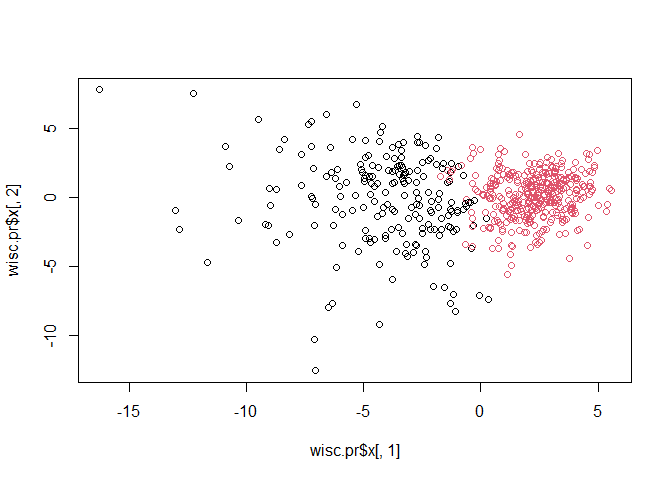

# Class09_Cancer
Krysten Jones (A10553682)

# Unsupervised Machine Learning Mini-Project Cancer

Today we’re analyzing data from Wisconsin Cancer Center. First of course
we want to import our data. This can be done in a few different ways.
For this, we will download the project into the project folder and
download by clicking on it directly in the files section on the bottom
right. Alternatively, once it is in your project folder you can use the
following below command.

``` r
fna.data <- "WisconsinCancer.csv"
wisc.df <- read.csv(fna.data, row.names=1)
head(wisc.df)
```

             diagnosis radius_mean texture_mean perimeter_mean area_mean
    842302           M       17.99        10.38         122.80    1001.0
    842517           M       20.57        17.77         132.90    1326.0
    84300903         M       19.69        21.25         130.00    1203.0
    84348301         M       11.42        20.38          77.58     386.1
    84358402         M       20.29        14.34         135.10    1297.0
    843786           M       12.45        15.70          82.57     477.1
             smoothness_mean compactness_mean concavity_mean concave.points_mean
    842302           0.11840          0.27760         0.3001             0.14710
    842517           0.08474          0.07864         0.0869             0.07017
    84300903         0.10960          0.15990         0.1974             0.12790
    84348301         0.14250          0.28390         0.2414             0.10520
    84358402         0.10030          0.13280         0.1980             0.10430
    843786           0.12780          0.17000         0.1578             0.08089
             symmetry_mean fractal_dimension_mean radius_se texture_se perimeter_se
    842302          0.2419                0.07871    1.0950     0.9053        8.589
    842517          0.1812                0.05667    0.5435     0.7339        3.398
    84300903        0.2069                0.05999    0.7456     0.7869        4.585
    84348301        0.2597                0.09744    0.4956     1.1560        3.445
    84358402        0.1809                0.05883    0.7572     0.7813        5.438
    843786          0.2087                0.07613    0.3345     0.8902        2.217
             area_se smoothness_se compactness_se concavity_se concave.points_se
    842302    153.40      0.006399        0.04904      0.05373           0.01587
    842517     74.08      0.005225        0.01308      0.01860           0.01340
    84300903   94.03      0.006150        0.04006      0.03832           0.02058
    84348301   27.23      0.009110        0.07458      0.05661           0.01867
    84358402   94.44      0.011490        0.02461      0.05688           0.01885
    843786     27.19      0.007510        0.03345      0.03672           0.01137
             symmetry_se fractal_dimension_se radius_worst texture_worst
    842302       0.03003             0.006193        25.38         17.33
    842517       0.01389             0.003532        24.99         23.41
    84300903     0.02250             0.004571        23.57         25.53
    84348301     0.05963             0.009208        14.91         26.50
    84358402     0.01756             0.005115        22.54         16.67
    843786       0.02165             0.005082        15.47         23.75
             perimeter_worst area_worst smoothness_worst compactness_worst
    842302            184.60     2019.0           0.1622            0.6656
    842517            158.80     1956.0           0.1238            0.1866
    84300903          152.50     1709.0           0.1444            0.4245
    84348301           98.87      567.7           0.2098            0.8663
    84358402          152.20     1575.0           0.1374            0.2050
    843786            103.40      741.6           0.1791            0.5249
             concavity_worst concave.points_worst symmetry_worst
    842302            0.7119               0.2654         0.4601
    842517            0.2416               0.1860         0.2750
    84300903          0.4504               0.2430         0.3613
    84348301          0.6869               0.2575         0.6638
    84358402          0.4000               0.1625         0.2364
    843786            0.5355               0.1741         0.3985
             fractal_dimension_worst
    842302                   0.11890
    842517                   0.08902
    84300903                 0.08758
    84348301                 0.17300
    84358402                 0.07678
    843786                   0.12440

We are going to be using hierarchical clustering `hclust()` and k means
clustering `kmeans()` as well as principal component analysis using the
`prcomp()` function.

looking at our data the diagnosis column has M= melignant B= benign.
However, we want to see if we can figure out the diagnosis without being
told (just from the data). So we will want to remove the diagnosis
column from our dataset.

``` r
wisc.data <- wisc.df[,-1]
head(wisc.data)
```

             radius_mean texture_mean perimeter_mean area_mean smoothness_mean
    842302         17.99        10.38         122.80    1001.0         0.11840
    842517         20.57        17.77         132.90    1326.0         0.08474
    84300903       19.69        21.25         130.00    1203.0         0.10960
    84348301       11.42        20.38          77.58     386.1         0.14250
    84358402       20.29        14.34         135.10    1297.0         0.10030
    843786         12.45        15.70          82.57     477.1         0.12780
             compactness_mean concavity_mean concave.points_mean symmetry_mean
    842302            0.27760         0.3001             0.14710        0.2419
    842517            0.07864         0.0869             0.07017        0.1812
    84300903          0.15990         0.1974             0.12790        0.2069
    84348301          0.28390         0.2414             0.10520        0.2597
    84358402          0.13280         0.1980             0.10430        0.1809
    843786            0.17000         0.1578             0.08089        0.2087
             fractal_dimension_mean radius_se texture_se perimeter_se area_se
    842302                  0.07871    1.0950     0.9053        8.589  153.40
    842517                  0.05667    0.5435     0.7339        3.398   74.08
    84300903                0.05999    0.7456     0.7869        4.585   94.03
    84348301                0.09744    0.4956     1.1560        3.445   27.23
    84358402                0.05883    0.7572     0.7813        5.438   94.44
    843786                  0.07613    0.3345     0.8902        2.217   27.19
             smoothness_se compactness_se concavity_se concave.points_se
    842302        0.006399        0.04904      0.05373           0.01587
    842517        0.005225        0.01308      0.01860           0.01340
    84300903      0.006150        0.04006      0.03832           0.02058
    84348301      0.009110        0.07458      0.05661           0.01867
    84358402      0.011490        0.02461      0.05688           0.01885
    843786        0.007510        0.03345      0.03672           0.01137
             symmetry_se fractal_dimension_se radius_worst texture_worst
    842302       0.03003             0.006193        25.38         17.33
    842517       0.01389             0.003532        24.99         23.41
    84300903     0.02250             0.004571        23.57         25.53
    84348301     0.05963             0.009208        14.91         26.50
    84358402     0.01756             0.005115        22.54         16.67
    843786       0.02165             0.005082        15.47         23.75
             perimeter_worst area_worst smoothness_worst compactness_worst
    842302            184.60     2019.0           0.1622            0.6656
    842517            158.80     1956.0           0.1238            0.1866
    84300903          152.50     1709.0           0.1444            0.4245
    84348301           98.87      567.7           0.2098            0.8663
    84358402          152.20     1575.0           0.1374            0.2050
    843786            103.40      741.6           0.1791            0.5249
             concavity_worst concave.points_worst symmetry_worst
    842302            0.7119               0.2654         0.4601
    842517            0.2416               0.1860         0.2750
    84300903          0.4504               0.2430         0.3613
    84348301          0.6869               0.2575         0.6638
    84358402          0.4000               0.1625         0.2364
    843786            0.5355               0.1741         0.3985
             fractal_dimension_worst
    842302                   0.11890
    842517                   0.08902
    84300903                 0.08758
    84348301                 0.17300
    84358402                 0.07678
    843786                   0.12440

see now we have the data frame without the diagnosis column, but what if
we want it later? We can save it in another vector. If you don’t use the
`as.factor()` function, it will leave them as characters which will
cause problems later. So if you do it without the vector will return
each value in “” which is how you know it’s a character. YOU DON’T WANT
THIS

``` r
diagnosis <- as.factor(wisc.df[,1])
head(diagnosis)
```

    [1] M M M M M M
    Levels: B M

Looks good. You still want to use head here cause the vector is
LOOOONNNNGGG

> Q1. How many observations are in this dataset?

We can also examine our data using the `skimr` program

``` r
skimr::skim(wisc.df)
```

|                                                  |         |
|:-------------------------------------------------|:--------|
| Name                                             | wisc.df |
| Number of rows                                   | 569     |
| Number of columns                                | 31      |
| \_\_\_\_\_\_\_\_\_\_\_\_\_\_\_\_\_\_\_\_\_\_\_   |         |
| Column type frequency:                           |         |
| character                                        | 1       |
| numeric                                          | 30      |
| \_\_\_\_\_\_\_\_\_\_\_\_\_\_\_\_\_\_\_\_\_\_\_\_ |         |
| Group variables                                  | None    |

Data summary

**Variable type: character**

| skim_variable | n_missing | complete_rate | min | max | empty | n_unique | whitespace |
|:--------------|----------:|--------------:|----:|----:|------:|---------:|-----------:|
| diagnosis     |         0 |             1 |   1 |   1 |     0 |        2 |          0 |

**Variable type: numeric**

| skim_variable           | n_missing | complete_rate |   mean |     sd |     p0 |    p25 |    p50 |     p75 |    p100 | hist  |
|:------------------------|----------:|--------------:|-------:|-------:|-------:|-------:|-------:|--------:|--------:|:------|
| radius_mean             |         0 |             1 |  14.13 |   3.52 |   6.98 |  11.70 |  13.37 |   15.78 |   28.11 | ▂▇▃▁▁ |
| texture_mean            |         0 |             1 |  19.29 |   4.30 |   9.71 |  16.17 |  18.84 |   21.80 |   39.28 | ▃▇▃▁▁ |
| perimeter_mean          |         0 |             1 |  91.97 |  24.30 |  43.79 |  75.17 |  86.24 |  104.10 |  188.50 | ▃▇▃▁▁ |
| area_mean               |         0 |             1 | 654.89 | 351.91 | 143.50 | 420.30 | 551.10 |  782.70 | 2501.00 | ▇▃▂▁▁ |
| smoothness_mean         |         0 |             1 |   0.10 |   0.01 |   0.05 |   0.09 |   0.10 |    0.11 |    0.16 | ▁▇▇▁▁ |
| compactness_mean        |         0 |             1 |   0.10 |   0.05 |   0.02 |   0.06 |   0.09 |    0.13 |    0.35 | ▇▇▂▁▁ |
| concavity_mean          |         0 |             1 |   0.09 |   0.08 |   0.00 |   0.03 |   0.06 |    0.13 |    0.43 | ▇▃▂▁▁ |
| concave.points_mean     |         0 |             1 |   0.05 |   0.04 |   0.00 |   0.02 |   0.03 |    0.07 |    0.20 | ▇▃▂▁▁ |
| symmetry_mean           |         0 |             1 |   0.18 |   0.03 |   0.11 |   0.16 |   0.18 |    0.20 |    0.30 | ▁▇▅▁▁ |
| fractal_dimension_mean  |         0 |             1 |   0.06 |   0.01 |   0.05 |   0.06 |   0.06 |    0.07 |    0.10 | ▆▇▂▁▁ |
| radius_se               |         0 |             1 |   0.41 |   0.28 |   0.11 |   0.23 |   0.32 |    0.48 |    2.87 | ▇▁▁▁▁ |
| texture_se              |         0 |             1 |   1.22 |   0.55 |   0.36 |   0.83 |   1.11 |    1.47 |    4.88 | ▇▅▁▁▁ |
| perimeter_se            |         0 |             1 |   2.87 |   2.02 |   0.76 |   1.61 |   2.29 |    3.36 |   21.98 | ▇▁▁▁▁ |
| area_se                 |         0 |             1 |  40.34 |  45.49 |   6.80 |  17.85 |  24.53 |   45.19 |  542.20 | ▇▁▁▁▁ |
| smoothness_se           |         0 |             1 |   0.01 |   0.00 |   0.00 |   0.01 |   0.01 |    0.01 |    0.03 | ▇▃▁▁▁ |
| compactness_se          |         0 |             1 |   0.03 |   0.02 |   0.00 |   0.01 |   0.02 |    0.03 |    0.14 | ▇▃▁▁▁ |
| concavity_se            |         0 |             1 |   0.03 |   0.03 |   0.00 |   0.02 |   0.03 |    0.04 |    0.40 | ▇▁▁▁▁ |
| concave.points_se       |         0 |             1 |   0.01 |   0.01 |   0.00 |   0.01 |   0.01 |    0.01 |    0.05 | ▇▇▁▁▁ |
| symmetry_se             |         0 |             1 |   0.02 |   0.01 |   0.01 |   0.02 |   0.02 |    0.02 |    0.08 | ▇▃▁▁▁ |
| fractal_dimension_se    |         0 |             1 |   0.00 |   0.00 |   0.00 |   0.00 |   0.00 |    0.00 |    0.03 | ▇▁▁▁▁ |
| radius_worst            |         0 |             1 |  16.27 |   4.83 |   7.93 |  13.01 |  14.97 |   18.79 |   36.04 | ▆▇▃▁▁ |
| texture_worst           |         0 |             1 |  25.68 |   6.15 |  12.02 |  21.08 |  25.41 |   29.72 |   49.54 | ▃▇▆▁▁ |
| perimeter_worst         |         0 |             1 | 107.26 |  33.60 |  50.41 |  84.11 |  97.66 |  125.40 |  251.20 | ▇▇▃▁▁ |
| area_worst              |         0 |             1 | 880.58 | 569.36 | 185.20 | 515.30 | 686.50 | 1084.00 | 4254.00 | ▇▂▁▁▁ |
| smoothness_worst        |         0 |             1 |   0.13 |   0.02 |   0.07 |   0.12 |   0.13 |    0.15 |    0.22 | ▂▇▇▂▁ |
| compactness_worst       |         0 |             1 |   0.25 |   0.16 |   0.03 |   0.15 |   0.21 |    0.34 |    1.06 | ▇▅▁▁▁ |
| concavity_worst         |         0 |             1 |   0.27 |   0.21 |   0.00 |   0.11 |   0.23 |    0.38 |    1.25 | ▇▅▂▁▁ |
| concave.points_worst    |         0 |             1 |   0.11 |   0.07 |   0.00 |   0.06 |   0.10 |    0.16 |    0.29 | ▅▇▅▃▁ |
| symmetry_worst          |         0 |             1 |   0.29 |   0.06 |   0.16 |   0.25 |   0.28 |    0.32 |    0.66 | ▅▇▁▁▁ |
| fractal_dimension_worst |         0 |             1 |   0.08 |   0.02 |   0.06 |   0.07 |   0.08 |    0.09 |    0.21 | ▇▃▁▁▁ |

looking at the original dataframe wisc.df according to skimr, there are
569 observations in the original dataset.

> Q2. How many of the observations have a malignant diagnosis?

``` r
sum(wisc.df$diagnosis == "M")
```

    [1] 212

So there are 212 variables with “M” in the diagnosis column (so are
malignant). Another way is to use the table function

``` r
table(wisc.df$diagnosis)
```


      B   M 
    357 212 

> Q3. How many variables/features in the data are suffixed with \_mean?

``` r
length(grep("_mean$", colnames(wisc.df), value = T))
```

    [1] 10

If you want to only know the location in the vector, then you can set
the value argument above to false. With it being true, it will return
the names. if you want to know how many values it is, you’d wrap it in
the length command.

There are 10 variables in the data suffixed with “-mean”

> Question 4

Lets see if we need to scale it? Just by looking at the data, we can see
that the area column has much higher values than some of the other
columns, so we will need to scale it.

``` r
head(wisc.data)
```

             radius_mean texture_mean perimeter_mean area_mean smoothness_mean
    842302         17.99        10.38         122.80    1001.0         0.11840
    842517         20.57        17.77         132.90    1326.0         0.08474
    84300903       19.69        21.25         130.00    1203.0         0.10960
    84348301       11.42        20.38          77.58     386.1         0.14250
    84358402       20.29        14.34         135.10    1297.0         0.10030
    843786         12.45        15.70          82.57     477.1         0.12780
             compactness_mean concavity_mean concave.points_mean symmetry_mean
    842302            0.27760         0.3001             0.14710        0.2419
    842517            0.07864         0.0869             0.07017        0.1812
    84300903          0.15990         0.1974             0.12790        0.2069
    84348301          0.28390         0.2414             0.10520        0.2597
    84358402          0.13280         0.1980             0.10430        0.1809
    843786            0.17000         0.1578             0.08089        0.2087
             fractal_dimension_mean radius_se texture_se perimeter_se area_se
    842302                  0.07871    1.0950     0.9053        8.589  153.40
    842517                  0.05667    0.5435     0.7339        3.398   74.08
    84300903                0.05999    0.7456     0.7869        4.585   94.03
    84348301                0.09744    0.4956     1.1560        3.445   27.23
    84358402                0.05883    0.7572     0.7813        5.438   94.44
    843786                  0.07613    0.3345     0.8902        2.217   27.19
             smoothness_se compactness_se concavity_se concave.points_se
    842302        0.006399        0.04904      0.05373           0.01587
    842517        0.005225        0.01308      0.01860           0.01340
    84300903      0.006150        0.04006      0.03832           0.02058
    84348301      0.009110        0.07458      0.05661           0.01867
    84358402      0.011490        0.02461      0.05688           0.01885
    843786        0.007510        0.03345      0.03672           0.01137
             symmetry_se fractal_dimension_se radius_worst texture_worst
    842302       0.03003             0.006193        25.38         17.33
    842517       0.01389             0.003532        24.99         23.41
    84300903     0.02250             0.004571        23.57         25.53
    84348301     0.05963             0.009208        14.91         26.50
    84358402     0.01756             0.005115        22.54         16.67
    843786       0.02165             0.005082        15.47         23.75
             perimeter_worst area_worst smoothness_worst compactness_worst
    842302            184.60     2019.0           0.1622            0.6656
    842517            158.80     1956.0           0.1238            0.1866
    84300903          152.50     1709.0           0.1444            0.4245
    84348301           98.87      567.7           0.2098            0.8663
    84358402          152.20     1575.0           0.1374            0.2050
    843786            103.40      741.6           0.1791            0.5249
             concavity_worst concave.points_worst symmetry_worst
    842302            0.7119               0.2654         0.4601
    842517            0.2416               0.1860         0.2750
    84300903          0.4504               0.2430         0.3613
    84348301          0.6869               0.2575         0.6638
    84358402          0.4000               0.1625         0.2364
    843786            0.5355               0.1741         0.3985
             fractal_dimension_worst
    842302                   0.11890
    842517                   0.08902
    84300903                 0.08758
    84348301                 0.17300
    84358402                 0.07678
    843786                   0.12440

If you want to look at the means ans standard deviation, to double check
us, this will help give a better idea, but gives a large return

``` r
colMeans(wisc.data)
```

                radius_mean            texture_mean          perimeter_mean 
               1.412729e+01            1.928965e+01            9.196903e+01 
                  area_mean         smoothness_mean        compactness_mean 
               6.548891e+02            9.636028e-02            1.043410e-01 
             concavity_mean     concave.points_mean           symmetry_mean 
               8.879932e-02            4.891915e-02            1.811619e-01 
     fractal_dimension_mean               radius_se              texture_se 
               6.279761e-02            4.051721e-01            1.216853e+00 
               perimeter_se                 area_se           smoothness_se 
               2.866059e+00            4.033708e+01            7.040979e-03 
             compactness_se            concavity_se       concave.points_se 
               2.547814e-02            3.189372e-02            1.179614e-02 
                symmetry_se    fractal_dimension_se            radius_worst 
               2.054230e-02            3.794904e-03            1.626919e+01 
              texture_worst         perimeter_worst              area_worst 
               2.567722e+01            1.072612e+02            8.805831e+02 
           smoothness_worst       compactness_worst         concavity_worst 
               1.323686e-01            2.542650e-01            2.721885e-01 
       concave.points_worst          symmetry_worst fractal_dimension_worst 
               1.146062e-01            2.900756e-01            8.394582e-02 

``` r
# remember that the 2 hear means use the columns
apply(wisc.data,2,sd)
```

                radius_mean            texture_mean          perimeter_mean 
               3.524049e+00            4.301036e+00            2.429898e+01 
                  area_mean         smoothness_mean        compactness_mean 
               3.519141e+02            1.406413e-02            5.281276e-02 
             concavity_mean     concave.points_mean           symmetry_mean 
               7.971981e-02            3.880284e-02            2.741428e-02 
     fractal_dimension_mean               radius_se              texture_se 
               7.060363e-03            2.773127e-01            5.516484e-01 
               perimeter_se                 area_se           smoothness_se 
               2.021855e+00            4.549101e+01            3.002518e-03 
             compactness_se            concavity_se       concave.points_se 
               1.790818e-02            3.018606e-02            6.170285e-03 
                symmetry_se    fractal_dimension_se            radius_worst 
               8.266372e-03            2.646071e-03            4.833242e+00 
              texture_worst         perimeter_worst              area_worst 
               6.146258e+00            3.360254e+01            5.693570e+02 
           smoothness_worst       compactness_worst         concavity_worst 
               2.283243e-02            1.573365e-01            2.086243e-01 
       concave.points_worst          symmetry_worst fractal_dimension_worst 
               6.573234e-02            6.186747e-02            1.806127e-02 

> Q4. From your results, what proportion of the original variance is
> captured by the first principal components (PC1)?

Now we want to take a look at our principal components using the
`prcomp()` command

``` r
wisc.pr <- prcomp(wisc.data, scale = TRUE)
summary(wisc.pr)
```

    Importance of components:
                              PC1    PC2     PC3     PC4     PC5     PC6     PC7
    Standard deviation     3.6444 2.3857 1.67867 1.40735 1.28403 1.09880 0.82172
    Proportion of Variance 0.4427 0.1897 0.09393 0.06602 0.05496 0.04025 0.02251
    Cumulative Proportion  0.4427 0.6324 0.72636 0.79239 0.84734 0.88759 0.91010
                               PC8    PC9    PC10   PC11    PC12    PC13    PC14
    Standard deviation     0.69037 0.6457 0.59219 0.5421 0.51104 0.49128 0.39624
    Proportion of Variance 0.01589 0.0139 0.01169 0.0098 0.00871 0.00805 0.00523
    Cumulative Proportion  0.92598 0.9399 0.95157 0.9614 0.97007 0.97812 0.98335
                              PC15    PC16    PC17    PC18    PC19    PC20   PC21
    Standard deviation     0.30681 0.28260 0.24372 0.22939 0.22244 0.17652 0.1731
    Proportion of Variance 0.00314 0.00266 0.00198 0.00175 0.00165 0.00104 0.0010
    Cumulative Proportion  0.98649 0.98915 0.99113 0.99288 0.99453 0.99557 0.9966
                              PC22    PC23   PC24    PC25    PC26    PC27    PC28
    Standard deviation     0.16565 0.15602 0.1344 0.12442 0.09043 0.08307 0.03987
    Proportion of Variance 0.00091 0.00081 0.0006 0.00052 0.00027 0.00023 0.00005
    Cumulative Proportion  0.99749 0.99830 0.9989 0.99942 0.99969 0.99992 0.99997
                              PC29    PC30
    Standard deviation     0.02736 0.01153
    Proportion of Variance 0.00002 0.00000
    Cumulative Proportion  1.00000 1.00000

So PC1 contains 44.27% of the variance in our dataset as determined by
the “proportion of variance” row in the PC1 column

> Q5. How many principal components (PCs) are required to describe at
> least 70% of the original variance in the data?

Three PC’s (PC1, PC2, and PC3) are required to describe at least 70% of
the original variance in the data as based on the Cumulative proportion
row 72.636%.

You can also use a command to check this (but he types way faster than I
do so I missed it), but here’s another version

``` r
# Extract variance explained
variance <- wisc.pr$sdev^2

# Calculate cumulative variance 
cumvar <- cumsum(variance/sum(variance))

# Get index where cumulative variance exceeds 0.7 
which(cumvar >= 0.7)[1]
```

    [1] 3

> Q6. How many principal components (PCs) are required to describe at
> least 90% of the original variance in the data?

Seven PC’s (PC1-7) are requried to describe at least 90% of the original
variance in the data as based on the Cumulative proportion row 91.01%.

Using code.

``` r
which(cumvar >= 0.9)[1]
```

    [1] 7

> Q7. What stands out to you about this plot? Is it easy or difficult to
> understand? Why?

Now lets plot the data. First using base R. If you don’t factor
diagnosis previously, you will need to call the `as.factor()` function
here.

``` r
plot(wisc.pr$x[,1], wisc.pr$x[,2], col = as.factor(diagnosis), 
     xlab = "PC1", ylab = "PC2")
```


How about using a biplot?

``` r
biplot(wisc.pr)
```


Wow that’s a mess. It is definitely difficult to understand

> Q8. Generate a similar plot for principal components 1 and 3. What do
> you notice about these plots?

``` r
plot(wisc.pr$x[,1], wisc.pr$x[,3], col = diagnosis, 
     xlab = "PC1", ylab = "PC3")
```


This plot looks very similar to the plot of PC1 and PC2, but there is
slightly more overlap between the malignant and benign groups.

Using ggplot, everything needs to be in a dataframe format or it won’t
work. So first we need to convert everything to a dataframeme.

``` r
df <- as.data.frame(wisc.pr$x)
df$diagnosis <- diagnosis

# Load the ggplot2 package
library(ggplot2)

# Make a scatter plot colored by diagnosis
ggplot(df) + 
  aes(PC1, PC2, col=df$diagnosis) + 
  geom_point()
```


## Variance Explained

``` r
pr.var <- wisc.pr$sdev^2
head(pr.var)
```

    [1] 13.281608  5.691355  2.817949  1.980640  1.648731  1.207357

``` r
# Variance explained by each principal component: pve
pve <- pr.var / sum(pr.var)

# Plot variance explained for each principal component
plot(pve, xlab = "Principal Component", 
     ylab = "Proportion of Variance Explained", 
     ylim = c(0, 1), type = "o")
```


``` r
# Alternative scree plot of the same data, note data driven y-axis
barplot(pve, ylab = "Precent of Variance Explained",
     names.arg=paste0("PC",1:length(pve)), las=2, axes = FALSE)
axis(2, at=pve, labels=round(pve,2)*100 )
```


This has a data driven axis, that will have the tick marks where the
data points are. This can help figure out where the “elbow” is (based on
where the tickmarks end)

### factoextra

There is another package known as `factoextra` which can give clearer
evidence for the

``` r
## ggplot based graph
#install.packages("factoextra")
library(factoextra)
```

    Welcome! Want to learn more? See two factoextra-related books at https://goo.gl/ve3WBa

``` r
fviz_eig(wisc.pr, addlabels = TRUE)
```


> Q9. For the first principal component, what is the component of the
> loading vector (i.e. wisc.pr\$rotation\[,1\]) for the feature
> concave.points_mean? This tells us how much this original feature
> contributes to the first PC.

A loading vector is how which variables contribute most to the variance
in the PCA. This is like how we had different foods contribute to
differentiating between being Irish or British previously. So which of
these features in the dataset are contributing most to the diagnosis of
benign vs malignant? Concave.points_mean is one of the column names in
our dataset.

## Influence = rotation = loading = weight (they all mean the same thing)

``` r
head(wisc.data)
```

             radius_mean texture_mean perimeter_mean area_mean smoothness_mean
    842302         17.99        10.38         122.80    1001.0         0.11840
    842517         20.57        17.77         132.90    1326.0         0.08474
    84300903       19.69        21.25         130.00    1203.0         0.10960
    84348301       11.42        20.38          77.58     386.1         0.14250
    84358402       20.29        14.34         135.10    1297.0         0.10030
    843786         12.45        15.70          82.57     477.1         0.12780
             compactness_mean concavity_mean concave.points_mean symmetry_mean
    842302            0.27760         0.3001             0.14710        0.2419
    842517            0.07864         0.0869             0.07017        0.1812
    84300903          0.15990         0.1974             0.12790        0.2069
    84348301          0.28390         0.2414             0.10520        0.2597
    84358402          0.13280         0.1980             0.10430        0.1809
    843786            0.17000         0.1578             0.08089        0.2087
             fractal_dimension_mean radius_se texture_se perimeter_se area_se
    842302                  0.07871    1.0950     0.9053        8.589  153.40
    842517                  0.05667    0.5435     0.7339        3.398   74.08
    84300903                0.05999    0.7456     0.7869        4.585   94.03
    84348301                0.09744    0.4956     1.1560        3.445   27.23
    84358402                0.05883    0.7572     0.7813        5.438   94.44
    843786                  0.07613    0.3345     0.8902        2.217   27.19
             smoothness_se compactness_se concavity_se concave.points_se
    842302        0.006399        0.04904      0.05373           0.01587
    842517        0.005225        0.01308      0.01860           0.01340
    84300903      0.006150        0.04006      0.03832           0.02058
    84348301      0.009110        0.07458      0.05661           0.01867
    84358402      0.011490        0.02461      0.05688           0.01885
    843786        0.007510        0.03345      0.03672           0.01137
             symmetry_se fractal_dimension_se radius_worst texture_worst
    842302       0.03003             0.006193        25.38         17.33
    842517       0.01389             0.003532        24.99         23.41
    84300903     0.02250             0.004571        23.57         25.53
    84348301     0.05963             0.009208        14.91         26.50
    84358402     0.01756             0.005115        22.54         16.67
    843786       0.02165             0.005082        15.47         23.75
             perimeter_worst area_worst smoothness_worst compactness_worst
    842302            184.60     2019.0           0.1622            0.6656
    842517            158.80     1956.0           0.1238            0.1866
    84300903          152.50     1709.0           0.1444            0.4245
    84348301           98.87      567.7           0.2098            0.8663
    84358402          152.20     1575.0           0.1374            0.2050
    843786            103.40      741.6           0.1791            0.5249
             concavity_worst concave.points_worst symmetry_worst
    842302            0.7119               0.2654         0.4601
    842517            0.2416               0.1860         0.2750
    84300903          0.4504               0.2430         0.3613
    84348301          0.6869               0.2575         0.6638
    84358402          0.4000               0.1625         0.2364
    843786            0.5355               0.1741         0.3985
             fractal_dimension_worst
    842302                   0.11890
    842517                   0.08902
    84300903                 0.08758
    84348301                 0.17300
    84358402                 0.07678
    843786                   0.12440

``` r
# so the 1 here below is designating PC1
wisc.pr$rotation[,1]
```

                radius_mean            texture_mean          perimeter_mean 
                -0.21890244             -0.10372458             -0.22753729 
                  area_mean         smoothness_mean        compactness_mean 
                -0.22099499             -0.14258969             -0.23928535 
             concavity_mean     concave.points_mean           symmetry_mean 
                -0.25840048             -0.26085376             -0.13816696 
     fractal_dimension_mean               radius_se              texture_se 
                -0.06436335             -0.20597878             -0.01742803 
               perimeter_se                 area_se           smoothness_se 
                -0.21132592             -0.20286964             -0.01453145 
             compactness_se            concavity_se       concave.points_se 
                -0.17039345             -0.15358979             -0.18341740 
                symmetry_se    fractal_dimension_se            radius_worst 
                -0.04249842             -0.10256832             -0.22799663 
              texture_worst         perimeter_worst              area_worst 
                -0.10446933             -0.23663968             -0.22487053 
           smoothness_worst       compactness_worst         concavity_worst 
                -0.12795256             -0.21009588             -0.22876753 
       concave.points_worst          symmetry_worst fractal_dimension_worst 
                -0.25088597             -0.12290456             -0.13178394 

``` r
# then look for the concave.points_mean
```

Alternatively, you can specifically search for the name

``` r
wisc.pr$rotation["concave.points_mean", "PC1"]
```

    [1] -0.2608538

## Hierarchical Clustering

You do hierarchical clustering on original data, not on PCA.

First let’s scale our data and create a distribution (we’ll do Euclidian
distance). Then do hierarchical clustering using the complete method

``` r
data.scaled <- scale(wisc.data)
data.dist <- dist(data.scaled)
wisc.hclust <- hclust(data.dist, "complete")
```

> Q10. Using the plot() and abline() functions, what is the height at
> which the clustering model has 4 clusters?

Remember that abline can act as the cutree function and put a line
across the hierarchical clusters

``` r
plot(wisc.hclust)
abline(h=19, col="red", lty=2)
```


The cluster has 4 groups at a height of about 19-20.

## Selecting Number of Clusters

``` r
wisc.hclust.clusters <- cutree(wisc.hclust, k=4)
table(wisc.hclust.clusters, diagnosis)
```

                        diagnosis
    wisc.hclust.clusters   B   M
                       1  12 165
                       2   2   5
                       3 343  40
                       4   0   2

Here we picked four clusters and see that cluster 1 largely corresponds
to malignant cells (with diagnosis values of 1) whilst cluster 3 largely
corresponds to benign cells (with diagnosis values of 0).

> Q12. Which method gives your favorite results for the same data.dist
> dataset? Explain your reasoning.

``` r
plot(hclust(data.dist, "complete"))
```


``` r
plot(hclust(data.dist, "single"))
```


``` r
plot(hclust(data.dist, "average"))
```


I prefer the complete method as there is a larger vertical difference
between the groups (especially with fewer clusters) so they’re easier to
distinguish. Average isn’t bad, but single looks very difficult to
distinguish.

# Combining Methods

## Clustering in PC space

I will pick 3 PCs here for further analysis but you can use more
(e.g. include 90% variance).

``` r
d.pc <- dist(wisc.pr$x[,1:3])
wisc.pr.hc <- hclust(d.pc, method = "ward.D2")
plot(wisc.pr.hc)
```


This seems much easier to read.

Now lets try with only 2 groups, cut the tree into two clusters and save
it as a “grps” variable

``` r
grps <- cutree(wisc.pr.hc, k=2)
table(grps)
```

    grps
      1   2 
    203 366 

``` r
table(diagnosis)
```

    diagnosis
      B   M 
    357 212 

``` r
table(diagnosis, grps)
```

             grps
    diagnosis   1   2
            B  24 333
            M 179  33

Lets make some plots

``` r
# color by groups
plot(wisc.pr$x[,1:2], col=grps)
```


``` r
# color by diagnosis
plot(wisc.pr$x[,1:2], col=diagnosis)
```


``` r
# this is just another way of doing the first one (less pretty, but will work)
plot(wisc.pr$x[,1], wisc.pr$x[,2], col = grps)
```



Note the color swap here as the hclust cluster 1 is mostly “M” and
cluster 2 is mostly “B” as we saw from the results of calling
table(grps, diagnosis). To match things up we can turn our groups into a
factor and reorder the levels so cluster 2 comes first and thus gets the
first color (black) and cluster 1 gets the second color (red).

``` r
# so we're going to change the factor assignment, first we need to define the groups
g <- as.factor(grps)
levels(g)
```

    [1] "1" "2"

``` r
# then reverse the default (which is B= 1, and M =2)
g <- relevel(g,2)
levels(g)
```

    [1] "2" "1"

``` r
# Plot using our re-ordered factor 
plot(wisc.pr$x[,1:2], col=g)
```


You cannot just assign colors manually as it will just repeat the color
vector “red, black, red, black” ect.

### Making 3D graphs with `rgl`

``` r
library(rgl)
plot3d(wisc.pr$x[,1:3], xlab="PC 1", ylab="PC 2", zlab="PC 3", cex=1.5, size=1, type="s", col=grps)
# the below code is just to put it in the report (will only work in html format)
#rglwidget(width = 400, height = 400)
```

``` r
# inputs for hclust must be a distance matrix
wisc.pr.hclust <- hclust(dist(wisc.pr$x[,1:7]), method="ward.D2")
wisc.pr.hclust.clusters <- cutree(wisc.pr.hclust, k=2)
```

> Q13. How well does the newly created model with four clusters separate
> out the two diagnoses?

``` r
# this is with K = 2 and 7 PC
wisc.pr.hclust.K2.clusters <- cutree(wisc.pr.hclust, k=2)
table(wisc.pr.hclust.K2.clusters, diagnosis)
```

                              diagnosis
    wisc.pr.hclust.K2.clusters   B   M
                             1  28 188
                             2 329  24

``` r
# this is with K=2 and 3 PC
wisc.pr.hc.K2.clust <- cutree(wisc.pr.hc, k=2)
table(wisc.pr.hc.K2.clust, diagnosis)
```

                       diagnosis
    wisc.pr.hc.K2.clust   B   M
                      1  24 179
                      2 333  33

``` r
# this is with 7 PC with K=4
wisc.pr.hclust.clusters <- cutree(wisc.pr.hclust, k=4)
table(wisc.pr.hclust.clusters, diagnosis)
```

                           diagnosis
    wisc.pr.hclust.clusters   B   M
                          1   0  45
                          2   2  77
                          3  26  66
                          4 329  24

``` r
# recall that our 3 PC one was stored as wisc.pr.hc, for K=4
wisc.pr.hc.clust <- cutree(wisc.pr.hc, k=4)
table(wisc.pr.hc.clust, diagnosis)
```

                    diagnosis
    wisc.pr.hc.clust   B   M
                   1   0 111
                   2  24  68
                   3 184  32
                   4 149   1

With only 2 clusters, there is not much of a difference between looking
at a 90% variance cut off (PC1:7) compared to a 70% (PC1:3) cut off.
However, using 4 clusters, there does appear to be a large difference
between clusters especially cluster 1 and 4 between the two groups.
Using 4 clusters, it’s a bit easier to determine which cluster is likely
to be malignant vs benign as there is larger variation between the
benign and malignant groups. So if you have more groups, how do you
assign the other clusters when you only have 2 known groups. So for the
7PC and K=4, group 1 is probably malignant while cluster 3 would say be
inconclusive. Cluster 4 is likely benign.

> Q14. How well do the hierarchical clustering models you created in
> previous sections (i.e. before PCA) do in terms of separating the
> diagnoses? Again, use the table() function to compare the output of
> each model (wisc.km\$cluster and wisc.hclust.clusters) with the vector
> containing the actual diagnoses.

``` r
# doing K means
wisc.km <- kmeans(wisc.data, 4, nstart = 10, iter.max = 10)
table(wisc.km$cluster, diagnosis)
```

       diagnosis
          B   M
      1   0  19
      2   1 100
      3 262   6
      4  94  87

``` r
# looking at hierarchical clustering
table(wisc.hclust.clusters, diagnosis)
```

                        diagnosis
    wisc.hclust.clusters   B   M
                       1  12 165
                       2   2   5
                       3 343  40
                       4   0   2

With the H clusters you’re getting more potential false negatives while
with k means you have more potential false positives. So the k means I
think would be better because then you know if you need to follow up if
you might have cancer.

``` r
#url <- "new_samples.csv"
url <- "https://tinyurl.com/new-samples-CSV"
new <- read.csv(url)
npc <- predict(wisc.pr, newdata=new)
npc
```

               PC1       PC2        PC3        PC4       PC5        PC6        PC7
    [1,]  2.576616 -3.135913  1.3990492 -0.7631950  2.781648 -0.8150185 -0.3959098
    [2,] -4.754928 -3.009033 -0.1660946 -0.6052952 -1.140698 -1.2189945  0.8193031
                PC8       PC9       PC10      PC11      PC12      PC13     PC14
    [1,] -0.2307350 0.1029569 -0.9272861 0.3411457  0.375921 0.1610764 1.187882
    [2,] -0.3307423 0.5281896 -0.4855301 0.7173233 -1.185917 0.5893856 0.303029
              PC15       PC16        PC17        PC18        PC19       PC20
    [1,] 0.3216974 -0.1743616 -0.07875393 -0.11207028 -0.08802955 -0.2495216
    [2,] 0.1299153  0.1448061 -0.40509706  0.06565549  0.25591230 -0.4289500
               PC21       PC22       PC23       PC24        PC25         PC26
    [1,]  0.1228233 0.09358453 0.08347651  0.1223396  0.02124121  0.078884581
    [2,] -0.1224776 0.01732146 0.06316631 -0.2338618 -0.20755948 -0.009833238
                 PC27        PC28         PC29         PC30
    [1,]  0.220199544 -0.02946023 -0.015620933  0.005269029
    [2,] -0.001134152  0.09638361  0.002795349 -0.019015820

``` r
plot(wisc.pr$x[,1:2], col=g)
points(npc[,1], npc[,2], col="blue", pch=16, cex=3)
text(npc[,1], npc[,2], c(1,2), col="white")
```


> Q16. Which of these new patients should we prioritize for follow up
> based on your results?

You would test group 2 again for follow up because I would want to
ensure that they did in fact have cancer while I probably wouldn’t
follow up for the benign as the normal ones seem to cluster tightly and
it isn’t on the edge.
