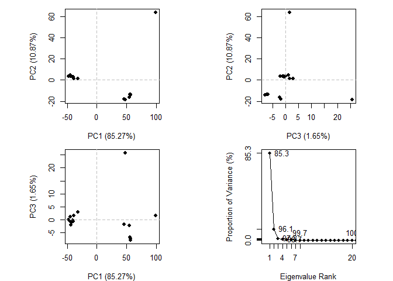
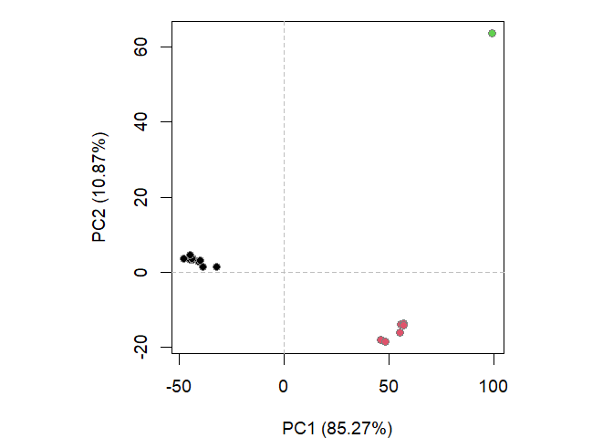
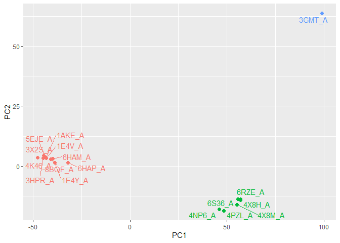

# Class10_Structure
Krysten Jones (A10553682)

We will start by using the protein data bank (PDB) website located at
https://www.rcsb.org/ and “Analyze” \> “PDB Statistics” \> “by
Experimental Method and Molecular Type”.

> Q1: What percentage of structures in the PDB are solved by X-Ray and
> Electron Microscopy.

X-Ray Structures: 84.8%

Electron Microscopy Structures: 8.33%

> Q2: What proportion of structures in the PDB are protein?

There are a total of 183,201 protein only structures in the database out
of a total of 211,377 which is about 86.7%

``` r
183201/211377
```

    [1] 0.8667026

> Q3: Type HIV in the PDB website search box on the home page and
> determine how many HIV-1 protease structures are in the current PDB?

Searching for HIV in the PDB website returns 7,280 protein structures.
When a protease subquery is added, 1,603 protein structures are found.

## Using Mol\*

Mol\* is an online web-based molecular viewer that can be found at
https://molstar.org/viewer/. Replace the default protein name next to
the “PDB ID” box on the left with your protein of interest then click
the `apply` button below. For us, this is 1hsg

You can turn off the Ligand and Water options by clicking the eye next
to the name to improve visualization of the protein polymer. Turn off
water, but leave ligand for now then hide the “stat-tree” for now by
clicking on it’s associated icon on the left to improve space.

Next change the display representation of the Ligand to Spacefill (a.k.a
VdW spheres) using the controls on the bottom right.

Ligand -\> “…” –\> Add Representation -\> spacefill -\> “…”

Now edit the polymer itself

Polymer” -\> “Set Coloring” -\> “Residue Property” -\> “Secondary
Structure”

Now take an image by clicking the shutter button on the middle right and
download it. The image will be “1HSG.png” by default.

Click on the ligand and it will zoom in and display a sequence. Find Asp
25 (D25) and click on it, it should highlight while your mouse is over
it.

To simplify, on the right panel, hide the ligand view by clicking the
eye button.

Click on the arrow button on the mid right panel (below the camera
shutter button) then select Asp 25 (D25) from the sequence at the top.
This will highlight your sequence of interest.

cube icon (blue box in below figure) and from the drop-down menu that
appears select Representation Spacefill or Ball & Stick (whatever you
prefer), then click +Create Component.

If you mess up, you can go to the bottom right panel and delete or alter
your custom selection.

Download another image

> Q4: Water molecules normally have 3 atoms. Why do we see just one atom
> per water molecule in this structure?

It is likely just showing us the larger oxygen atom (ususlly placed at
the center of the H2O molecule) to allow for better visualization
(otherwise water would be in the way).

> Q5: There is a critical “conserved” water molecule in the binding
> site. Can you identify this water molecule? What residue number does
> this water molecule have?

Water molecule 308 is at the center of the protein near where the ligand
is bound and is a critical “conserved” water molecule in the binding
site. Another drug that mimicked its function was found to be 3000x more
effective.

> Q6: Generate and save a figure clearly showing the two distinct chains
> of HIV-protease along with the ligand. You might also consider showing
> the catalytic residues ASP 25 in each chain and the critical water (we
> recommend “Ball & Stick” for these side-chains). Add this figure to
> your Quarto document.

### 1HSG

# Introduction to Bio 3D in R

First as always, load the package and file of interest

``` r
library(bio3d)
pdb <- read.pdb("1hsg")
```

      Note: Accessing on-line PDB file

``` r
pdb
```


     Call:  read.pdb(file = "1hsg")

       Total Models#: 1
         Total Atoms#: 1686,  XYZs#: 5058  Chains#: 2  (values: A B)

         Protein Atoms#: 1514  (residues/Calpha atoms#: 198)
         Nucleic acid Atoms#: 0  (residues/phosphate atoms#: 0)

         Non-protein/nucleic Atoms#: 172  (residues: 128)
         Non-protein/nucleic resid values: [ HOH (127), MK1 (1) ]

       Protein sequence:
          PQITLWQRPLVTIKIGGQLKEALLDTGADDTVLEEMSLPGRWKPKMIGGIGGFIKVRQYD
          QILIEICGHKAIGTVLVGPTPVNIIGRNLLTQIGCTLNFPQITLWQRPLVTIKIGGQLKE
          ALLDTGADDTVLEEMSLPGRWKPKMIGGIGGFIKVRQYDQILIEICGHKAIGTVLVGPTP
          VNIIGRNLLTQIGCTLNF

    + attr: atom, xyz, seqres, helix, sheet,
            calpha, remark, call

> Q7: How many amino acid residues are there in this pdb object?

198

> Q8: Name one of the two non-protein residues?

HOH

> Q9: How many protein chains are in this structure?

2

Lets look at some attributes, we can call a specific section like atom
as well

``` r
attributes(pdb)
```

    $names
    [1] "atom"   "xyz"    "seqres" "helix"  "sheet"  "calpha" "remark" "call"  

    $class
    [1] "pdb" "sse"

``` r
head(pdb$atom)
```

      type eleno elety  alt resid chain resno insert      x      y     z o     b
    1 ATOM     1     N <NA>   PRO     A     1   <NA> 29.361 39.686 5.862 1 38.10
    2 ATOM     2    CA <NA>   PRO     A     1   <NA> 30.307 38.663 5.319 1 40.62
    3 ATOM     3     C <NA>   PRO     A     1   <NA> 29.760 38.071 4.022 1 42.64
    4 ATOM     4     O <NA>   PRO     A     1   <NA> 28.600 38.302 3.676 1 43.40
    5 ATOM     5    CB <NA>   PRO     A     1   <NA> 30.508 37.541 6.342 1 37.87
    6 ATOM     6    CG <NA>   PRO     A     1   <NA> 29.296 37.591 7.162 1 38.40
      segid elesy charge
    1  <NA>     N   <NA>
    2  <NA>     C   <NA>
    3  <NA>     C   <NA>
    4  <NA>     O   <NA>
    5  <NA>     C   <NA>
    6  <NA>     C   <NA>

Lets try a different file

``` r
adk <- read.pdb("6s36")
```

      Note: Accessing on-line PDB file
       PDB has ALT records, taking A only, rm.alt=TRUE

``` r
adk
```


     Call:  read.pdb(file = "6s36")

       Total Models#: 1
         Total Atoms#: 1898,  XYZs#: 5694  Chains#: 1  (values: A)

         Protein Atoms#: 1654  (residues/Calpha atoms#: 214)
         Nucleic acid Atoms#: 0  (residues/phosphate atoms#: 0)

         Non-protein/nucleic Atoms#: 244  (residues: 244)
         Non-protein/nucleic resid values: [ CL (3), HOH (238), MG (2), NA (1) ]

       Protein sequence:
          MRIILLGAPGAGKGTQAQFIMEKYGIPQISTGDMLRAAVKSGSELGKQAKDIMDAGKLVT
          DELVIALVKERIAQEDCRNGFLLDGFPRTIPQADAMKEAGINVDYVLEFDVPDELIVDKI
          VGRRVHAPSGRVYHVKFNPPKVEGKDDVTGEELTTRKDDQEETVRKRLVEYHQMTAPLIG
          YYSKEAEAGNTKYAKVDGTKPVAEVRADLEKILG

    + attr: atom, xyz, seqres, helix, sheet,
            calpha, remark, call

Normal mode analysis (NMA) is a structural bioinformatics method to
predict protein flexibility and potential functional motions (a.k.a.
conformational changes).

``` r
m <- nma(adk)
```

     Building Hessian...        Done in 0.02 seconds.
     Diagonalizing Hessian...   Done in 0.29 seconds.

``` r
plot(m)
```


``` r
mktrj(m, file="adk_m7.pdb")
```

load the resulting “adk_m7.pdb” PDB into Mol\* with the “Open Files”
option on the right side control panel. Once loaded click the “play”
button to see a movie (see image below)

# Comparative Structural Analysis (11.08.2023)

Perform principal component analysis (PCA) on the complete collection of
Adenylate kinase structures in the protein data-bank (PDB).

Starting from only one Adk PDB identifier (PDB ID: 1AKE) we will search
the entire PDB for related structures using BLAST, fetch, align and
superpose the identified structures, perform PCA and finally calculate
the normal modes of each individual structure in order to probe for
potential differences in structural flexibility

If you haven’t already, install the following packages in your consul
using the following commands install.packages(“bio3d”)
install.packages(“devtools”) install.packages(“BiocManager”)

BiocManager::install(“msa”)
devtools::install_bitbucket(“Grantlab/bio3d-view”)

> Q10. Which of the packages above is found only on BioConductor and not
> CRAN?

msa

> Q11. Which of the above packages is not found on BioConductor or
> CRAN?:

Grantlab/bio3d-view

> Q12. True or False? Functions from the devtools package can be used to
> install packages from GitHub and BitBucket?

TRUE

Get structures of interest

``` r
library(bio3d)
aa <- get.seq("1ake_A")
```

    Warning in get.seq("1ake_A"): Removing existing file: seqs.fasta

    Fetching... Please wait. Done.

``` r
aa
```

                 1        .         .         .         .         .         60 
    pdb|1AKE|A   MRIILLGAPGAGKGTQAQFIMEKYGIPQISTGDMLRAAVKSGSELGKQAKDIMDAGKLVT
                 1        .         .         .         .         .         60 

                61        .         .         .         .         .         120 
    pdb|1AKE|A   DELVIALVKERIAQEDCRNGFLLDGFPRTIPQADAMKEAGINVDYVLEFDVPDELIVDRI
                61        .         .         .         .         .         120 

               121        .         .         .         .         .         180 
    pdb|1AKE|A   VGRRVHAPSGRVYHVKFNPPKVEGKDDVTGEELTTRKDDQEETVRKRLVEYHQMTAPLIG
               121        .         .         .         .         .         180 

               181        .         .         .   214 
    pdb|1AKE|A   YYSKEAEAGNTKYAKVDGTKPVAEVRADLEKILG
               181        .         .         .   214 

    Call:
      read.fasta(file = outfile)

    Class:
      fasta

    Alignment dimensions:
      1 sequence rows; 214 position columns (214 non-gap, 0 gap) 

    + attr: id, ali, call

> Q13. How many amino acids are in this sequence, i.e. how long is this
> sequence?

214

I want to now search for all related structures in the database

``` r
# Blast or hmmer search 
b <- blast.pdb(aa)
# Plot a summary of search results
hits <- plot(b)
# List out some 'top hits'
head(hits$pdb.id)
# save this so we don't need to run blast every time
save(hits, b, file = "blast_results.Rds")
```

Side note: lets see if our results saved thus far so we don’t need to
run blast each time (or when we render)

``` r
load("blast_results.Rds")
hits
```

    $hits
       pdb.id   acc      group
    1  "1AKE_A" "1AKE_A" "1"  
    2  "8BQF_A" "8BQF_A" "1"  
    3  "4X8M_A" "4X8M_A" "1"  
    4  "6S36_A" "6S36_A" "1"  
    5  "6RZE_A" "6RZE_A" "1"  
    6  "4X8H_A" "4X8H_A" "1"  
    7  "3HPR_A" "3HPR_A" "1"  
    8  "1E4V_A" "1E4V_A" "1"  
    9  "5EJE_A" "5EJE_A" "1"  
    10 "1E4Y_A" "1E4Y_A" "1"  
    11 "3X2S_A" "3X2S_A" "1"  
    12 "6HAP_A" "6HAP_A" "1"  
    13 "6HAM_A" "6HAM_A" "1"  
    14 "4K46_A" "4K46_A" "1"  
    15 "4NP6_A" "4NP6_A" "1"  
    16 "3GMT_A" "3GMT_A" "1"  
    17 "4PZL_A" "4PZL_A" "1"  

    $pdb.id
     [1] "1AKE_A" "8BQF_A" "4X8M_A" "6S36_A" "6RZE_A" "4X8H_A" "3HPR_A" "1E4V_A"
     [9] "5EJE_A" "1E4Y_A" "3X2S_A" "6HAP_A" "6HAM_A" "4K46_A" "4NP6_A" "3GMT_A"
    [17] "4PZL_A"

    $acc
     [1] "1AKE_A" "8BQF_A" "4X8M_A" "6S36_A" "6RZE_A" "4X8H_A" "3HPR_A" "1E4V_A"
     [9] "5EJE_A" "1E4Y_A" "3X2S_A" "6HAP_A" "6HAM_A" "4K46_A" "4NP6_A" "3GMT_A"
    [17] "4PZL_A"

    $inds
     [1]  TRUE  TRUE  TRUE  TRUE  TRUE  TRUE  TRUE  TRUE  TRUE  TRUE  TRUE  TRUE
    [13]  TRUE  TRUE  TRUE  TRUE  TRUE FALSE FALSE FALSE FALSE FALSE FALSE FALSE
    [25] FALSE FALSE FALSE FALSE FALSE FALSE FALSE FALSE FALSE FALSE FALSE FALSE
    [37] FALSE FALSE FALSE FALSE FALSE FALSE FALSE FALSE FALSE FALSE FALSE FALSE
    [49] FALSE FALSE FALSE FALSE FALSE FALSE FALSE FALSE FALSE FALSE FALSE FALSE
    [61] FALSE FALSE FALSE FALSE FALSE FALSE FALSE FALSE FALSE FALSE FALSE FALSE
    [73] FALSE FALSE FALSE FALSE FALSE FALSE FALSE FALSE FALSE FALSE FALSE

    attr(,"class")
    [1] "blast"

``` r
# Download releated PDB files
files <- get.pdb(hits$pdb.id, path="pdbs", split=TRUE, gzip=TRUE)
```

    Warning in get.pdb(hits$pdb.id, path = "pdbs", split = TRUE, gzip = TRUE):
    pdbs/1AKE.pdb exists. Skipping download

    Warning in get.pdb(hits$pdb.id, path = "pdbs", split = TRUE, gzip = TRUE):
    pdbs/8BQF.pdb exists. Skipping download

    Warning in get.pdb(hits$pdb.id, path = "pdbs", split = TRUE, gzip = TRUE):
    pdbs/4X8M.pdb exists. Skipping download

    Warning in get.pdb(hits$pdb.id, path = "pdbs", split = TRUE, gzip = TRUE):
    pdbs/6S36.pdb exists. Skipping download

    Warning in get.pdb(hits$pdb.id, path = "pdbs", split = TRUE, gzip = TRUE):
    pdbs/6RZE.pdb exists. Skipping download

    Warning in get.pdb(hits$pdb.id, path = "pdbs", split = TRUE, gzip = TRUE):
    pdbs/4X8H.pdb exists. Skipping download

    Warning in get.pdb(hits$pdb.id, path = "pdbs", split = TRUE, gzip = TRUE):
    pdbs/3HPR.pdb exists. Skipping download

    Warning in get.pdb(hits$pdb.id, path = "pdbs", split = TRUE, gzip = TRUE):
    pdbs/1E4V.pdb exists. Skipping download

    Warning in get.pdb(hits$pdb.id, path = "pdbs", split = TRUE, gzip = TRUE):
    pdbs/5EJE.pdb exists. Skipping download

    Warning in get.pdb(hits$pdb.id, path = "pdbs", split = TRUE, gzip = TRUE):
    pdbs/1E4Y.pdb exists. Skipping download

    Warning in get.pdb(hits$pdb.id, path = "pdbs", split = TRUE, gzip = TRUE):
    pdbs/3X2S.pdb exists. Skipping download

    Warning in get.pdb(hits$pdb.id, path = "pdbs", split = TRUE, gzip = TRUE):
    pdbs/6HAP.pdb exists. Skipping download

    Warning in get.pdb(hits$pdb.id, path = "pdbs", split = TRUE, gzip = TRUE):
    pdbs/6HAM.pdb exists. Skipping download

    Warning in get.pdb(hits$pdb.id, path = "pdbs", split = TRUE, gzip = TRUE):
    pdbs/4K46.pdb exists. Skipping download

    Warning in get.pdb(hits$pdb.id, path = "pdbs", split = TRUE, gzip = TRUE):
    pdbs/4NP6.pdb exists. Skipping download

    Warning in get.pdb(hits$pdb.id, path = "pdbs", split = TRUE, gzip = TRUE):
    pdbs/3GMT.pdb exists. Skipping download

    Warning in get.pdb(hits$pdb.id, path = "pdbs", split = TRUE, gzip = TRUE):
    pdbs/4PZL.pdb exists. Skipping download


      |                                                                            
      |                                                                      |   0%
      |                                                                            
      |====                                                                  |   6%
      |                                                                            
      |========                                                              |  12%
      |                                                                            
      |============                                                          |  18%
      |                                                                            
      |================                                                      |  24%
      |                                                                            
      |=====================                                                 |  29%
      |                                                                            
      |=========================                                             |  35%
      |                                                                            
      |=============================                                         |  41%
      |                                                                            
      |=================================                                     |  47%
      |                                                                            
      |=====================================                                 |  53%
      |                                                                            
      |=========================================                             |  59%
      |                                                                            
      |=============================================                         |  65%
      |                                                                            
      |=================================================                     |  71%
      |                                                                            
      |======================================================                |  76%
      |                                                                            
      |==========================================================            |  82%
      |                                                                            
      |==============================================================        |  88%
      |                                                                            
      |==================================================================    |  94%
      |                                                                            
      |======================================================================| 100%

``` r
# Align related PDBs
pdbs <- pdbaln(files, fit = TRUE, exefile="msa")
```

    Reading PDB files:
    pdbs/split_chain/1AKE_A.pdb
    pdbs/split_chain/8BQF_A.pdb
    pdbs/split_chain/4X8M_A.pdb
    pdbs/split_chain/6S36_A.pdb
    pdbs/split_chain/6RZE_A.pdb
    pdbs/split_chain/4X8H_A.pdb
    pdbs/split_chain/3HPR_A.pdb
    pdbs/split_chain/1E4V_A.pdb
    pdbs/split_chain/5EJE_A.pdb
    pdbs/split_chain/1E4Y_A.pdb
    pdbs/split_chain/3X2S_A.pdb
    pdbs/split_chain/6HAP_A.pdb
    pdbs/split_chain/6HAM_A.pdb
    pdbs/split_chain/4K46_A.pdb
    pdbs/split_chain/4NP6_A.pdb
    pdbs/split_chain/3GMT_A.pdb
    pdbs/split_chain/4PZL_A.pdb
       PDB has ALT records, taking A only, rm.alt=TRUE
    .   PDB has ALT records, taking A only, rm.alt=TRUE
    ..   PDB has ALT records, taking A only, rm.alt=TRUE
    .   PDB has ALT records, taking A only, rm.alt=TRUE
    ..   PDB has ALT records, taking A only, rm.alt=TRUE
    ..   PDB has ALT records, taking A only, rm.alt=TRUE
    ....   PDB has ALT records, taking A only, rm.alt=TRUE
    .   PDB has ALT records, taking A only, rm.alt=TRUE
    ....

    Extracting sequences

    pdb/seq: 1   name: pdbs/split_chain/1AKE_A.pdb 
       PDB has ALT records, taking A only, rm.alt=TRUE
    pdb/seq: 2   name: pdbs/split_chain/8BQF_A.pdb 
       PDB has ALT records, taking A only, rm.alt=TRUE
    pdb/seq: 3   name: pdbs/split_chain/4X8M_A.pdb 
    pdb/seq: 4   name: pdbs/split_chain/6S36_A.pdb 
       PDB has ALT records, taking A only, rm.alt=TRUE
    pdb/seq: 5   name: pdbs/split_chain/6RZE_A.pdb 
       PDB has ALT records, taking A only, rm.alt=TRUE
    pdb/seq: 6   name: pdbs/split_chain/4X8H_A.pdb 
    pdb/seq: 7   name: pdbs/split_chain/3HPR_A.pdb 
       PDB has ALT records, taking A only, rm.alt=TRUE
    pdb/seq: 8   name: pdbs/split_chain/1E4V_A.pdb 
    pdb/seq: 9   name: pdbs/split_chain/5EJE_A.pdb 
       PDB has ALT records, taking A only, rm.alt=TRUE
    pdb/seq: 10   name: pdbs/split_chain/1E4Y_A.pdb 
    pdb/seq: 11   name: pdbs/split_chain/3X2S_A.pdb 
    pdb/seq: 12   name: pdbs/split_chain/6HAP_A.pdb 
    pdb/seq: 13   name: pdbs/split_chain/6HAM_A.pdb 
       PDB has ALT records, taking A only, rm.alt=TRUE
    pdb/seq: 14   name: pdbs/split_chain/4K46_A.pdb 
       PDB has ALT records, taking A only, rm.alt=TRUE
    pdb/seq: 15   name: pdbs/split_chain/4NP6_A.pdb 
    pdb/seq: 16   name: pdbs/split_chain/3GMT_A.pdb 
    pdb/seq: 17   name: pdbs/split_chain/4PZL_A.pdb 

``` r
# Vector containing PDB codes for figure axis
ids <- basename.pdb(pdbs$id)

# Draw schematic alignment
#plot(pdbs, labels=ids)
# this is giving me a figure margins too large error when trying to render
```

The function pdb.annotate() provides a convenient way of annotating the
PDB files we have collected. Below we use the function to annotate each
structure to its source species. This will come in handy when annotating
plots later on

``` r
anno <- pdb.annotate(ids)
unique(anno$source)
```

    [1] "Escherichia coli"                                
    [2] "Escherichia coli K-12"                           
    [3] "Escherichia coli O139:H28 str. E24377A"          
    [4] "Escherichia coli str. K-12 substr. MDS42"        
    [5] "Photobacterium profundum"                        
    [6] "Vibrio cholerae O1 biovar El Tor str. N16961"    
    [7] "Burkholderia pseudomallei 1710b"                 
    [8] "Francisella tularensis subsp. tularensis SCHU S4"

``` r
anno
```

           structureId chainId macromoleculeType chainLength experimentalTechnique
    1AKE_A        1AKE       A           Protein         214                 X-ray
    8BQF_A        8BQF       A           Protein         234                 X-ray
    4X8M_A        4X8M       A           Protein         214                 X-ray
    6S36_A        6S36       A           Protein         214                 X-ray
    6RZE_A        6RZE       A           Protein         214                 X-ray
    4X8H_A        4X8H       A           Protein         214                 X-ray
    3HPR_A        3HPR       A           Protein         214                 X-ray
    1E4V_A        1E4V       A           Protein         214                 X-ray
    5EJE_A        5EJE       A           Protein         214                 X-ray
    1E4Y_A        1E4Y       A           Protein         214                 X-ray
    3X2S_A        3X2S       A           Protein         214                 X-ray
    6HAP_A        6HAP       A           Protein         214                 X-ray
    6HAM_A        6HAM       A           Protein         214                 X-ray
    4K46_A        4K46       A           Protein         214                 X-ray
    4NP6_A        4NP6       A           Protein         217                 X-ray
    3GMT_A        3GMT       A           Protein         230                 X-ray
    4PZL_A        4PZL       A           Protein         242                 X-ray
           resolution       scopDomain                                        pfam
    1AKE_A      2.000 Adenylate kinase                      Adenylate kinase (ADK)
    8BQF_A      2.050             <NA>                      Adenylate kinase (ADK)
    4X8M_A      2.600             <NA>                      Adenylate kinase (ADK)
    6S36_A      1.600             <NA>                      Adenylate kinase (ADK)
    6RZE_A      1.690             <NA> Adenylate kinase, active site lid (ADK_lid)
    4X8H_A      2.500             <NA>                      Adenylate kinase (ADK)
    3HPR_A      2.000             <NA>                      Adenylate kinase (ADK)
    1E4V_A      1.850 Adenylate kinase Adenylate kinase, active site lid (ADK_lid)
    5EJE_A      1.900             <NA> Adenylate kinase, active site lid (ADK_lid)
    1E4Y_A      1.850 Adenylate kinase Adenylate kinase, active site lid (ADK_lid)
    3X2S_A      2.800             <NA>                      Adenylate kinase (ADK)
    6HAP_A      2.700             <NA> Adenylate kinase, active site lid (ADK_lid)
    6HAM_A      2.550             <NA> Adenylate kinase, active site lid (ADK_lid)
    4K46_A      2.010             <NA>                      Adenylate kinase (ADK)
    4NP6_A      2.004             <NA>                      Adenylate kinase (ADK)
    3GMT_A      2.100             <NA>                      Adenylate kinase (ADK)
    4PZL_A      2.100             <NA>                      Adenylate kinase (ADK)
                   ligandId
    1AKE_A              AP5
    8BQF_A              AP5
    4X8M_A             <NA>
    6S36_A CL (3),NA,MG (2)
    6RZE_A    NA (3),CL (2)
    4X8H_A             <NA>
    3HPR_A              AP5
    1E4V_A              AP5
    5EJE_A           AP5,CO
    1E4Y_A              AP5
    3X2S_A   JPY (2),AP5,MG
    6HAP_A              AP5
    6HAM_A              AP5
    4K46_A      ADP,AMP,PO4
    4NP6_A             <NA>
    3GMT_A          SO4 (2)
    4PZL_A       CA,FMT,GOL
                                                                                 ligandName
    1AKE_A                                                 BIS(ADENOSINE)-5'-PENTAPHOSPHATE
    8BQF_A                                                 BIS(ADENOSINE)-5'-PENTAPHOSPHATE
    4X8M_A                                                                             <NA>
    6S36_A                                    CHLORIDE ION (3),SODIUM ION,MAGNESIUM ION (2)
    6RZE_A                                                  SODIUM ION (3),CHLORIDE ION (2)
    4X8H_A                                                                             <NA>
    3HPR_A                                                 BIS(ADENOSINE)-5'-PENTAPHOSPHATE
    1E4V_A                                                 BIS(ADENOSINE)-5'-PENTAPHOSPHATE
    5EJE_A                                 BIS(ADENOSINE)-5'-PENTAPHOSPHATE,COBALT (II) ION
    1E4Y_A                                                 BIS(ADENOSINE)-5'-PENTAPHOSPHATE
    3X2S_A N-(pyren-1-ylmethyl)acetamide (2),BIS(ADENOSINE)-5'-PENTAPHOSPHATE,MAGNESIUM ION
    6HAP_A                                                 BIS(ADENOSINE)-5'-PENTAPHOSPHATE
    6HAM_A                                                 BIS(ADENOSINE)-5'-PENTAPHOSPHATE
    4K46_A                   ADENOSINE-5'-DIPHOSPHATE,ADENOSINE MONOPHOSPHATE,PHOSPHATE ION
    4NP6_A                                                                             <NA>
    3GMT_A                                                                  SULFATE ION (2)
    4PZL_A                                                 CALCIUM ION,FORMIC ACID,GLYCEROL
                                                     source
    1AKE_A                                 Escherichia coli
    8BQF_A                                 Escherichia coli
    4X8M_A                                 Escherichia coli
    6S36_A                                 Escherichia coli
    6RZE_A                                 Escherichia coli
    4X8H_A                                 Escherichia coli
    3HPR_A                            Escherichia coli K-12
    1E4V_A                                 Escherichia coli
    5EJE_A           Escherichia coli O139:H28 str. E24377A
    1E4Y_A                                 Escherichia coli
    3X2S_A         Escherichia coli str. K-12 substr. MDS42
    6HAP_A           Escherichia coli O139:H28 str. E24377A
    6HAM_A                            Escherichia coli K-12
    4K46_A                         Photobacterium profundum
    4NP6_A     Vibrio cholerae O1 biovar El Tor str. N16961
    3GMT_A                  Burkholderia pseudomallei 1710b
    4PZL_A Francisella tularensis subsp. tularensis SCHU S4
                                                                                                                                                                         structureTitle
    1AKE_A STRUCTURE OF THE COMPLEX BETWEEN ADENYLATE KINASE FROM ESCHERICHIA COLI AND THE INHIBITOR AP5A REFINED AT 1.9 ANGSTROMS RESOLUTION: A MODEL FOR A CATALYTIC TRANSITION STATE
    8BQF_A                                                                                                                                                Adenylate Kinase L107I MUTANT
    4X8M_A                                                                                                                   Crystal structure of E. coli Adenylate kinase Y171W mutant
    6S36_A                                                                                                                   Crystal structure of E. coli Adenylate kinase R119K mutant
    6RZE_A                                                                                                                   Crystal structure of E. coli Adenylate kinase R119A mutant
    4X8H_A                                                                                                                   Crystal structure of E. coli Adenylate kinase P177A mutant
    3HPR_A                                                                                               Crystal structure of V148G adenylate kinase from E. coli, in complex with Ap5A
    1E4V_A                                                                                                       Mutant G10V of adenylate kinase from E. coli, modified in the Gly-loop
    5EJE_A                                                                                  Crystal structure of E. coli Adenylate kinase G56C/T163C double mutant in complex with Ap5a
    1E4Y_A                                                                                                        Mutant P9L of adenylate kinase from E. coli, modified in the Gly-loop
    3X2S_A                                                                                                                      Crystal structure of pyrene-conjugated adenylate kinase
    6HAP_A                                                                                                                                                             Adenylate kinase
    6HAM_A                                                                                                                                                             Adenylate kinase
    4K46_A                                                                                                          Crystal Structure of Adenylate Kinase from Photobacterium profundum
    4NP6_A                                                                                                   Crystal Structure of Adenylate Kinase from Vibrio cholerae O1 biovar eltor
    3GMT_A                                                                                                         Crystal structure of adenylate kinase from burkholderia pseudomallei
    4PZL_A                                                                              The crystal structure of adenylate kinase from Francisella tularensis subsp. tularensis SCHU S4
                                                         citation rObserved   rFree
    1AKE_A                 Muller, C.W., et al. J Mol Biol (1992)   0.19600      NA
    8BQF_A   Scheerer, D., et al. Proc Natl Acad Sci U S A (2023)   0.22073 0.25789
    4X8M_A                Kovermann, M., et al. Nat Commun (2015)   0.24910 0.30890
    6S36_A                  Rogne, P., et al. Biochemistry (2019)   0.16320 0.23560
    6RZE_A                  Rogne, P., et al. Biochemistry (2019)   0.18650 0.23500
    4X8H_A                Kovermann, M., et al. Nat Commun (2015)   0.19610 0.28950
    3HPR_A  Schrank, T.P., et al. Proc Natl Acad Sci U S A (2009)   0.21000 0.24320
    1E4V_A                   Muller, C.W., et al. Proteins (1993)   0.19600      NA
    5EJE_A  Kovermann, M., et al. Proc Natl Acad Sci U S A (2017)   0.18890 0.23580
    1E4Y_A                   Muller, C.W., et al. Proteins (1993)   0.17800      NA
    3X2S_A                Fujii, A., et al. Bioconjug Chem (2015)   0.20700 0.25600
    6HAP_A               Kantaev, R., et al. J Phys Chem B (2018)   0.22630 0.27760
    6HAM_A               Kantaev, R., et al. J Phys Chem B (2018)   0.20511 0.24325
    4K46_A                    Cho, Y.-J., et al. To be published    0.17000 0.22290
    4NP6_A                       Kim, Y., et al. To be published    0.18800 0.22200
    3GMT_A Buchko, G.W., et al. Biochem Biophys Res Commun (2010)   0.23800 0.29500
    4PZL_A                       Tan, K., et al. To be published    0.19360 0.23680
             rWork spaceGroup
    1AKE_A 0.19600  P 21 2 21
    8BQF_A 0.21882  P 2 21 21
    4X8M_A 0.24630    C 1 2 1
    6S36_A 0.15940    C 1 2 1
    6RZE_A 0.18190    C 1 2 1
    4X8H_A 0.19140    C 1 2 1
    3HPR_A 0.20620  P 21 21 2
    1E4V_A 0.19600  P 21 2 21
    5EJE_A 0.18630  P 21 2 21
    1E4Y_A 0.17800   P 1 21 1
    3X2S_A 0.20700 P 21 21 21
    6HAP_A 0.22370    I 2 2 2
    6HAM_A 0.20311       P 43
    4K46_A 0.16730 P 21 21 21
    4NP6_A 0.18600       P 43
    3GMT_A 0.23500   P 1 21 1
    4PZL_A 0.19130       P 32

PCA

``` r
library(bio3d)
# Perform PCA
pc.xray <- pca(pdbs)
plot(pc.xray)
```



``` r
# Calculate RMSD
rd <- rmsd(pdbs)
```

    Warning in rmsd(pdbs): No indices provided, using the 199 non NA positions

``` r
# Structure-based clustering
hc.rd <- hclust(dist(rd))
grps.rd <- cutree(hc.rd, k=3)

plot(pc.xray, 1:2, col="grey50", bg=grps.rd, pch=21, cex=1)
```



Figure 10: Projection of Adenylate kinase X-ray structures. Each dot
represents one PDB structure.

The plot shows a conformer plot – a low-dimensional representation of
the conformational variability within the ensemble of PDB structures.
The plot is obtained by projecting the individual structures onto two
selected PCs (e.g. PC-1 and PC-2). These projections display the
inter-conformer relationship in terms of the conformational differences
described by the selected PCs.

``` r
mktrj(pc.xray, file = "pca_results.pdb")
```

Plotting with ggplot

``` r
#Plotting results with ggplot2
library(ggplot2)
library(ggrepel)

df <- data.frame(PC1=pc.xray$z[,1], 
                 PC2=pc.xray$z[,2], 
                 col=as.factor(grps.rd),
                 ids=ids)

p <- ggplot(df) + 
  aes(PC1, PC2, col=col, label=ids) +
  geom_point(size=2) +
  geom_text_repel(max.overlaps = 20) +
  theme(legend.position = "none")
p
```


