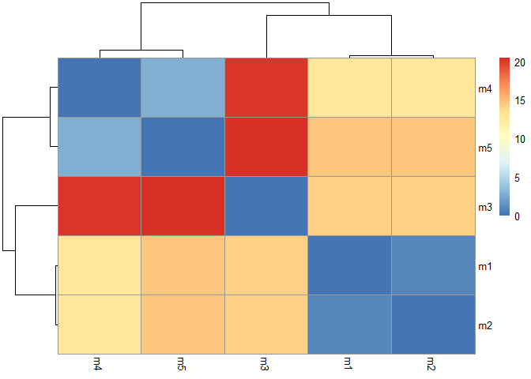
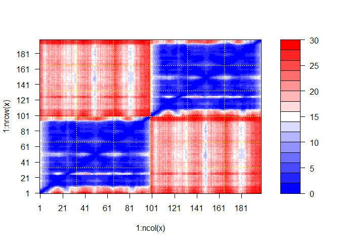
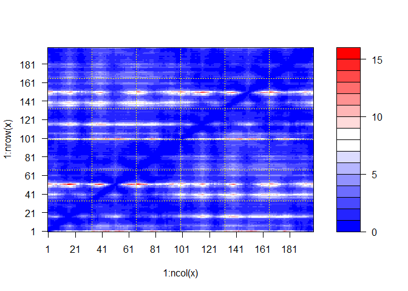

# Class11_Alphafold2
Krysten Jones (A10553682)

# The EBI AlphaFold database

Using alphafold https://alphafold.ebi.ac.uk/ you can search for your
protein sequence by just entering it into the search bar. It is based on
the Uniprot database

For the 3D viewer (which is molstar) values \>70 is considered good, and
below is bad. Areas of low confidence might be “intrinsically disordered
regions”, but this is circumstantial evidence and may not be correct.

Predicted aligned error (PAE): dark green is good, light green is not so
much. This is a distance matrix where the closer to the center line, the
closer those two aminoacids are in sequence proximity. Areas that aren’t
close to the line, but are highly associated means that they are close
in proximity based on folding.

# Generating Your Own Structure Predictions

https://github.com/sokrypton/ColabFold Scroll down, use the mmseq2
notebook. Not quite as sensitive as HMMER, but is faster. Open the
notebook, click connect on the top right to connect the a google GPU
node. 2) Paste in your query sequence (no spaces) if you want to do two
chains put “:” between the two sequences. So for us which is a
homodimer, post it again. 2) Change other aspects of interest - template
mode = if you need a protein template, usually you can leave it off
(will take a lot longer to turn on) -num_recycles:the higher this
number, the longer it will take to run and the more accurate (kinda like
iterations) 3) Click on “Runtime” at the top and then “run all” 4)
download your file and move it to your project folder

# Using Molstar

1)  Upload your pdb model using molstar

- left column, upload file

2)  upload all of them
3)  select the different chains and superimpose
4)  go to the right side bar click “components” –\> “polymer” –\> “atom
    property” –\> “uncertainty/disorder”

# Looking at it in R

here we post process and inspect our modeling results from
AlphaFold2(AF) My results from AF live in the folder/directory
`HIVPR_Dimer_23119`

``` r
results_dir <- "HIVPR_Dimer_23119"
# pattern = has this in the name
# full.names = return the complete path
pdb_files <- list.files(results_dir, pattern =".pdb", full.names = TRUE)
```

First we need to align and superimpose these PDB files using `pdbaln()`
function

``` r
library(bio3d)
pdbs <- pdbaln(pdb_files, fit = TRUE, exefile = "msa")
```

    Reading PDB files:
    HIVPR_Dimer_23119/HIVPR_Dimer_23119_unrelaxed_rank_001_alphafold2_multimer_v3_model_1_seed_000.pdb
    HIVPR_Dimer_23119/HIVPR_Dimer_23119_unrelaxed_rank_002_alphafold2_multimer_v3_model_5_seed_000.pdb
    HIVPR_Dimer_23119/HIVPR_Dimer_23119_unrelaxed_rank_003_alphafold2_multimer_v3_model_4_seed_000.pdb
    HIVPR_Dimer_23119/HIVPR_Dimer_23119_unrelaxed_rank_004_alphafold2_multimer_v3_model_2_seed_000.pdb
    HIVPR_Dimer_23119/HIVPR_Dimer_23119_unrelaxed_rank_005_alphafold2_multimer_v3_model_3_seed_000.pdb
    .....

    Extracting sequences

    pdb/seq: 1   name: HIVPR_Dimer_23119/HIVPR_Dimer_23119_unrelaxed_rank_001_alphafold2_multimer_v3_model_1_seed_000.pdb 
    pdb/seq: 2   name: HIVPR_Dimer_23119/HIVPR_Dimer_23119_unrelaxed_rank_002_alphafold2_multimer_v3_model_5_seed_000.pdb 
    pdb/seq: 3   name: HIVPR_Dimer_23119/HIVPR_Dimer_23119_unrelaxed_rank_003_alphafold2_multimer_v3_model_4_seed_000.pdb 
    pdb/seq: 4   name: HIVPR_Dimer_23119/HIVPR_Dimer_23119_unrelaxed_rank_004_alphafold2_multimer_v3_model_2_seed_000.pdb 
    pdb/seq: 5   name: HIVPR_Dimer_23119/HIVPR_Dimer_23119_unrelaxed_rank_005_alphafold2_multimer_v3_model_3_seed_000.pdb 

## The RMSD matrix

A common measure of structural dissimilarity called root mean square
distance (RMSD). The smaller it is, the closer two things are together

``` r
library(pheatmap)
rd <- rmsd(pdbs)
```

    Warning in rmsd(pdbs): No indices provided, using the 198 non NA positions

``` r
# these just change the column and row names to m1-5 to take up less space.
rownames(rd) <- paste0("m", 1:5)
colnames(rd) <- paste0("m", 1:5)
rd
```

           m1     m2     m3     m4     m5
    m1  0.000  0.899 14.228 12.825 14.689
    m2  0.899  0.000 14.278 12.674 14.540
    m3 14.228 14.278  0.000 20.099 20.431
    m4 12.825 12.674 20.099  0.000  2.815
    m5 14.689 14.540 20.431  2.815  0.000

``` r
pheatmap(rd)
```



The dendrogram shows which ones are closer together (so m1 and m2 are
close to each other), then next m3, then m4 and m5 are close to each
other.

Lets view these in molstar again, here we want the fitted coordinates

``` r
# what this does is superimpose the parts that are exactly identical you can now look at this in molstar
xyz <- pdbfit(pdbs, outpath = "fitted")
```

A full atom based fitting or superimposition did not work very well
because we have multiple chains that are in different conformations.

I want to focus the superimposition on the most invariant part (the
rigid “core” if you will)

``` r
library(bio3d)
# this will go through and sequentially discards parts that are the most variable
core <- core.find(pdbs)
```

     core size 197 of 198  vol = 6154.839 
     core size 196 of 198  vol = 5399.676 
     core size 195 of 198  vol = 5074.795 
     core size 194 of 198  vol = 4802.518 
     core size 193 of 198  vol = 4520.256 
     core size 192 of 198  vol = 4305.362 
     core size 191 of 198  vol = 4089.792 
     core size 190 of 198  vol = 3886.145 
     core size 189 of 198  vol = 3758.321 
     core size 188 of 198  vol = 3620.18 
     core size 187 of 198  vol = 3496.698 
     core size 186 of 198  vol = 3389.985 
     core size 185 of 198  vol = 3320.114 
     core size 184 of 198  vol = 3258.683 
     core size 183 of 198  vol = 3208.591 
     core size 182 of 198  vol = 3156.736 
     core size 181 of 198  vol = 3141.668 
     core size 180 of 198  vol = 3136.574 
     core size 179 of 198  vol = 3155.52 
     core size 178 of 198  vol = 3185.362 
     core size 177 of 198  vol = 3204.487 
     core size 176 of 198  vol = 3211.978 
     core size 175 of 198  vol = 3234.993 
     core size 174 of 198  vol = 3244.062 
     core size 173 of 198  vol = 3237.845 
     core size 172 of 198  vol = 3218.77 
     core size 171 of 198  vol = 3180.743 
     core size 170 of 198  vol = 3130.369 
     core size 169 of 198  vol = 3067.881 
     core size 168 of 198  vol = 2989.546 
     core size 167 of 198  vol = 2928.272 
     core size 166 of 198  vol = 2851.193 
     core size 165 of 198  vol = 2780.877 
     core size 164 of 198  vol = 2708.433 
     core size 163 of 198  vol = 2636.516 
     core size 162 of 198  vol = 2563.25 
     core size 161 of 198  vol = 2478.024 
     core size 160 of 198  vol = 2404.793 
     core size 159 of 198  vol = 2330.997 
     core size 158 of 198  vol = 2250.477 
     core size 157 of 198  vol = 2159.432 
     core size 156 of 198  vol = 2070.759 
     core size 155 of 198  vol = 1983.579 
     core size 154 of 198  vol = 1917.913 
     core size 153 of 198  vol = 1842.556 
     core size 152 of 198  vol = 1775.398 
     core size 151 of 198  vol = 1695.133 
     core size 150 of 198  vol = 1632.173 
     core size 149 of 198  vol = 1570.391 
     core size 148 of 198  vol = 1497.238 
     core size 147 of 198  vol = 1434.802 
     core size 146 of 198  vol = 1367.706 
     core size 145 of 198  vol = 1302.596 
     core size 144 of 198  vol = 1251.985 
     core size 143 of 198  vol = 1207.976 
     core size 142 of 198  vol = 1167.112 
     core size 141 of 198  vol = 1118.27 
     core size 140 of 198  vol = 1081.664 
     core size 139 of 198  vol = 1029.75 
     core size 138 of 198  vol = 981.766 
     core size 137 of 198  vol = 944.446 
     core size 136 of 198  vol = 899.224 
     core size 135 of 198  vol = 859.402 
     core size 134 of 198  vol = 814.694 
     core size 133 of 198  vol = 771.862 
     core size 132 of 198  vol = 733.807 
     core size 131 of 198  vol = 702.053 
     core size 130 of 198  vol = 658.757 
     core size 129 of 198  vol = 622.574 
     core size 128 of 198  vol = 578.29 
     core size 127 of 198  vol = 543.07 
     core size 126 of 198  vol = 510.934 
     core size 125 of 198  vol = 481.595 
     core size 124 of 198  vol = 464.672 
     core size 123 of 198  vol = 451.721 
     core size 122 of 198  vol = 430.417 
     core size 121 of 198  vol = 409.141 
     core size 120 of 198  vol = 378.942 
     core size 119 of 198  vol = 348.325 
     core size 118 of 198  vol = 324.738 
     core size 117 of 198  vol = 312.394 
     core size 116 of 198  vol = 300.89 
     core size 115 of 198  vol = 279.976 
     core size 114 of 198  vol = 263.434 
     core size 113 of 198  vol = 250.263 
     core size 112 of 198  vol = 229.592 
     core size 111 of 198  vol = 209.929 
     core size 110 of 198  vol = 196.379 
     core size 109 of 198  vol = 180.628 
     core size 108 of 198  vol = 167.088 
     core size 107 of 198  vol = 155.875 
     core size 106 of 198  vol = 142.595 
     core size 105 of 198  vol = 128.924 
     core size 104 of 198  vol = 114.054 
     core size 103 of 198  vol = 100.936 
     core size 102 of 198  vol = 90.431 
     core size 101 of 198  vol = 81.972 
     core size 100 of 198  vol = 74.017 
     core size 99 of 198  vol = 66.855 
     core size 98 of 198  vol = 59.525 
     core size 97 of 198  vol = 52.263 
     core size 96 of 198  vol = 43.699 
     core size 95 of 198  vol = 35.813 
     core size 94 of 198  vol = 28.888 
     core size 93 of 198  vol = 20.692 
     core size 92 of 198  vol = 14.975 
     core size 91 of 198  vol = 9.146 
     core size 90 of 198  vol = 5.232 
     core size 89 of 198  vol = 3.53 
     core size 88 of 198  vol = 2.657 
     core size 87 of 198  vol = 1.998 
     core size 86 of 198  vol = 1.333 
     core size 85 of 198  vol = 1.141 
     core size 84 of 198  vol = 1.012 
     core size 83 of 198  vol = 0.891 
     core size 82 of 198  vol = 0.749 
     core size 81 of 198  vol = 0.618 
     core size 80 of 198  vol = 0.538 
     core size 79 of 198  vol = 0.479 
     FINISHED: Min vol ( 0.5 ) reached

``` r
core.inds <-core
# this will make a new direcetry called "corefit"
xyz <- pdbfit(pdbs, inds = core.inds, outpath="corefit")
```

How do you know which model is the best model? You would look at the PAE
(predicted aligned error) scores. Again, lower numbers are better.

These are contained in the JSON files. Lets first list all the JSON
files

``` r
pae_files <- list.files(results_dir, pattern = "0.json", full.names = TRUE)
pae_files
```

    [1] "HIVPR_Dimer_23119/HIVPR_Dimer_23119_scores_rank_001_alphafold2_multimer_v3_model_1_seed_000.json"
    [2] "HIVPR_Dimer_23119/HIVPR_Dimer_23119_scores_rank_002_alphafold2_multimer_v3_model_5_seed_000.json"
    [3] "HIVPR_Dimer_23119/HIVPR_Dimer_23119_scores_rank_003_alphafold2_multimer_v3_model_4_seed_000.json"
    [4] "HIVPR_Dimer_23119/HIVPR_Dimer_23119_scores_rank_004_alphafold2_multimer_v3_model_2_seed_000.json"
    [5] "HIVPR_Dimer_23119/HIVPR_Dimer_23119_scores_rank_005_alphafold2_multimer_v3_model_3_seed_000.json"

Just like before, lets read in our files (this is why you need the file
path)

``` r
library(jsonlite)
pae1 <- read_json(pae_files[1], simplifyVector = TRUE)
attributes(pae1)
```

    $names
    [1] "plddt"   "max_pae" "pae"     "ptm"     "iptm"   

``` r
pae1$max_pae
```

    [1] 15.54688

Similarly we can do the 5th one

``` r
pae5 <- read_json(pae_files[5], simplifyVector = TRUE)
attributes(pae5)
```

    $names
    [1] "plddt"   "max_pae" "pae"     "ptm"     "iptm"   

``` r
pae5$max_pae
```

    [1] 29.29688

You can see that the max pae for model 5 is almost twice that of
model 1. So model 1 is the better model

Visualizing is another good way to look at this. You can see there is
much more blue in model 1 than in model 5. For model 5, it means that
there is high error in the second chain (which starts around residue 90)
which is red, and low error in the first chain (which is blue).

``` r
plot.dmat(pae5$pae)
```



``` r
plot.dmat(pae1$pae)
```



# main points

We can run Alphafold2 to predict a structure of a protein
