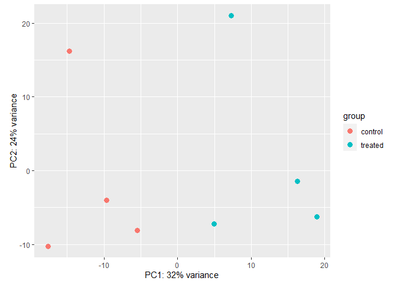
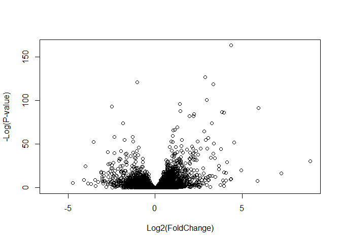
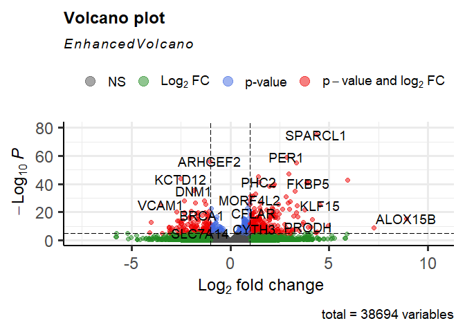
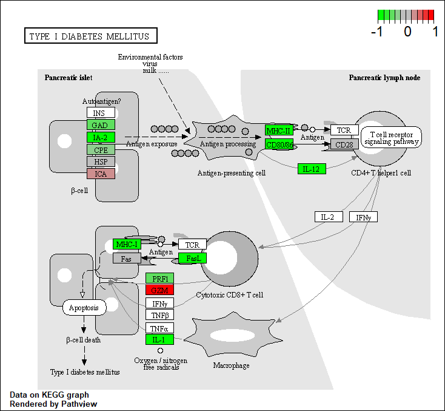

# Class13_DEseq2_RNAseq
Krysten Jones (A10553682)

# Analyzing Effects of Dexamethasone on Asthma

As always, we first need to install our packages of interest. We’ll be
using DEseq2 which is hosted on bioconductor. So first we need to
install BiocManager if we haven’t already using
`install.packages("BiocManager")` in the consul. Then use BiocManager to
install DEseq2 with the command `BiocManager::install("DESeq2")` once
again in the consul. As always, don’t install anything in the quarto
document. If it asks you to update some other packages, tell it to
intall none (n). If you change your mind later, you can reinstall it
with the argument `force=TRUE`.

``` r
#load your package
library('DESeq2')
library(ggplot2)
```

You’ll see a lot of things that are masked, this means that the old
function is being overwritten with a new one. If you wanted to use the
old version, you will have to call the package using
`package:package_name:command_name` for example
`package:MatrixGenerics:rowMedians`

When you render your report it will include all of these masks by
default. If you don’t want that you can turn it off. To edit a whole
code chunk use `#|` before a command so in this case `#|message:false`.
You can do the same with the warning messages if you’d like to turn it
off you can use `#| warning: false`. You can also do other things
including telling it to not run the code chunk at all using
`#| eval: false`.

## Importing Data

Download the files from online and move them into your project folder.
Then call them using the below commands.

``` r
counts <- read.csv("airway_scaledcounts.csv", row.names=1)
metadata <-  read.csv("airway_metadata.csv")
```

lets look at the structure now

``` r
head(counts)
```

                    SRR1039508 SRR1039509 SRR1039512 SRR1039513 SRR1039516
    ENSG00000000003        723        486        904        445       1170
    ENSG00000000005          0          0          0          0          0
    ENSG00000000419        467        523        616        371        582
    ENSG00000000457        347        258        364        237        318
    ENSG00000000460         96         81         73         66        118
    ENSG00000000938          0          0          1          0          2
                    SRR1039517 SRR1039520 SRR1039521
    ENSG00000000003       1097        806        604
    ENSG00000000005          0          0          0
    ENSG00000000419        781        417        509
    ENSG00000000457        447        330        324
    ENSG00000000460         94        102         74
    ENSG00000000938          0          0          0

``` r
head(metadata)
```

              id     dex celltype     geo_id
    1 SRR1039508 control   N61311 GSM1275862
    2 SRR1039509 treated   N61311 GSM1275863
    3 SRR1039512 control  N052611 GSM1275866
    4 SRR1039513 treated  N052611 GSM1275867
    5 SRR1039516 control  N080611 GSM1275870
    6 SRR1039517 treated  N080611 GSM1275871

> Q1: How many genes are in this dataset?

``` r
nrow(counts)
```

    [1] 38694

38694

> Q2: How many ‘control’ cell lines do we have?

``` r
sum(metadata$dex == "control")
```

    [1] 4

4

DO NOT DO THIS IN YOUR ACTUAL RNASEQ ANALYSIS

First we need to compare the actual data to the metadata to compare the
controls to the treatment. To do this I will 1) Identify and extract the
“control” columns 2) Calculate the mean values for control and treatment
groups columns 3) Compare mean of the control and treatment groups

Step 1: identifying and extracting the “control” columns

``` r
# vector for controls
control.inds <-metadata$dex == "control"
# ask for the specific row indexes of metadata control.inds
metadata[control.inds,]
```

              id     dex celltype     geo_id
    1 SRR1039508 control   N61311 GSM1275862
    3 SRR1039512 control  N052611 GSM1275866
    5 SRR1039516 control  N080611 GSM1275870
    7 SRR1039520 control  N061011 GSM1275874

``` r
head(counts[,control.inds])
```

                    SRR1039508 SRR1039512 SRR1039516 SRR1039520
    ENSG00000000003        723        904       1170        806
    ENSG00000000005          0          0          0          0
    ENSG00000000419        467        616        582        417
    ENSG00000000457        347        364        318        330
    ENSG00000000460         96         73        118        102
    ENSG00000000938          0          1          2          0

This now gives you only the control columns (not the treated)

You can now get the means across rows

``` r
control.means <- rowMeans(counts[,control.inds])
head(control.means)
```

    ENSG00000000003 ENSG00000000005 ENSG00000000419 ENSG00000000457 ENSG00000000460 
             900.75            0.00          520.50          339.75           97.25 
    ENSG00000000938 
               0.75 

lets look at these genes and see if for these few that the values make
sense. First for the 005 one, you’ll notice that there is 0, if you look
online this will also be not annotated so this is correct. Now looking
at 938, you’ll notice that we get 0.75, this is an odd value and you
might want to make note for this later.

> Q3. How would you make the above code in either approach more robust?
> Is there a function that could help here?

The rowMeans function could help instead of using the rowSums and
dividing by 4.

``` r
control.mean <- rowMeans(counts[,metadata$dex =="control"])
head(control.mean)
```

    ENSG00000000003 ENSG00000000005 ENSG00000000419 ENSG00000000457 ENSG00000000460 
             900.75            0.00          520.50          339.75           97.25 
    ENSG00000000938 
               0.75 

> Q4. Follow the same procedure for the treated samples (i.e. calculate
> the mean per gene across drug treated samples and assign to a labeled
> vector called treated.mean)

``` r
treated.mean <- rowMeans(counts[,metadata$dex =="treated"])
head(treated.mean)
```

    ENSG00000000003 ENSG00000000005 ENSG00000000419 ENSG00000000457 ENSG00000000460 
             658.00            0.00          546.00          316.50           78.75 
    ENSG00000000938 
               0.00 

> Q5 (a). Create a scatter plot showing the mean of the treated samples
> against the mean of the control samples. Your plot should look
> something like the following.

``` r
meancounts <- data.frame(control.mean, treated.mean)
plot(meancounts)
```


> Q5 (b).You could also use the ggplot2 package to make this figure
> producing the plot below. What geom\_?() function would you use for
> this plot?

you would use `geom_point()`

Now we can combine these to a single data frame so we can look at it as
a graph

``` r
ggplot(meancounts, aes(control.mean, treated.mean)) +
  geom_point()
```


You’ll notice that the points are clustered at the bottom left, so the
first thing we’re going want to do a log transformation of these means.

> Q6. Try plotting both axes on a log scale. What is the argument to
> plot() that allows you to do this?

`log = "xy"`

Lets see if we can do that in base R

``` r
# this will transform both the x and y axes
plot(meancounts, log ="xy")
```

    Warning in xy.coords(x, y, xlabel, ylabel, log): 15032 x values <= 0 omitted
    from logarithmic plot

    Warning in xy.coords(x, y, xlabel, ylabel, log): 15281 y values <= 0 omitted
    from logarithmic plot


It looks better, but we’re still seeing a high spread at the bottom left
and less at the top right. But there are a lot of points we can now
start to visualize.

``` r
#Treated/control
log2(10/10)
```

    [1] 0

``` r
log2(20/10)
```

    [1] 1

Lets add a log2 fold change column to the dataframe. You can use this in
base R by just assignment (don’t need to use mutate from the dplyr
package, but you could).

``` r
meancounts$log2fc <- log2(meancounts[,"treated.mean"]/meancounts[,"control.mean"])
head(meancounts)
```

                    control.mean treated.mean      log2fc
    ENSG00000000003       900.75       658.00 -0.45303916
    ENSG00000000005         0.00         0.00         NaN
    ENSG00000000419       520.50       546.00  0.06900279
    ENSG00000000457       339.75       316.50 -0.10226805
    ENSG00000000460        97.25        78.75 -0.30441833
    ENSG00000000938         0.75         0.00        -Inf

Since we put the treatment on top, that means that the negative sign
means that the gene is less expressed in the treatment compared to the
control. If it’s positive, then there is higher epression in the treated
than the control.

You’ll notice that even in just the head we have a “NaN” and “-Inf”
which are not numbers that we can work with so we’ll have to do
something about it. We can’t say anything about these genes anyway so
we’re just going to have to exclude them.

``` r
# What values in the first two cols are zero
head(meancounts[, 1:2] == 0)
```

                    control.mean treated.mean
    ENSG00000000003        FALSE        FALSE
    ENSG00000000005         TRUE         TRUE
    ENSG00000000419        FALSE        FALSE
    ENSG00000000457        FALSE        FALSE
    ENSG00000000460        FALSE        FALSE
    ENSG00000000938        FALSE         TRUE

``` r
# ok that looks correct, now we want to exclude ALL rows that have a TRUE in them so we're going to first quantify which ones have TRUE. So if there is a single True it will give a value of 1 and if it has a TRUE for both it will give a value of 2
head(rowSums(meancounts[,1:2] == 0))
```

    ENSG00000000003 ENSG00000000005 ENSG00000000419 ENSG00000000457 ENSG00000000460 
                  0               2               0               0               0 
    ENSG00000000938 
                  1 

``` r
# also looks correct, now lets assign it to a vector
```

``` r
to.rm.inds <-rowSums(meancounts[,1:2] == 0)
# you can also try to do it with adding a "> 0" at the end
#to.rm.inds <-rowSums(meancounts[,1:2] == 0) >0
# this second way is safer 

# lets double check, this should give us the opposite of what we had before
head(meancounts[to.rm.inds,])
```

                      control.mean treated.mean     log2fc
    ENSG00000000005           0.00            0        NaN
    ENSG00000000003         900.75          658 -0.4530392
    ENSG00000000003.1       900.75          658 -0.4530392
    ENSG00000000005.1         0.00            0        NaN
    ENSG00000000005.2         0.00            0        NaN
    ENSG00000000003.2       900.75          658 -0.4530392

``` r
#we want the opposite values so we can use the !
head(!to.rm.inds)
```

    ENSG00000000003 ENSG00000000005 ENSG00000000419 ENSG00000000457 ENSG00000000460 
               TRUE           FALSE            TRUE            TRUE            TRUE 
    ENSG00000000938 
              FALSE 

``` r
# now we have it matching what we want so we can assign it to a variable
my.counts <- meancounts[!to.rm.inds,]
# how many rows do we have left?
nrow(my.counts)
```

    [1] 21817

``` r
#21817
```

``` r
# this is an example from the document
zero.vals <- which(meancounts[,1:2]==0, arr.ind=TRUE)

to.rm <- unique(zero.vals[,1])
mycounts <- meancounts[-to.rm,]
head(mycounts)
```

                    control.mean treated.mean      log2fc
    ENSG00000000003       900.75       658.00 -0.45303916
    ENSG00000000419       520.50       546.00  0.06900279
    ENSG00000000457       339.75       316.50 -0.10226805
    ENSG00000000460        97.25        78.75 -0.30441833
    ENSG00000000971      5219.00      6687.50  0.35769358
    ENSG00000001036      2327.00      1785.75 -0.38194109

> Q7. What is the purpose of the arr.ind argument in the which()
> function call above? Why would we then take the first column of the
> output and need to call the unique() function?

Lets look at what happens if we set it to false

``` r
zero.vals <- which(meancounts[,1:2]==0, arr.ind=FALSE)

to.rm <- unique(zero.vals[,1])
mycounts <- meancounts[-to.rm,]
head(mycounts)
```

It throws an error, lets try if we only run the first line of code

``` r
# this just gives you the counts in the row
zero.vals <- which(meancounts[,1:2]==0, arr.ind=FALSE)
head(zero.vals)
```

    [1]   2  65  70  73 121 123

``` r
#This will keep the names of the genes, but also puts them in ascending order where greater values come later
zero.vals <- which(meancounts[,1:2]==0, arr.ind=TRUE)
head(zero.vals)
```

                    row col
    ENSG00000000005   2   1
    ENSG00000004848  65   1
    ENSG00000004948  70   1
    ENSG00000005001  73   1
    ENSG00000006059 121   1
    ENSG00000006071 123   1

You’ll notice that in our call below, we specify that we want column 1
from the zero values subset of the data frame and call the unique
function. Lets see what the first column is. The first row that we are
doing is the location of the gene name (so the first one is row 2 and
column 1 from our data frame)

``` r
head(zero.vals[,1])
```

    ENSG00000000005 ENSG00000004848 ENSG00000004948 ENSG00000005001 ENSG00000006059 
                  2              65              70              73             121 
    ENSG00000006071 
                123 

So What about removing them from our data. We need to call unique
function because when we see the data frame `zero.vals` it will have
listed the same gene twice if there was a 0 in the first column
(control.mean) and again if there was a 0 in the second column
(treatment.mean). Since we only want each gene to be listed ONCE, we
have to ask it to be unique from the zero.values dataframe (If I’m being
honest I still don’t super get this)

``` r
to.rm <- unique(zero.vals[,1])
mycounts <- meancounts[-to.rm,]
head(mycounts)
```

                    control.mean treated.mean      log2fc
    ENSG00000000003       900.75       658.00 -0.45303916
    ENSG00000000419       520.50       546.00  0.06900279
    ENSG00000000457       339.75       316.50 -0.10226805
    ENSG00000000460        97.25        78.75 -0.30441833
    ENSG00000000971      5219.00      6687.50  0.35769358
    ENSG00000001036      2327.00      1785.75 -0.38194109

> Q8. Using the up.ind vector above can you determine how many up
> regulated genes we have at the greater than 2 fc level?

``` r
up.ind <- mycounts$log2fc > 2
count(up.ind)
```

    [1] 250

250

> Q9. Using the down.ind vector above can you determine how many down
> regulated genes we have at the greater than 2 fc level?

``` r
down.ind <- mycounts$log2fc < (-2)
count(down.ind)
```

    [1] 367

367

> Q10. Do you trust these results? Why or why not?

We do not trust these results because there is no significance value
given (p-value).

# Using DEseq2

## PCA

First we’ll want to use PCA to flatten our data and make it more
managable from all of the dimensions created by each individual gene.

Using `DESeqDataSetFromMatrix` will give us integers from previous
counts. We can use this function to make a matrix that we can use for
DESeq2

``` r
dds <- DESeqDataSetFromMatrix(countData=counts, 
                              colData=metadata, 
                              design=~dex)
```

    converting counts to integer mode

    Warning in DESeqDataSet(se, design = design, ignoreRank): some variables in
    design formula are characters, converting to factors

``` r
dds
```

    class: DESeqDataSet 
    dim: 38694 8 
    metadata(1): version
    assays(1): counts
    rownames(38694): ENSG00000000003 ENSG00000000005 ... ENSG00000283120
      ENSG00000283123
    rowData names(0):
    colnames(8): SRR1039508 SRR1039509 ... SRR1039520 SRR1039521
    colData names(4): id dex celltype geo_id

First we’ll do some flattening of dimensions in the form of PCA.
Remember to do PCA’s we need to have variance.

``` r
# this is using base R,
vsd <- vst(dds, blind = FALSE)
plotPCA(vsd, intgroup = c("dex"))
```



``` r
# we want to add the returnData argument. This is necessary if we want to use ggplot2
pcaData <- plotPCA(vsd, intgroup=c("dex"), returnData=TRUE)
# look at the data returned from the PCA
head(pcaData)
```

                      PC1        PC2   group     dex       name
    SRR1039508 -17.607922 -10.225252 control control SRR1039508
    SRR1039509   4.996738  -7.238117 treated treated SRR1039509
    SRR1039512  -5.474456  -8.113993 control control SRR1039512
    SRR1039513  18.912974  -6.226041 treated treated SRR1039513
    SRR1039516 -14.729173  16.252000 control control SRR1039516
    SRR1039517   7.279863  21.008034 treated treated SRR1039517

``` r
# here's where we define the variance for PCA
# Calculate percent variance per PC for the plot axis labels
percentVar <- round(100 * attr(pcaData, "percentVar"))
# so first we are calling percentVar from our pcaData dataframe thne we are using the attr command which is an attribute function, multiplying by 100 and storing the rounded vector now as the percentVar which happens to be the same name as the column
```

The attribute function is used to retrieve the value of a specific
attribute associated with an object. So in this case we want it to
retrieve the values from the percentVar column

Now that we have the data from the PCA command, and the variance we can
now use ggplot2 to plot the data.

``` r
ggplot(pcaData) +
  aes(x = PC1, y = PC2, color = dex) +
  geom_point(size =3) +
  xlab(paste0("PC1: ", percentVar[1], "% variance")) +
  ylab(paste0("PC2: ", percentVar[2], "% variance")) +
  coord_fixed() +
  theme_bw()
```


## DESeq Analysis

First we’ll want to call DESeq on our dataframe (the matrix we input
later)

``` r
# calling the DESeq funciton on our original dataframe and overwriting the original name after making it a DESeq object
dds <- DESeq(dds)
```

    estimating size factors

    estimating dispersions

    gene-wise dispersion estimates

    mean-dispersion relationship

    final dispersion estimates

    fitting model and testing

``` r
# now lets look at what the results of the DESeq funciton makes
res <- results(dds)
head(res)
```

    log2 fold change (MLE): dex treated vs control 
    Wald test p-value: dex treated vs control 
    DataFrame with 6 rows and 6 columns
                      baseMean log2FoldChange     lfcSE      stat    pvalue
                     <numeric>      <numeric> <numeric> <numeric> <numeric>
    ENSG00000000003 747.194195     -0.3507030  0.168246 -2.084470 0.0371175
    ENSG00000000005   0.000000             NA        NA        NA        NA
    ENSG00000000419 520.134160      0.2061078  0.101059  2.039475 0.0414026
    ENSG00000000457 322.664844      0.0245269  0.145145  0.168982 0.8658106
    ENSG00000000460  87.682625     -0.1471420  0.257007 -0.572521 0.5669691
    ENSG00000000938   0.319167     -1.7322890  3.493601 -0.495846 0.6200029
                         padj
                    <numeric>
    ENSG00000000003  0.163035
    ENSG00000000005        NA
    ENSG00000000419  0.176032
    ENSG00000000457  0.961694
    ENSG00000000460  0.815849
    ENSG00000000938        NA

lots of interesting stuff here, but as always we need to change it to a
dataframe to be able to manipulate it

``` r
res <- as.data.frame(res)
# now we can use dataframe functions like summary
summary(res)
```

        baseMean        log2FoldChange       lfcSE            stat        
     Min.   :     0.0   Min.   :-6.030   Min.   :0.057   Min.   :-15.894  
     1st Qu.:     0.0   1st Qu.:-0.425   1st Qu.:0.174   1st Qu.: -0.643  
     Median :     1.1   Median :-0.009   Median :0.445   Median : -0.027  
     Mean   :   570.2   Mean   :-0.011   Mean   :1.136   Mean   :  0.045  
     3rd Qu.:   201.8   3rd Qu.: 0.306   3rd Qu.:1.848   3rd Qu.:  0.593  
     Max.   :329280.4   Max.   : 8.906   Max.   :3.534   Max.   : 18.422  
                        NA's   :13436    NA's   :13436   NA's   :13436    
         pvalue           padj      
     Min.   :0.000   Min.   :0.000  
     1st Qu.:0.168   1st Qu.:0.203  
     Median :0.533   Median :0.606  
     Mean   :0.495   Mean   :0.539  
     3rd Qu.:0.800   3rd Qu.:0.866  
     Max.   :1.000   Max.   :1.000  
     NA's   :13578   NA's   :23549  

By default the argument alpha is set to 0.1. If the adjusted p value
cutoff will be a value other than 0.1, alpha should be set to that
value. Using the code below, we can change the cutoff to be 0.05 instead

``` r
res05 <- results(dds, alpha=0.05)
summary(res05)
```


    out of 25258 with nonzero total read count
    adjusted p-value < 0.05
    LFC > 0 (up)       : 1236, 4.9%
    LFC < 0 (down)     : 933, 3.7%
    outliers [1]       : 142, 0.56%
    low counts [2]     : 9033, 36%
    (mean count < 6)
    [1] see 'cooksCutoff' argument of ?results
    [2] see 'independentFiltering' argument of ?results

Much better, 10% was a bit too high.

## Adding annotations

Install more programs in your consul using BiocManager install:
BiocManager::install(“AnnotationDbi”)
BiocManager::install(“org.Hs.eg.db”)

Same as before, if it asks you to update other packages, put “n” for
none

Then we can call it from the library function

``` r
library("AnnotationDbi")
library("org.Hs.eg.db")
```

``` r
# lets have a look at our column options for this
columns(org.Hs.eg.db)
```

     [1] "ACCNUM"       "ALIAS"        "ENSEMBL"      "ENSEMBLPROT"  "ENSEMBLTRANS"
     [6] "ENTREZID"     "ENZYME"       "EVIDENCE"     "EVIDENCEALL"  "GENENAME"    
    [11] "GENETYPE"     "GO"           "GOALL"        "IPI"          "MAP"         
    [16] "OMIM"         "ONTOLOGY"     "ONTOLOGYALL"  "PATH"         "PFAM"        
    [21] "PMID"         "PROSITE"      "REFSEQ"       "SYMBOL"       "UCSCKG"      
    [26] "UNIPROT"     

Look at these column names, these are all databases that have gene IDs.
So you can now pick your favorite database. Our dataset has the genes
listed in Ensamble, now we want to add Symbol to it

We can use the mapIds() function to add individual columns to our
results table. We provide the row names of our results table as a key,
and specify that keytype=ENSEMBL. The column argument tells the mapIds()
function which information we want, and the multiVals argument tells the
function what to do if there are multiple possible values for a single
input value. Here we ask to just give us back the first one that occurs
in the database.

``` r
res$symbol <- mapIds(org.Hs.eg.db, 
# Our genenames they're in the row names
                     keys=row.names(res), 
# The format of our genenames
                     keytype="ENSEMBL",
# The new format we want to add
                     column="SYMBOL",        
# If there are multiple genes that map, just take the first name
                     multiVals="first")
```

    'select()' returned 1:many mapping between keys and columns

``` r
head(res)
```

                       baseMean log2FoldChange     lfcSE       stat     pvalue
    ENSG00000000003 747.1941954    -0.35070302 0.1682457 -2.0844697 0.03711747
    ENSG00000000005   0.0000000             NA        NA         NA         NA
    ENSG00000000419 520.1341601     0.20610777 0.1010592  2.0394752 0.04140263
    ENSG00000000457 322.6648439     0.02452695 0.1451451  0.1689823 0.86581056
    ENSG00000000460  87.6826252    -0.14714205 0.2570073 -0.5725210 0.56696907
    ENSG00000000938   0.3191666    -1.73228897 3.4936010 -0.4958463 0.62000288
                         padj   symbol
    ENSG00000000003 0.1630348   TSPAN6
    ENSG00000000005        NA     TNMD
    ENSG00000000419 0.1760317     DPM1
    ENSG00000000457 0.9616942    SCYL3
    ENSG00000000460 0.8158486 C1orf112
    ENSG00000000938        NA      FGR

> Q11. Run the mapIds() function two more times to add the Entrez ID and
> UniProt accession and GENENAME as new columns called
> res$entrez, res$uniprot and res\$genename.

``` r
# this is what GO and KEGG uses
# it doesn't matter which order you add the column or keytype (notice that they are reversed from above)
res$entrez <- mapIds(org.Hs.eg.db,
                     keys=row.names(res),
                     column="ENTREZID",
                     keytype="ENSEMBL",
                     multiVals="first")
```

    'select()' returned 1:many mapping between keys and columns

``` r
res$uniprot <- mapIds(org.Hs.eg.db,
                     keys=row.names(res),
                     column="UNIPROT",
                     keytype="ENSEMBL",
                     multiVals="first")
```

    'select()' returned 1:many mapping between keys and columns

``` r
res$genename <- mapIds(org.Hs.eg.db,
                     keys=row.names(res),
                     column="GENENAME",
                     keytype="ENSEMBL",
                     multiVals="first")
```

    'select()' returned 1:many mapping between keys and columns

``` r
head(res)
```

                       baseMean log2FoldChange     lfcSE       stat     pvalue
    ENSG00000000003 747.1941954    -0.35070302 0.1682457 -2.0844697 0.03711747
    ENSG00000000005   0.0000000             NA        NA         NA         NA
    ENSG00000000419 520.1341601     0.20610777 0.1010592  2.0394752 0.04140263
    ENSG00000000457 322.6648439     0.02452695 0.1451451  0.1689823 0.86581056
    ENSG00000000460  87.6826252    -0.14714205 0.2570073 -0.5725210 0.56696907
    ENSG00000000938   0.3191666    -1.73228897 3.4936010 -0.4958463 0.62000288
                         padj   symbol entrez    uniprot
    ENSG00000000003 0.1630348   TSPAN6   7105 A0A024RCI0
    ENSG00000000005        NA     TNMD  64102     Q9H2S6
    ENSG00000000419 0.1760317     DPM1   8813     O60762
    ENSG00000000457 0.9616942    SCYL3  57147     Q8IZE3
    ENSG00000000460 0.8158486 C1orf112  55732 A0A024R922
    ENSG00000000938        NA      FGR   2268     P09769
                                                                       genename
    ENSG00000000003                                               tetraspanin 6
    ENSG00000000005                                                 tenomodulin
    ENSG00000000419 dolichyl-phosphate mannosyltransferase subunit 1, catalytic
    ENSG00000000457                                    SCY1 like pseudokinase 3
    ENSG00000000460                         chromosome 1 open reading frame 112
    ENSG00000000938              FGR proto-oncogene, Src family tyrosine kinase

Now arrange by the p-adjust value

``` r
# order the results by padj column
ord <- order( res$padj )
#View(res[ord,])
head(res[ord,])
```

                      baseMean log2FoldChange      lfcSE      stat       pvalue
    ENSG00000152583   954.7709       4.368359 0.23712679  18.42204 8.744898e-76
    ENSG00000179094   743.2527       2.863889 0.17556931  16.31201 8.107836e-60
    ENSG00000116584  2277.9135      -1.034701 0.06509844 -15.89440 6.928546e-57
    ENSG00000189221  2383.7537       3.341544 0.21240579  15.73189 9.144326e-56
    ENSG00000120129  3440.7038       2.965211 0.20369513  14.55710 5.264243e-48
    ENSG00000148175 13493.9204       1.427168 0.10038904  14.21638 7.251278e-46
                            padj  symbol entrez    uniprot
    ENSG00000152583 1.324415e-71 SPARCL1   8404 A0A024RDE1
    ENSG00000179094 6.139658e-56    PER1   5187     O15534
    ENSG00000116584 3.497761e-53 ARHGEF2   9181     Q92974
    ENSG00000189221 3.462270e-52    MAOA   4128     P21397
    ENSG00000120129 1.594539e-44   DUSP1   1843     B4DU40
    ENSG00000148175 1.830344e-42    STOM   2040     F8VSL7
                                                        genename
    ENSG00000152583                                 SPARC like 1
    ENSG00000179094                 period circadian regulator 1
    ENSG00000116584 Rho/Rac guanine nucleotide exchange factor 2
    ENSG00000189221                          monoamine oxidase A
    ENSG00000120129               dual specificity phosphatase 1
    ENSG00000148175                                     stomatin

``` r
# save the results
write.csv(res[ord,], "deseq_results.csv")
```

## Data Visualization

Now we can make some Volcano Plots which is often how people look at
these things.

``` r
plot( res$log2FoldChange,  -log(res$padj), 
      xlab="Log2(FoldChange)",
      ylab="-Log(P-value)")
```



That wasn’t super informative, we can try adding cut-off lines to match
the

``` r
plot( res$log2FoldChange,  -log(res$padj), 
 ylab="-Log(P-value)", xlab="Log2(FoldChange)")

# Add some cut-off lines
# these are the two vertical lines at -2 and 2 based on log2 fold change of at least 2
abline(v=c(-2,2), col="darkgray", lty=2)
# at least a log fold of ___ for the horizontal line
abline(h=-log(0.05), col="darkgray", lty=2)
```


Black only is kinda boring, lets try adding some color

``` r
# Setup our custom point color vector 
mycols <- rep("gray", nrow(res))
mycols[ abs(res$log2FoldChange) > 2 ]  <- "red" 

inds <- (res$padj < 0.01) & (abs(res$log2FoldChange) > 2 )
mycols[ inds ] <- "blue"

# Volcano plot with custom colors 
plot( res$log2FoldChange,  -log(res$padj), 
 col=mycols, ylab="-Log(P-value)", xlab="Log2(FoldChange)" )

# Cut-off lines
abline(v=c(-2,2), col="gray", lty=2)
abline(h=-log(0.1), col="gray", lty=2)
```


So red here isn’t significant, but blue is which looks much better and
is more informative.

If you want to make a prettier plot, you can use the `EnhancedVolcano`
once again we will install it using
`BiocManager::install("EnhancedVolcano")` and will select none if it
asks about updating.

``` r
# call the program
library(EnhancedVolcano)
```

    Loading required package: ggrepel

``` r
# too difficult to write res everytime, so we're just going to store it as a dataframe called "x"
x <- as.data.frame(res)
# look at the dataframe to double check
head(x)
```

                       baseMean log2FoldChange     lfcSE       stat     pvalue
    ENSG00000000003 747.1941954    -0.35070302 0.1682457 -2.0844697 0.03711747
    ENSG00000000005   0.0000000             NA        NA         NA         NA
    ENSG00000000419 520.1341601     0.20610777 0.1010592  2.0394752 0.04140263
    ENSG00000000457 322.6648439     0.02452695 0.1451451  0.1689823 0.86581056
    ENSG00000000460  87.6826252    -0.14714205 0.2570073 -0.5725210 0.56696907
    ENSG00000000938   0.3191666    -1.73228897 3.4936010 -0.4958463 0.62000288
                         padj   symbol entrez    uniprot
    ENSG00000000003 0.1630348   TSPAN6   7105 A0A024RCI0
    ENSG00000000005        NA     TNMD  64102     Q9H2S6
    ENSG00000000419 0.1760317     DPM1   8813     O60762
    ENSG00000000457 0.9616942    SCYL3  57147     Q8IZE3
    ENSG00000000460 0.8158486 C1orf112  55732 A0A024R922
    ENSG00000000938        NA      FGR   2268     P09769
                                                                       genename
    ENSG00000000003                                               tetraspanin 6
    ENSG00000000005                                                 tenomodulin
    ENSG00000000419 dolichyl-phosphate mannosyltransferase subunit 1, catalytic
    ENSG00000000457                                    SCY1 like pseudokinase 3
    ENSG00000000460                         chromosome 1 open reading frame 112
    ENSG00000000938              FGR proto-oncogene, Src family tyrosine kinase

``` r
# make a plot
EnhancedVolcano(x,
    lab = x$symbol,
    x = 'log2FoldChange',
    y = 'pvalue')
```



Cool

## Pathway Analysis using KEGG and GO

First as always we’ll need to install our packages in the R consul using
`BiocManager::install( c("pathview", "gage", "gageData") )`.

``` r
# call the packages of interest
library(pathview)
```

    ##############################################################################
    Pathview is an open source software package distributed under GNU General
    Public License version 3 (GPLv3). Details of GPLv3 is available at
    http://www.gnu.org/licenses/gpl-3.0.html. Particullary, users are required to
    formally cite the original Pathview paper (not just mention it) in publications
    or products. For details, do citation("pathview") within R.

    The pathview downloads and uses KEGG data. Non-academic uses may require a KEGG
    license agreement (details at http://www.kegg.jp/kegg/legal.html).
    ##############################################################################

``` r
library(gage)
```

``` r
library(gageData)

# now we're going to grab info from kegg
data(kegg.sets.hs)

# Examine the first 2 pathways in this kegg set for humans
head(kegg.sets.hs, 2)
```

    $`hsa00232 Caffeine metabolism`
    [1] "10"   "1544" "1548" "1549" "1553" "7498" "9"   

    $`hsa00983 Drug metabolism - other enzymes`
     [1] "10"     "1066"   "10720"  "10941"  "151531" "1548"   "1549"   "1551"  
     [9] "1553"   "1576"   "1577"   "1806"   "1807"   "1890"   "221223" "2990"  
    [17] "3251"   "3614"   "3615"   "3704"   "51733"  "54490"  "54575"  "54576" 
    [25] "54577"  "54578"  "54579"  "54600"  "54657"  "54658"  "54659"  "54963" 
    [33] "574537" "64816"  "7083"   "7084"   "7172"   "7363"   "7364"   "7365"  
    [41] "7366"   "7367"   "7371"   "7372"   "7378"   "7498"   "79799"  "83549" 
    [49] "8824"   "8833"   "9"      "978"   

The main gage() function requires a named vector of fold changes, where
the names of the values are the Entrez gene IDs.

``` r
#Note that we used the mapIDs() function above to obtain Entrez gene IDs (stored in res$entrez) and we have the fold change results from DESeq2 analysis (stored in res$log2FoldChange).
foldchanges = res$log2FoldChange
names(foldchanges) = res$entrez
head(foldchanges)
```

           7105       64102        8813       57147       55732        2268 
    -0.35070302          NA  0.20610777  0.02452695 -0.14714205 -1.73228897 

``` r
# Get the results using the gage package
keggres = gage(foldchanges, gsets=kegg.sets.hs)
#N ow lets look at the object returned from gage().
attributes(keggres)
```

    $names
    [1] "greater" "less"    "stats"  

``` r
# Look at the first three down (less) pathways
head(keggres$less, 3)
```

                                          p.geomean stat.mean        p.val
    hsa05332 Graft-versus-host disease 0.0004250461 -3.473346 0.0004250461
    hsa04940 Type I diabetes mellitus  0.0017820293 -3.002352 0.0017820293
    hsa05310 Asthma                    0.0020045888 -3.009050 0.0020045888
                                            q.val set.size         exp1
    hsa05332 Graft-versus-host disease 0.09053483       40 0.0004250461
    hsa04940 Type I diabetes mellitus  0.14232581       42 0.0017820293
    hsa05310 Asthma                    0.14232581       29 0.0020045888

This will give you the pathway names as hsa# . You can now pull up the
pathway using the below command

``` r
pathview(gene.data=foldchanges, pathway.id="hsa05310")
```

    'select()' returned 1:1 mapping between keys and columns

    Info: Working in directory C:/Users/kryst/Documents/UCSD 2022/Classes/2023 Q4 Fall/BGGN 213/Lab Assignments/BGGN213_github/Class13_DEseq2

    Info: Writing image file hsa05310.pathview.png

there are arguments that you can pass to pathview to get higher
resolution figures and other things. The hsa#.png will show you the
default pathway, the hsa#pathview.png

You can use the below command DON’T RUN IT AS AN R CODE


``` r
# this one has kegg.native = false, this will make it a pdf instead of png
pathview(gene.data=foldchanges, pathway.id="hsa05310", kegg.native=FALSE)
```

    'select()' returned 1:1 mapping between keys and columns

    Info: Working in directory C:/Users/kryst/Documents/UCSD 2022/Classes/2023 Q4 Fall/BGGN 213/Lab Assignments/BGGN213_github/Class13_DEseq2

    Info: Writing image file hsa05310.pathview.pdf

> Q12. Can you do the same procedure as above to plot the pathview
> figures for the top 2 down-reguled pathways?

``` r
pathview(gene.data=foldchanges, pathway.id="hsa04940")
```

    'select()' returned 1:1 mapping between keys and columns

    Info: Working in directory C:/Users/kryst/Documents/UCSD 2022/Classes/2023 Q4 Fall/BGGN 213/Lab Assignments/BGGN213_github/Class13_DEseq2

    Info: Writing image file hsa04940.pathview.png


