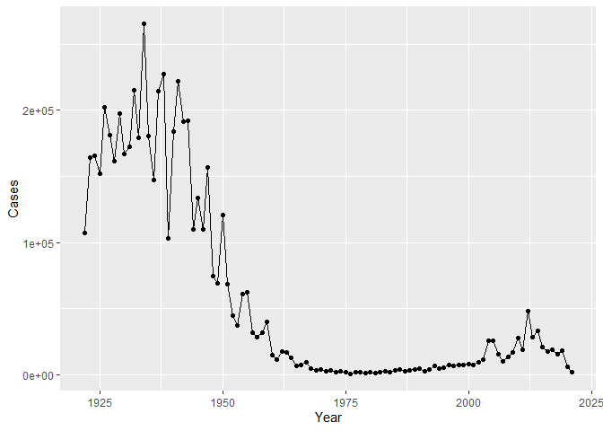
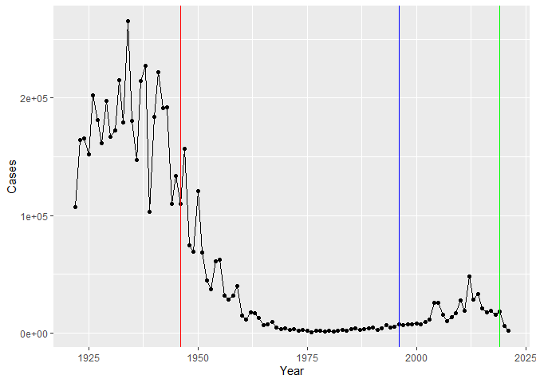
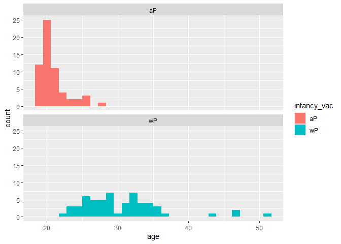
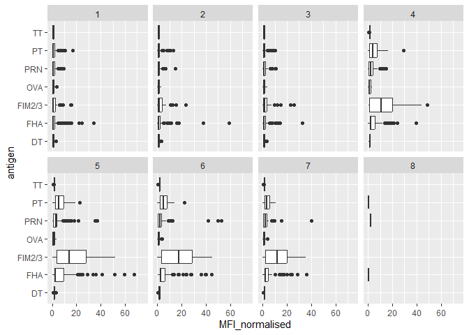
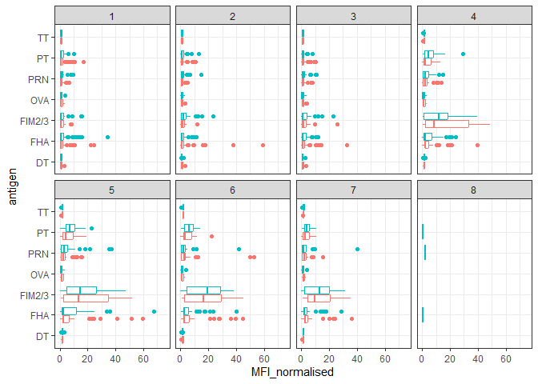
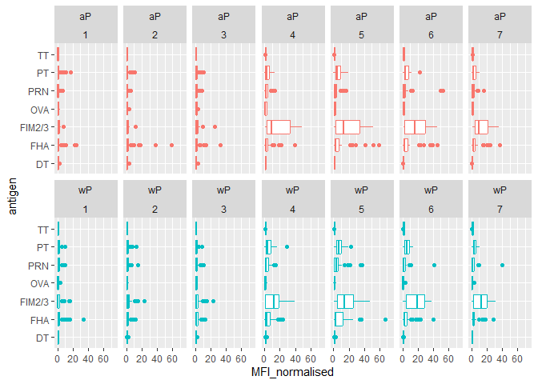
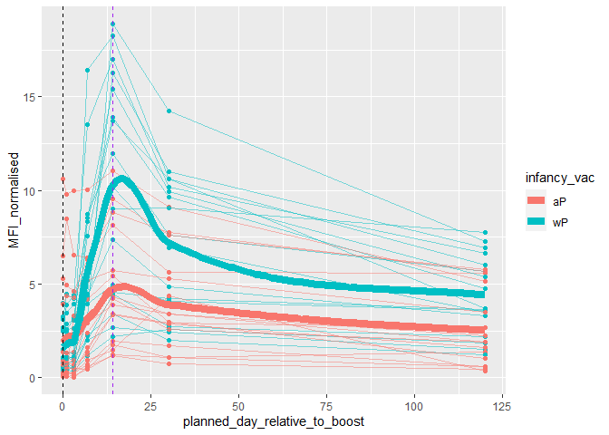
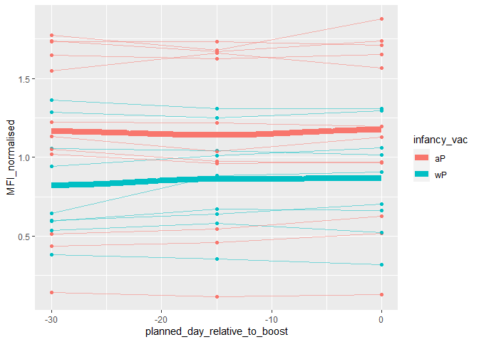
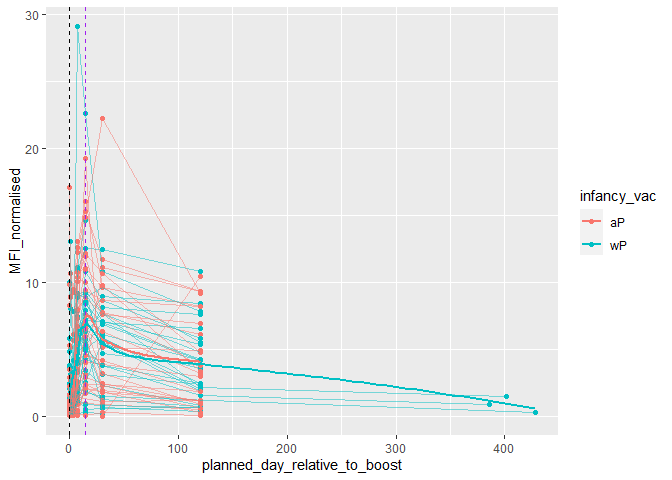

# Class19_Pertussis
Krysten Jones (A10553682)

# Investigating Pertussis

Pertussis aka whooping cough is a disease that can effect anyone, but
can be fatal in young children. It is included in the DTaP vaccine for
children and the Tdap for adults (Tdap actually has lower ammounts of
acellular Pertussis than DTaP).

Lets have a look at the numbers of pertussis in the US

The United States Centers for Disease Control and Prevention (CDC) has
been compiling reported pertussis case numbers since 1922 in their
National Notifiable Diseases Surveillance System (NNDSS). We can view
this data on the CDC website here:
https://www.cdc.gov/pertussis/surv-reporting/cases-by-year.html

> Q1. With the help of the R “addin” package datapasta assign the CDC
> pertussis case number data to a data frame called cdc and use ggplot
> to make a plot of cases numbers over time.

First as always we’ll need to install the packages we’re going to use.
Today’s includes datapasta `install.packages('datapasta')`.Unlike usual,
we’re not going to call it from the library function. Instead we’re
going to go to `Addins` up at the top and scroll down to

There’s another package called `` that can read through the html and
find the embedded tables

``` r
# we want the code chunk to run, but don't need it to print out the table so we'll change echo to false.
#| echo: false
cdc <- data.frame(
                          Year = c(1922L,
                                   1923L,1924L,1925L,1926L,1927L,1928L,
                                   1929L,1930L,1931L,1932L,1933L,1934L,1935L,
                                   1936L,1937L,1938L,1939L,1940L,1941L,
                                   1942L,1943L,1944L,1945L,1946L,1947L,1948L,
                                   1949L,1950L,1951L,1952L,1953L,1954L,
                                   1955L,1956L,1957L,1958L,1959L,1960L,
                                   1961L,1962L,1963L,1964L,1965L,1966L,1967L,
                                   1968L,1969L,1970L,1971L,1972L,1973L,
                                   1974L,1975L,1976L,1977L,1978L,1979L,1980L,
                                   1981L,1982L,1983L,1984L,1985L,1986L,
                                   1987L,1988L,1989L,1990L,1991L,1992L,1993L,
                                   1994L,1995L,1996L,1997L,1998L,1999L,
                                   2000L,2001L,2002L,2003L,2004L,2005L,
                                   2006L,2007L,2008L,2009L,2010L,2011L,2012L,
                                   2013L,2014L,2015L,2016L,2017L,2018L,
                                   2019L,2020L,2021L),
  Cases = c(107473,
                                   164191,165418,152003,202210,181411,
                                   161799,197371,166914,172559,215343,179135,
                                   265269,180518,147237,214652,227319,103188,
                                   183866,222202,191383,191890,109873,
                                   133792,109860,156517,74715,69479,120718,
                                   68687,45030,37129,60886,62786,31732,28295,
                                   32148,40005,14809,11468,17749,17135,
                                   13005,6799,7717,9718,4810,3285,4249,
                                   3036,3287,1759,2402,1738,1010,2177,2063,
                                   1623,1730,1248,1895,2463,2276,3589,
                                   4195,2823,3450,4157,4570,2719,4083,6586,
                                   4617,5137,7796,6564,7405,7298,7867,
                                   7580,9771,11647,25827,25616,15632,10454,
                                   13278,16858,27550,18719,48277,28639,
                                   32971,20762,17972,18975,15609,18617,6124,
                                   2116)
)
```

For some reason, it will only let me paste with the column titles if you
don’t paste in an R block, then change it to R block after pasting

``` r
library(ggplot2)
ggplot(cdc, aes(Year, Cases)) +
  geom_line() +
  geom_point()
```



> Q2. Using the ggplot geom_vline() function add lines to your previous
> plot for the 1946 introduction of the wP vaccine and the 1996 switch
> to aP vaccine (see example in the hint below). What do you notice?

``` r
library(ggplot2)
ggplot(cdc, aes(Year, Cases)) +
  geom_line() +
  geom_point() +
  geom_vline(xintercept=1946, color ="red") +
  geom_vline(xintercept=1996, color ="blue") +
  geom_vline(xintercept=2019, color ="green")
```



> Q3. Describe what happened after the introduction of the aP vaccine?
> Do you have a possible explanation for the observed trend?

Could be due to transition from wP vaccine to aP vaccine. The aP vaccine
induced protection wanes faster than wP, why? Whole bacteria vs part of
the bacteria (bordatella).

## CMI-PB project

The CMI-PB project collects and makes available data on the immune
response to Pertussis booster vaccination.

We will access this data via the API (Application profile interface). We
will use the JSON lite package `jsonlite` using
`install.packages('jsonlite')`.

``` r
library(jsonlite)
# go to website, hover over link and click copy link
# if you don't change simplify vector to true, it will then return the json file instead of a datatable
subject <- read_json("http://cmi-pb.org/api/subject", simplifyVector = TRUE)
head(subject)
```

      subject_id infancy_vac biological_sex              ethnicity  race
    1          1          wP         Female Not Hispanic or Latino White
    2          2          wP         Female Not Hispanic or Latino White
    3          3          wP         Female                Unknown White
    4          4          wP           Male Not Hispanic or Latino Asian
    5          5          wP           Male Not Hispanic or Latino Asian
    6          6          wP         Female Not Hispanic or Latino White
      year_of_birth date_of_boost      dataset
    1    1986-01-01    2016-09-12 2020_dataset
    2    1968-01-01    2019-01-28 2020_dataset
    3    1983-01-01    2016-10-10 2020_dataset
    4    1988-01-01    2016-08-29 2020_dataset
    5    1991-01-01    2016-08-29 2020_dataset
    6    1988-01-01    2016-10-10 2020_dataset

> Q4. How many aP and wP infancy vaccinated subjects are in the dataset?

``` r
# how many subjects total
nrow(subject)
```

    [1] 118

``` r
# how many aP vs wP
table(subject$infancy_vac)
```


    aP wP 
    60 58 

60 aP and 58 wP

> Q5. How many Male and Female subjects/patients are in the dataset?

``` r
table(subject$biological_sex)
```


    Female   Male 
        79     39 

79 female, 39 male

> Q6. What is the breakdown of race and biological sex (e.g. number of
> Asian females, White males etc…)?

``` r
table(subject$race, subject$biological_sex)
```

                                               
                                                Female Male
      American Indian/Alaska Native                  0    1
      Asian                                         21   11
      Black or African American                      2    0
      More Than One Race                             9    2
      Native Hawaiian or Other Pacific Islander      1    1
      Unknown or Not Reported                       11    4
      White                                         35   20

Age distribution

\##Calculate Age

> Q7. Using this approach determine (i) the average age of wP
> individuals, (ii) the average age of aP individuals; and (iii) are
> they significantly different?

``` r
library(tidyverse)
#add new column to convert to current age
subject$current_age <-time_length(today() - ymd(subject$year_of_birth),(unit="year"))
head(subject)
```

      subject_id infancy_vac biological_sex              ethnicity  race
    1          1          wP         Female Not Hispanic or Latino White
    2          2          wP         Female Not Hispanic or Latino White
    3          3          wP         Female                Unknown White
    4          4          wP           Male Not Hispanic or Latino Asian
    5          5          wP           Male Not Hispanic or Latino Asian
    6          6          wP         Female Not Hispanic or Latino White
      year_of_birth date_of_boost      dataset current_age
    1    1986-01-01    2016-09-12 2020_dataset    37.93292
    2    1968-01-01    2019-01-28 2020_dataset    55.93429
    3    1983-01-01    2016-10-10 2020_dataset    40.93361
    4    1988-01-01    2016-08-29 2020_dataset    35.93429
    5    1991-01-01    2016-08-29 2020_dataset    32.93361
    6    1988-01-01    2016-10-10 2020_dataset    35.93429

2)  

``` r
library(dplyr)

wP <- subject %>% 
  filter(infancy_vac == "wP") %>%
  summary(current_age)
wP
```

       subject_id     infancy_vac        biological_sex      ethnicity        
     Min.   :  1.00   Length:58          Length:58          Length:58         
     1st Qu.: 17.50   Class :character   Class :character   Class :character  
     Median : 37.00   Mode  :character   Mode  :character   Mode  :character  
     Mean   : 47.76                                                           
     3rd Qu.: 73.75                                                           
     Max.   :114.00                                                           
         race           year_of_birth      date_of_boost        dataset         
     Length:58          Length:58          Length:58          Length:58         
     Class :character   Class :character   Class :character   Class :character  
     Mode  :character   Mode  :character   Mode  :character   Mode  :character  
                                                                                
                                                                                
                                                                                
      current_age   
     Min.   :27.93  
     1st Qu.:31.18  
     Median :35.43  
     Mean   :36.33  
     3rd Qu.:38.93  
     Max.   :55.93  

mean age of wP subject is 36.32 years old.

2)  

``` r
aP <- subject %>% 
  filter(infancy_vac == "aP") %>%
  summary(current_age)
aP
```

       subject_id     infancy_vac        biological_sex      ethnicity        
     Min.   :  9.00   Length:60          Length:60          Length:60         
     1st Qu.: 47.75   Class :character   Class :character   Class :character  
     Median : 73.00   Mode  :character   Mode  :character   Mode  :character  
     Mean   : 70.85                                                           
     3rd Qu.: 94.25                                                           
     Max.   :118.00                                                           
         race           year_of_birth      date_of_boost        dataset         
     Length:60          Length:60          Length:60          Length:60         
     Class :character   Class :character   Class :character   Class :character  
     Mode  :character   Mode  :character   Mode  :character   Mode  :character  
                                                                                
                                                                                
                                                                                
      current_age   
     Min.   :20.93  
     1st Qu.:25.93  
     Median :25.93  
     Mean   :26.03  
     3rd Qu.:26.93  
     Max.   :29.93  

mean aP current age = 26.03 years.

3)  Using a t-test select only the wP and aP ages

``` r
sig_test <- subject %>% 
  select(current_age, infancy_vac) %>%
  group_by(infancy_vac)
head(sig_test)
```

    # A tibble: 6 × 2
    # Groups:   infancy_vac [1]
      current_age infancy_vac
            <dbl> <chr>      
    1        37.9 wP         
    2        55.9 wP         
    3        40.9 wP         
    4        35.9 wP         
    5        32.9 wP         
    6        35.9 wP         

``` r
dim(sig_test)
```

    [1] 118   2

``` r
t_test_result <- t.test(sig_test$infancy_vac =="aP", sig_test$infancy_vac =="wP")
t_test_result
```


        Welch Two Sample t-test

    data:  sig_test$infancy_vac == "aP" and sig_test$infancy_vac == "wP"
    t = 0.25931, df = 234, p-value = 0.7956
    alternative hypothesis: true difference in means is not equal to 0
    95 percent confidence interval:
     -0.1118253  0.1457236
    sample estimates:
    mean of x mean of y 
    0.5084746 0.4915254 

With a p-value of 0.7956 they are not significantly different.

> Q8. Determine the age of all individuals at time of boost?

Want the age of individuals at time of boost because want to see how
long the booster vaccine is maintaining titer levels

``` r
library(tidyverse)
#want to know when this happened
subject$age <-time_length(ymd(subject$date_of_boost) - ymd(subject$year_of_birth),(unit="year"))
head(subject)
```

      subject_id infancy_vac biological_sex              ethnicity  race
    1          1          wP         Female Not Hispanic or Latino White
    2          2          wP         Female Not Hispanic or Latino White
    3          3          wP         Female                Unknown White
    4          4          wP           Male Not Hispanic or Latino Asian
    5          5          wP           Male Not Hispanic or Latino Asian
    6          6          wP         Female Not Hispanic or Latino White
      year_of_birth date_of_boost      dataset current_age      age
    1    1986-01-01    2016-09-12 2020_dataset    37.93292 30.69678
    2    1968-01-01    2019-01-28 2020_dataset    55.93429 51.07461
    3    1983-01-01    2016-10-10 2020_dataset    40.93361 33.77413
    4    1988-01-01    2016-08-29 2020_dataset    35.93429 28.65982
    5    1991-01-01    2016-08-29 2020_dataset    32.93361 25.65914
    6    1988-01-01    2016-10-10 2020_dataset    35.93429 28.77481

> Q9. With the help of a faceted boxplot or histogram (see below), do
> you think these two groups are significantly different?

``` r
ggplot(subject, aes(age, fill=infancy_vac))+
  facet_wrap(vars(infancy_vac), ncol=1)+
  geom_histogram()
```

    `stat_bin()` using `bins = 30`. Pick better value with `binwidth`.



``` r
table(subject$dataset)
```


    2020_dataset 2021_dataset 2022_dataset 
              60           36           22 

## Grabbing other tables

``` r
titer <- read_json("http://cmi-pb.org/api/v4/plasma_ab_titer", simplifyVector = TRUE)
head(titer)
```

      specimen_id isotype is_antigen_specific antigen        MFI MFI_normalised
    1           1     IgE               FALSE   Total 1110.21154       2.493425
    2           1     IgE               FALSE   Total 2708.91616       2.493425
    3           1     IgG                TRUE      PT   68.56614       3.736992
    4           1     IgG                TRUE     PRN  332.12718       2.602350
    5           1     IgG                TRUE     FHA 1887.12263      34.050956
    6           1     IgE                TRUE     ACT    0.10000       1.000000
       unit lower_limit_of_detection
    1 UG/ML                 2.096133
    2 IU/ML                29.170000
    3 IU/ML                 0.530000
    4 IU/ML                 6.205949
    5 IU/ML                 4.679535
    6 IU/ML                 2.816431

``` r
specimen <-read_json("http://cmi-pb.org/api/specimen", simplifyVector = TRUE)
head(specimen)
```

      specimen_id subject_id actual_day_relative_to_boost
    1           1          1                           -3
    2           2          1                            1
    3           3          1                            3
    4           4          1                            7
    5           5          1                           11
    6           6          1                           32
      planned_day_relative_to_boost specimen_type visit
    1                             0         Blood     1
    2                             1         Blood     2
    3                             3         Blood     3
    4                             7         Blood     4
    5                            14         Blood     5
    6                            30         Blood     6

## Innerjoin vs full join

want to merge the subject and the titer tables together

> Q9. Complete the code to join specimen and subject tables to make a
> new merged data frame containing all specimen records along with their
> associated subject detail.

inner_join(x,y) will only keep the rows that have all the column values
full_join(x,y) will keep all rows if have any data (you will then have
to compensate for missing values)

``` r
meta <- inner_join(specimen, subject)
```

    Joining with `by = join_by(subject_id)`

``` r
head(meta)
```

      specimen_id subject_id actual_day_relative_to_boost
    1           1          1                           -3
    2           2          1                            1
    3           3          1                            3
    4           4          1                            7
    5           5          1                           11
    6           6          1                           32
      planned_day_relative_to_boost specimen_type visit infancy_vac biological_sex
    1                             0         Blood     1          wP         Female
    2                             1         Blood     2          wP         Female
    3                             3         Blood     3          wP         Female
    4                             7         Blood     4          wP         Female
    5                            14         Blood     5          wP         Female
    6                            30         Blood     6          wP         Female
                   ethnicity  race year_of_birth date_of_boost      dataset
    1 Not Hispanic or Latino White    1986-01-01    2016-09-12 2020_dataset
    2 Not Hispanic or Latino White    1986-01-01    2016-09-12 2020_dataset
    3 Not Hispanic or Latino White    1986-01-01    2016-09-12 2020_dataset
    4 Not Hispanic or Latino White    1986-01-01    2016-09-12 2020_dataset
    5 Not Hispanic or Latino White    1986-01-01    2016-09-12 2020_dataset
    6 Not Hispanic or Latino White    1986-01-01    2016-09-12 2020_dataset
      current_age      age
    1    37.93292 30.69678
    2    37.93292 30.69678
    3    37.93292 30.69678
    4    37.93292 30.69678
    5    37.93292 30.69678
    6    37.93292 30.69678

> Q10. Now using the same procedure join meta with titer data so we can
> further analyze this data in terms of time of visit aP/wP, male/female
> etc.

``` r
# x and y dataframes order determines what the order of the columns are in the combined dataframe
abdata <- inner_join(titer,meta)
```

    Joining with `by = join_by(specimen_id)`

``` r
dim(abdata)
```

    [1] 41810    22

``` r
head(abdata)
```

      specimen_id isotype is_antigen_specific antigen        MFI MFI_normalised
    1           1     IgE               FALSE   Total 1110.21154       2.493425
    2           1     IgE               FALSE   Total 2708.91616       2.493425
    3           1     IgG                TRUE      PT   68.56614       3.736992
    4           1     IgG                TRUE     PRN  332.12718       2.602350
    5           1     IgG                TRUE     FHA 1887.12263      34.050956
    6           1     IgE                TRUE     ACT    0.10000       1.000000
       unit lower_limit_of_detection subject_id actual_day_relative_to_boost
    1 UG/ML                 2.096133          1                           -3
    2 IU/ML                29.170000          1                           -3
    3 IU/ML                 0.530000          1                           -3
    4 IU/ML                 6.205949          1                           -3
    5 IU/ML                 4.679535          1                           -3
    6 IU/ML                 2.816431          1                           -3
      planned_day_relative_to_boost specimen_type visit infancy_vac biological_sex
    1                             0         Blood     1          wP         Female
    2                             0         Blood     1          wP         Female
    3                             0         Blood     1          wP         Female
    4                             0         Blood     1          wP         Female
    5                             0         Blood     1          wP         Female
    6                             0         Blood     1          wP         Female
                   ethnicity  race year_of_birth date_of_boost      dataset
    1 Not Hispanic or Latino White    1986-01-01    2016-09-12 2020_dataset
    2 Not Hispanic or Latino White    1986-01-01    2016-09-12 2020_dataset
    3 Not Hispanic or Latino White    1986-01-01    2016-09-12 2020_dataset
    4 Not Hispanic or Latino White    1986-01-01    2016-09-12 2020_dataset
    5 Not Hispanic or Latino White    1986-01-01    2016-09-12 2020_dataset
    6 Not Hispanic or Latino White    1986-01-01    2016-09-12 2020_dataset
      current_age      age
    1    37.93292 30.69678
    2    37.93292 30.69678
    3    37.93292 30.69678
    4    37.93292 30.69678
    5    37.93292 30.69678
    6    37.93292 30.69678

So there are 41810 rows and 22 columns

## Determining how many different antibody types

> Q11. How many specimens (i.e. entries in abdata) do we have for each
> isotype?

``` r
igg <- abdata %>% 
  filter(isotype == "IgG")
dim(igg)
```

    [1] 3240   22

``` r
ige <- abdata %>% 
  filter(isotype == "IgE")
dim(ige)
```

    [1] 6698   22

IgG = 3240 IgE = 6698

> Q12. What are the different \$dataset values in abdata and what do you
> notice about the number of rows for the most “recent” dataset?

``` r
ggplot(igg)+
  aes(MFI_normalised, antigen) +
  geom_boxplot()
```


OVA = albumin = control TT = tetnus toxin PT = protessus toxin DT =
diptheria toxin PRN = Pertactin autotransporter FHA = Filamentous
hemagglutinin FIM2/3 = Mixture of Fim2 and Fim3

## Examining IgG Ab titer levels

> Q13. Complete the following code to make a summary boxplot of Ab titer
> levels (MFI) for all antigens:

``` r
ggplot(igg) +
  aes(MFI_normalised, antigen) +
  geom_boxplot() + 
    xlim(0,75) +
  facet_wrap(vars(visit), nrow=2)
```

    Warning: Removed 5 rows containing non-finite values (`stat_boxplot()`).



> Q14. What antigens show differences in the level of IgG antibody
> titers recognizing them over time? Why these and not others?

``` r
ggplot(igg) +
  aes(MFI_normalised, antigen, col=infancy_vac ) +
  geom_boxplot(show.legend = FALSE) + 
  facet_wrap(vars(visit), nrow=2) +
  xlim(0,75) +
  theme_bw()
```

    Warning: Removed 5 rows containing non-finite values (`stat_boxplot()`).



``` r
igg %>% filter(visit != 8) %>%
ggplot() +
  aes(MFI_normalised, antigen, col=infancy_vac ) +
  geom_boxplot(show.legend = FALSE) + 
  xlim(0,75) +
  facet_wrap(vars(infancy_vac, visit), nrow=2)
```

    Warning: Removed 5 rows containing non-finite values (`stat_boxplot()`).



> Q15. Filter to pull out only two specific antigens for analysis and
> create a boxplot for each. You can chose any you like. Below I picked
> a “control” antigen (“OVA”, that is not in our vaccines) and a clear
> antigen of interest (“PT”, Pertussis Toxin, one of the key virulence
> factors produced by the bacterium B. pertussis).

> Q16. What do you notice about these two antigens time courses and the
> PT data in particular?

> Q17. Do you see any clear difference in aP vs. wP responses?

``` r
#abdata$planned_day_relative_to_boost
igpt.21 <- abdata %>% filter(dataset=="2021_dataset",
                             isotype == "IgG",
                             antigen == "PT")
head(igpt.21)
```

      specimen_id isotype is_antigen_specific antigen    MFI MFI_normalised unit
    1         468     IgG               FALSE      PT 112.75      1.0000000  MFI
    2         469     IgG               FALSE      PT 111.25      0.9866962  MFI
    3         470     IgG               FALSE      PT 125.50      1.1130820  MFI
    4         471     IgG               FALSE      PT 224.25      1.9889135  MFI
    5         472     IgG               FALSE      PT 304.00      2.6962306  MFI
    6         473     IgG               FALSE      PT 274.00      2.4301552  MFI
      lower_limit_of_detection subject_id actual_day_relative_to_boost
    1                 5.197441         61                           -4
    2                 5.197441         61                            1
    3                 5.197441         61                            3
    4                 5.197441         61                            7
    5                 5.197441         61                           14
    6                 5.197441         61                           30
      planned_day_relative_to_boost specimen_type visit infancy_vac biological_sex
    1                             0         Blood     1          wP         Female
    2                             1         Blood     2          wP         Female
    3                             3         Blood     3          wP         Female
    4                             7         Blood     4          wP         Female
    5                            14         Blood     5          wP         Female
    6                            30         Blood     6          wP         Female
                   ethnicity                    race year_of_birth date_of_boost
    1 Not Hispanic or Latino Unknown or Not Reported    1987-01-01    2019-04-08
    2 Not Hispanic or Latino Unknown or Not Reported    1987-01-01    2019-04-08
    3 Not Hispanic or Latino Unknown or Not Reported    1987-01-01    2019-04-08
    4 Not Hispanic or Latino Unknown or Not Reported    1987-01-01    2019-04-08
    5 Not Hispanic or Latino Unknown or Not Reported    1987-01-01    2019-04-08
    6 Not Hispanic or Latino Unknown or Not Reported    1987-01-01    2019-04-08
           dataset current_age      age
    1 2021_dataset    36.93361 32.26557
    2 2021_dataset    36.93361 32.26557
    3 2021_dataset    36.93361 32.26557
    4 2021_dataset    36.93361 32.26557
    5 2021_dataset    36.93361 32.26557
    6 2021_dataset    36.93361 32.26557

``` r
ggplot(igpt.21, 
       aes(planned_day_relative_to_boost, MFI_normalised, col=infancy_vac)) +
   geom_point()+
   geom_line(aes(group = subject_id), linewidth =0.5, alpha = 0.5) +
  geom_smooth(se=FALSE, span =0.4, linewidth = 3)+
   geom_vline(xintercept=0, linetype="dashed", color ="black") +
  geom_vline(xintercept=14, linetype="dashed", color ="purple")
```

    `geom_smooth()` using method = 'loess' and formula = 'y ~ x'

    Warning in simpleLoess(y, x, w, span, degree = degree, parametric = parametric,
    : pseudoinverse used at -0.6

    Warning in simpleLoess(y, x, w, span, degree = degree, parametric = parametric,
    : neighborhood radius 3.6

    Warning in simpleLoess(y, x, w, span, degree = degree, parametric = parametric,
    : reciprocal condition number 1.9334e-16

    Warning in simpleLoess(y, x, w, span, degree = degree, parametric = parametric,
    : There are other near singularities as well. 11364

    Warning in simpleLoess(y, x, w, span, degree = degree, parametric = parametric,
    : pseudoinverse used at -0.6

    Warning in simpleLoess(y, x, w, span, degree = degree, parametric = parametric,
    : neighborhood radius 3.6

    Warning in simpleLoess(y, x, w, span, degree = degree, parametric = parametric,
    : reciprocal condition number 2.0519e-16

    Warning in simpleLoess(y, x, w, span, degree = degree, parametric = parametric,
    : There are other near singularities as well. 11364



Now for year 2022

``` r
igpt.22 <- abdata %>% filter(dataset=="2022_dataset",
                             isotype == "IgG",
                             antigen == "PT")
head(igpt.22)
```

      specimen_id isotype is_antigen_specific antigen       MFI MFI_normalised unit
    1         820     IgG                TRUE      PT 0.5452703      0.5452703  MFI
    2         850     IgG                TRUE      PT 0.6713381      0.6713381  MFI
    3         781     IgG                TRUE      PT 1.6719673      1.6719673  MFI
    4         839     IgG                TRUE      PT 1.0580068      1.0580068  MFI
    5         732     IgG                TRUE      PT 1.0606177      1.0606177  MFI
    6         930     IgG                TRUE      PT 1.0187788      1.0187788  MFI
      lower_limit_of_detection subject_id actual_day_relative_to_boost
    1                0.1188872        106                          -15
    2                0.1188872        109                          -14
    3                0.1188872        102                          -14
    4                0.1188872        108                          -32
    5                0.1188872         97                            0
    6                0.1188872        118                          -52
      planned_day_relative_to_boost specimen_type visit infancy_vac biological_sex
    1                           -15         Blood     2          aP         Female
    2                           -15         Blood     2          wP         Female
    3                           -15         Blood     2          aP           Male
    4                           -30         Blood     1          wP         Female
    5                             0         Blood     3          wP           Male
    6                           -30         Blood     1          aP           Male
                   ethnicity  race year_of_birth date_of_boost      dataset
    1 Not Hispanic or Latino White    1996-01-01    2021-09-07 2022_dataset
    2 Not Hispanic or Latino White    1989-01-01    2021-09-27 2022_dataset
    3 Not Hispanic or Latino White    2003-01-01    2021-11-01 2022_dataset
    4 Not Hispanic or Latino White    1995-01-01    2021-09-27 2022_dataset
    5 Not Hispanic or Latino White    1986-01-01    2021-11-29 2022_dataset
    6 Not Hispanic or Latino Asian    1998-01-01    2022-01-24 2022_dataset
      current_age      age
    1    27.93429 25.68378
    2    34.93224 32.73648
    3    20.93361 18.83368
    4    28.93361 26.73785
    5    37.93292 35.90965
    6    25.93292 24.06297

``` r
ggplot(igpt.22, 
       aes(planned_day_relative_to_boost, MFI_normalised, col=infancy_vac)) +
   geom_point()+
   geom_line(aes(group = subject_id), linewidth =0.5, alpha = 0.5) +
  geom_smooth(se=FALSE, span =0.4, linewidth = 3)
```

    `geom_smooth()` using method = 'loess' and formula = 'y ~ x'

    Warning in simpleLoess(y, x, w, span, degree = degree, parametric = parametric,
    : pseudoinverse used at -30.15

    Warning in simpleLoess(y, x, w, span, degree = degree, parametric = parametric,
    : neighborhood radius 15.15

    Warning in simpleLoess(y, x, w, span, degree = degree, parametric = parametric,
    : reciprocal condition number 0

    Warning in simpleLoess(y, x, w, span, degree = degree, parametric = parametric,
    : There are other near singularities as well. 229.52

    Warning in simpleLoess(y, x, w, span, degree = degree, parametric = parametric,
    : pseudoinverse used at -30.15

    Warning in simpleLoess(y, x, w, span, degree = degree, parametric = parametric,
    : neighborhood radius 15.15

    Warning in simpleLoess(y, x, w, span, degree = degree, parametric = parametric,
    : reciprocal condition number 0

    Warning in simpleLoess(y, x, w, span, degree = degree, parametric = parametric,
    : There are other near singularities as well. 229.52



> Q18. Does this trend look similar for the 2020 dataset?

``` r
igpt.20 <- abdata %>% filter(dataset=="2020_dataset",
                             isotype == "IgG",
                             antigen == "PT")
head(igpt.20)
```

      specimen_id isotype is_antigen_specific antigen       MFI MFI_normalised
    1           1     IgG                TRUE      PT 68.566139      3.7369917
    2          19     IgG                TRUE      PT 20.116067      1.0963659
    3          27     IgG                TRUE      PT 37.552222      2.0466712
    4          37     IgG                TRUE      PT 69.685645      3.7980070
    5          45     IgG                TRUE      PT  3.914130      0.2133279
    6          55     IgG                TRUE      PT  9.139656      0.4981295
       unit lower_limit_of_detection subject_id actual_day_relative_to_boost
    1 IU/ML                     0.53          1                           -3
    2 IU/ML                     0.53          3                           -3
    3 IU/ML                     0.53          4                           -7
    4 IU/ML                     0.53          5                           -5
    5 IU/ML                     0.53          6                           -6
    6 IU/ML                     0.53          7                           -6
      planned_day_relative_to_boost specimen_type visit infancy_vac biological_sex
    1                             0         Blood     1          wP         Female
    2                             0         Blood     1          wP         Female
    3                             0         Blood     1          wP           Male
    4                             0         Blood     1          wP           Male
    5                             0         Blood     1          wP         Female
    6                             0         Blood     1          wP         Female
                   ethnicity               race year_of_birth date_of_boost
    1 Not Hispanic or Latino              White    1986-01-01    2016-09-12
    2                Unknown              White    1983-01-01    2016-10-10
    3 Not Hispanic or Latino              Asian    1988-01-01    2016-08-29
    4 Not Hispanic or Latino              Asian    1991-01-01    2016-08-29
    5 Not Hispanic or Latino              White    1988-01-01    2016-10-10
    6     Hispanic or Latino More Than One Race    1981-01-01    2016-11-07
           dataset current_age      age
    1 2020_dataset    37.93292 30.69678
    2 2020_dataset    40.93361 33.77413
    3 2020_dataset    35.93429 28.65982
    4 2020_dataset    32.93361 25.65914
    5 2020_dataset    35.93429 28.77481
    6 2020_dataset    42.93224 35.84942

``` r
ggplot(igpt.20, 
       aes(planned_day_relative_to_boost, MFI_normalised, col=infancy_vac)) +
   geom_point()+
   geom_line(aes(group = subject_id), linewidth =0.5, alpha = 0.5) +
  geom_smooth(se=FALSE, span =0.4, linewidth = 1) +
  geom_vline(xintercept=0, linetype="dashed", color ="black") +
  geom_vline(xintercept=14, linetype="dashed", color ="purple")
```

    `geom_smooth()` using method = 'loess' and formula = 'y ~ x'

    Warning in simpleLoess(y, x, w, span, degree = degree, parametric = parametric,
    : pseudoinverse used at -0.6

    Warning in simpleLoess(y, x, w, span, degree = degree, parametric = parametric,
    : neighborhood radius 3.6

    Warning in simpleLoess(y, x, w, span, degree = degree, parametric = parametric,
    : reciprocal condition number 4.5426e-16

    Warning in simpleLoess(y, x, w, span, degree = degree, parametric = parametric,
    : There are other near singularities as well. 11364

    Warning in simpleLoess(y, x, w, span, degree = degree, parametric = parametric,
    : pseudoinverse used at -2.14

    Warning in simpleLoess(y, x, w, span, degree = degree, parametric = parametric,
    : neighborhood radius 5.14

    Warning in simpleLoess(y, x, w, span, degree = degree, parametric = parametric,
    : reciprocal condition number 7.093e-16

    Warning in simpleLoess(y, x, w, span, degree = degree, parametric = parametric,
    : There are other near singularities as well. 9



Yes, but it is more difficult to see due to scale and the differences
seem to even out past day 100, but it is hard to tell due to not having
later datapoints from aP individuals.
