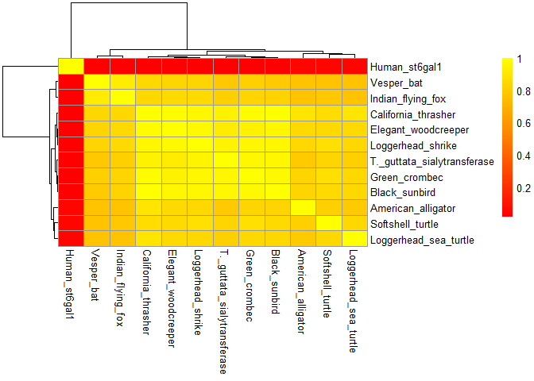

# Find_Gene_Project
Krysten Jones (A10553682)

# Using Bio3D

> \[Q7\] Generate a sequence identity based heatmap of your aligned
> sequences using R.If necessary convert your sequence alignment to the
> ubiquitous FASTA format (Seaview can read in clustal format and “Save
> as” FASTA format for example). Read this FASTA format alignment into R
> with the help of functions in the Bio3D package.

First as always, call your programs

``` r
library(bio3d)
Fasta <- read.fasta("MEGA_FASTA.fas")
```

> Calculate a sequence identity matrix (again using a function within
> the Bio3D package).

``` r
identity_matrix <- seqidentity(Fasta)
identity_matrix
```

                                T._guttata_sialytransferase Human_st6gal1
    T._guttata_sialytransferase                       1.000         0.014
    Human_st6gal1                                     0.014         1.000
    Green_crombec                                     0.965         0.014
    California_thrasher                               0.950         0.017
    Black_sunbird                                     0.965         0.014
    Elegant_woodcreeper                               0.930         0.014
    Loggerhead_shrike                                 0.953         0.014
    Softshell_turtle                                  0.837         0.043
    American_alligator                                0.802         0.043
    Loggerhead_sea_turtle                             0.814         0.043
    Vesper_bat                                        0.791         0.014
    Indian_flying_fox                                 0.814         0.014
                                Green_crombec California_thrasher Black_sunbird
    T._guttata_sialytransferase         0.965               0.950         0.965
    Human_st6gal1                       0.014               0.017         0.014
    Green_crombec                       1.000               0.983         0.977
    California_thrasher                 0.983               1.000         1.000
    Black_sunbird                       0.977               1.000         1.000
    Elegant_woodcreeper                 0.942               0.983         0.965
    Loggerhead_shrike                   0.965               0.967         0.965
    Softshell_turtle                    0.872               0.867         0.860
    American_alligator                  0.837               0.900         0.837
    Loggerhead_sea_turtle               0.849               0.900         0.849
    Vesper_bat                          0.814               0.850         0.802
    Indian_flying_fox                   0.837               0.850         0.826
                                Elegant_woodcreeper Loggerhead_shrike
    T._guttata_sialytransferase               0.930             0.953
    Human_st6gal1                             0.014             0.014
    Green_crombec                             0.942             0.965
    California_thrasher                       0.983             0.967
    Black_sunbird                             0.965             0.965
    Elegant_woodcreeper                       1.000             0.977
    Loggerhead_shrike                         0.977             1.000
    Softshell_turtle                          0.860             0.872
    American_alligator                        0.860             0.849
    Loggerhead_sea_turtle                     0.860             0.849
    Vesper_bat                                0.837             0.837
    Indian_flying_fox                         0.860             0.860
                                Softshell_turtle American_alligator
    T._guttata_sialytransferase            0.837              0.802
    Human_st6gal1                          0.043              0.043
    Green_crombec                          0.872              0.837
    California_thrasher                    0.867              0.900
    Black_sunbird                          0.860              0.837
    Elegant_woodcreeper                    0.860              0.860
    Loggerhead_shrike                      0.872              0.849
    Softshell_turtle                       1.000              0.814
    American_alligator                     0.814              1.000
    Loggerhead_sea_turtle                  0.849              0.802
    Vesper_bat                             0.767              0.767
    Indian_flying_fox                      0.791              0.767
                                Loggerhead_sea_turtle Vesper_bat Indian_flying_fox
    T._guttata_sialytransferase                 0.814      0.791             0.814
    Human_st6gal1                               0.043      0.014             0.014
    Green_crombec                               0.849      0.814             0.837
    California_thrasher                         0.900      0.850             0.850
    Black_sunbird                               0.849      0.802             0.826
    Elegant_woodcreeper                         0.860      0.837             0.860
    Loggerhead_shrike                           0.849      0.837             0.860
    Softshell_turtle                            0.849      0.767             0.791
    American_alligator                          0.802      0.767             0.767
    Loggerhead_sea_turtle                       1.000      0.767             0.767
    Vesper_bat                                  0.767      1.000             0.930
    Indian_flying_fox                           0.767      0.930             1.000

> Then generate a heatmap plot and add to your report. Do make sure your
> labels are visible and not cut at the figure margins.

``` r
library("pheatmap")
#vector of labels
seq_labs <- c( "T._guttata_sialytransferase","Human_St6Gal1", "Green_crombec", "California_thrasher", "Black_sunbird", "Elegant_woodcreeper", "Loggerhead_shrike", "Softshell_turtle", "American_alligator", "Loggerhead_sea_turtle", "Vesper_bat", "Indian_flying_fox")
```

Make heatmap using identity matrix

``` r
pheatmap(identity_matrix,
         cluster_rows = TRUE,
         cluster_cols = TRUE,
         annotation_legend_title = "Sequence Identity Heatmap",
         color=colorRampPalette(c("red", "yellow"))(100))
```



## Generating a consensus sequence and row-wise maximum from your sequence identity matrix

``` r
#determining file type
class(Fasta)
```

    [1] "fasta"

``` r
file.info("MEGA_FASTA.fas")
```

                   size isdir mode               mtime               ctime
    MEGA_FASTA.fas 2281 FALSE  666 2023-12-07 12:23:31 2023-12-08 14:32:28
                                 atime exe
    MEGA_FASTA.fas 2023-12-08 15:26:49  no

``` r
# generating consensus sequence using Bio3D
con_seq <- consensus(Fasta)
print(con_seq$seq)
```

     [1] "P" "S" "S" "G" "M" "L" "G" "I" "-" "-" "M" "M" "T" "L" "C" "D" "-" "V" "D"
    [20] "V" "Y" "E" "F" "L" "P" "S" "K" "R" "Q" "T" "D" "I" "C" "H" "Y" "Y" "Q" "K"
    [39] "F" "H" "D" "-" "A" "C" "T" "M" "G" "A" "Y" "H" "P" "L" "L" "F" "E" "K" "N"
    [58] "L" "V" "K" "-" "-" "N" "Q" "G" "T" "D" "E" "-" "I" "Y" "-" "-" "G" "K" "V"
    [77] "T" "L" "P" "G" "F" "R" "-" "-" "H" "C"

What if we change the cutoff, does that change the sequence?

``` r
con <- consensus(Fasta, cutoff = 0.6)
print(con$seq)
```

     [1] "P" "S" "S" "G" "M" "L" "G" "I" "-" "-" "M" "M" "T" "L" "C" "D" "-" "V" "D"
    [20] "V" "Y" "E" "F" "L" "P" "S" "K" "R" "Q" "T" "D" "I" "C" "H" "Y" "Y" "Q" "K"
    [39] "F" "H" "D" "-" "A" "C" "T" "M" "G" "A" "Y" "H" "P" "L" "L" "F" "E" "K" "N"
    [58] "L" "V" "K" "-" "-" "N" "Q" "G" "T" "D" "E" "-" "I" "Y" "-" "-" "G" "K" "V"
    [77] "T" "L" "P" "G" "F" "R" "-" "-" "H" "C"

``` r
# if want to remove the "" from the concensus sequence, you can call the code below
#cat(x, sep ="")
```

This appears to be the default cutoff

## Blast pdb

``` r
consensus_blast <- blast.pdb(con$seq)
hits <- plot(consensus_blast)
# Then save it so we don't have to blast again and you can skip to the next code chunk
save(hits, consensus_blast, file = "consensus_blast_results.Rds")
```

Using the `blast.pdb()` function with the consensus sequence threw an
error the first time so I did a bunch of extra unnecessary steps below
TT.TT. Skip from here to “PDB Results” section

Now we can load the results and skip re-running blast through the code
chunk above

``` r
load("consensus_blast_results.Rds")
hits
```

    $hits
      pdb.id   acc      group
    1 "6QVS_A" "6QVS_A" "1"  
    2 "4JS1_A" "4JS1_A" "1"  
    3 "4MPS_A" "4MPS_A" "1"  

    $pdb.id
    [1] "6QVS_A" "4JS1_A" "4MPS_A"

    $acc
    [1] "6QVS_A" "4JS1_A" "4MPS_A"

    $inds
    [1]  TRUE  TRUE  TRUE FALSE FALSE FALSE FALSE FALSE

    attr(,"class")
    [1] "blast"

## Skip if consensus search works

So it would be better just to search the sequence of interest and the
highest conserved sequence based on the sequence identity matrix.

To do this, we first need to subset just our sequence of interest from
the FASTA file.

## identity matrix max

``` r
row_max_values <- apply(identity_matrix, 1, max)
row_max_values
```

    T._guttata_sialytransferase               Human_st6gal1 
                              1                           1 
                  Green_crombec         California_thrasher 
                              1                           1 
                  Black_sunbird         Elegant_woodcreeper 
                              1                           1 
              Loggerhead_shrike            Softshell_turtle 
                              1                           1 
             American_alligator       Loggerhead_sea_turtle 
                              1                           1 
                     Vesper_bat           Indian_flying_fox 
                              1                           1 

Also having all the max be 1 is odd, this is because I’ve set the same
identity to itself for the heatmap, we’re interested in the other
identities for this, lets look at all of the unique identities

Finding identity matrix unique

``` r
unique_values_per_row <- apply(identity_matrix, 1, unique)
unique_values_per_row
```

    $T._guttata_sialytransferase
     [1] 1.000 0.014 0.965 0.950 0.930 0.953 0.837 0.802 0.814 0.791

    $Human_st6gal1
    [1] 0.014 1.000 0.017 0.043

    $Green_crombec
     [1] 0.965 0.014 1.000 0.983 0.977 0.942 0.872 0.837 0.849 0.814

    $California_thrasher
    [1] 0.950 0.017 0.983 1.000 0.967 0.867 0.900 0.850

    $Black_sunbird
    [1] 0.965 0.014 0.977 1.000 0.860 0.837 0.849 0.802 0.826

    $Elegant_woodcreeper
    [1] 0.930 0.014 0.942 0.983 0.965 1.000 0.977 0.860 0.837

    $Loggerhead_shrike
     [1] 0.953 0.014 0.965 0.967 0.977 1.000 0.872 0.849 0.837 0.860

    $Softshell_turtle
     [1] 0.837 0.043 0.872 0.867 0.860 1.000 0.814 0.849 0.767 0.791

    $American_alligator
    [1] 0.802 0.043 0.837 0.900 0.860 0.849 0.814 1.000 0.767

    $Loggerhead_sea_turtle
    [1] 0.814 0.043 0.849 0.900 0.860 0.802 1.000 0.767

    $Vesper_bat
    [1] 0.791 0.014 0.814 0.850 0.802 0.837 0.767 1.000 0.930

    $Indian_flying_fox
     [1] 0.814 0.014 0.837 0.850 0.826 0.860 0.791 0.767 0.930 1.000

Trying to get an easier visualization so I don’t have to look at all the
numbers

``` r
greater_than_threshold <- identity_matrix >= 0.983
greater_than_threshold
```

                                T._guttata_sialytransferase Human_st6gal1
    T._guttata_sialytransferase                        TRUE         FALSE
    Human_st6gal1                                     FALSE          TRUE
    Green_crombec                                     FALSE         FALSE
    California_thrasher                               FALSE         FALSE
    Black_sunbird                                     FALSE         FALSE
    Elegant_woodcreeper                               FALSE         FALSE
    Loggerhead_shrike                                 FALSE         FALSE
    Softshell_turtle                                  FALSE         FALSE
    American_alligator                                FALSE         FALSE
    Loggerhead_sea_turtle                             FALSE         FALSE
    Vesper_bat                                        FALSE         FALSE
    Indian_flying_fox                                 FALSE         FALSE
                                Green_crombec California_thrasher Black_sunbird
    T._guttata_sialytransferase         FALSE               FALSE         FALSE
    Human_st6gal1                       FALSE               FALSE         FALSE
    Green_crombec                        TRUE                TRUE         FALSE
    California_thrasher                  TRUE                TRUE          TRUE
    Black_sunbird                       FALSE                TRUE          TRUE
    Elegant_woodcreeper                 FALSE                TRUE         FALSE
    Loggerhead_shrike                   FALSE               FALSE         FALSE
    Softshell_turtle                    FALSE               FALSE         FALSE
    American_alligator                  FALSE               FALSE         FALSE
    Loggerhead_sea_turtle               FALSE               FALSE         FALSE
    Vesper_bat                          FALSE               FALSE         FALSE
    Indian_flying_fox                   FALSE               FALSE         FALSE
                                Elegant_woodcreeper Loggerhead_shrike
    T._guttata_sialytransferase               FALSE             FALSE
    Human_st6gal1                             FALSE             FALSE
    Green_crombec                             FALSE             FALSE
    California_thrasher                        TRUE             FALSE
    Black_sunbird                             FALSE             FALSE
    Elegant_woodcreeper                        TRUE             FALSE
    Loggerhead_shrike                         FALSE              TRUE
    Softshell_turtle                          FALSE             FALSE
    American_alligator                        FALSE             FALSE
    Loggerhead_sea_turtle                     FALSE             FALSE
    Vesper_bat                                FALSE             FALSE
    Indian_flying_fox                         FALSE             FALSE
                                Softshell_turtle American_alligator
    T._guttata_sialytransferase            FALSE              FALSE
    Human_st6gal1                          FALSE              FALSE
    Green_crombec                          FALSE              FALSE
    California_thrasher                    FALSE              FALSE
    Black_sunbird                          FALSE              FALSE
    Elegant_woodcreeper                    FALSE              FALSE
    Loggerhead_shrike                      FALSE              FALSE
    Softshell_turtle                        TRUE              FALSE
    American_alligator                     FALSE               TRUE
    Loggerhead_sea_turtle                  FALSE              FALSE
    Vesper_bat                             FALSE              FALSE
    Indian_flying_fox                      FALSE              FALSE
                                Loggerhead_sea_turtle Vesper_bat Indian_flying_fox
    T._guttata_sialytransferase                 FALSE      FALSE             FALSE
    Human_st6gal1                               FALSE      FALSE             FALSE
    Green_crombec                               FALSE      FALSE             FALSE
    California_thrasher                         FALSE      FALSE             FALSE
    Black_sunbird                               FALSE      FALSE             FALSE
    Elegant_woodcreeper                         FALSE      FALSE             FALSE
    Loggerhead_shrike                           FALSE      FALSE             FALSE
    Softshell_turtle                            FALSE      FALSE             FALSE
    American_alligator                          FALSE      FALSE             FALSE
    Loggerhead_sea_turtle                        TRUE      FALSE             FALSE
    Vesper_bat                                  FALSE       TRUE             FALSE
    Indian_flying_fox                           FALSE      FALSE              TRUE

``` r
values_above_threshold <- identity_matrix[greater_than_threshold]
print(values_above_threshold)
```

     [1] 1.000 1.000 1.000 0.983 0.983 1.000 1.000 0.983 1.000 1.000 0.983 1.000
    [13] 1.000 1.000 1.000 1.000 1.000 1.000

Green crombec, california thrasher, and elegant woodcreeper all have the
highest sequence identity of 0.983. So any of these sequences should
work

## Subsetting a FASTA file (double skip this)

This is only if you forget quotation marks for your FASTA sequence so
you think something is wrong \>.\<

To subset a fasta file, you first need to define the file path. You can
figure out and set the file path using `getwd()` and assigning it to a
variable.

``` r
getwd()
file_path <- "/Users/kryst/Documents/UCSD 2022/Classes/2023 Q4 Fall/BGGN 213/Lab Assignments/Find_Gene_Project/MEGA_FASTA.fas" 
```

Subsetting sequence from fasta file using Biostrings package. Biostrings
is part of bioconductor so first you need to install it using
`BiocManager::install("Biostrings")`. Looking at our original FASTA
file, the sequence of interest is stored as the third sequence so in the
`fasta_sequences` function, we will call the third vector

``` r
library(Biostrings)
fasta_sequences <-readAAStringSet(file_path)
guttata <- fasta_sequences[[3]]
guttata
```

## Getting Protein Database (PDB) info using Bio3D (skip again if consensus works)

The `blast.pdb()` function will only use a single sequence character,
but our subsetting above didn’t work because there is other data.
Instead you can just post the FASTA sequence using quotation marks

``` r
guttata <- blast.pdb("PSSGMLGIVLMXXLCDQVDVYEFLPSKRQTDICHYYQKFHDHACTMGAYHPLLFEKNLVKHMNQGTDEDIYTHGKVTLPGFRKVHC")
# save output so we don't need to run blast every time
g_hits <- plot(guttata)
save(g_hits, guttata, file = "guttata_blast_results.Rds")
```

Doing the same using Green crombec as the consensus due to it having the
highest sequence max identity (in this case 0.983). Could have picked
one of the 2 others with this value as well

``` r
library(bio3d)
crombec <- blast.pdb("PSSGMLGIVLMMTLCDQVDVYEFLPSKRQTDICHYYQKFHDHACTMGAYHPLLFEKNLVKHMNQGTDEDIYTHGKVTLPGFRNVHC")
c_hits <- plot(crombec)
save(c_hits, crombec, file = "cromec_blast_results.Rds")
```

Loading Rds files we made

Interestingly, loading just the hits will give fewer results (see below)

``` r
load("guttata_blast_results.Rds")
g_hits
```

    $hits
      pdb.id   acc      group
    1 "4JS1_A" "4JS1_A" "1"  
    2 "6QVS_A" "6QVS_A" "1"  
    3 "4MPS_A" "4MPS_A" "1"  

    $pdb.id
    [1] "4JS1_A" "6QVS_A" "4MPS_A"

    $acc
    [1] "4JS1_A" "6QVS_A" "4MPS_A"

    $inds
    [1]  TRUE  TRUE  TRUE FALSE FALSE FALSE FALSE

    attr(,"class")
    [1] "blast"

``` r
load("cromec_blast_results.Rds")
c_hits
```

    $hits
      pdb.id   acc      group
    1 "4JS1_A" "4JS1_A" "1"  
    2 "6QVS_A" "6QVS_A" "1"  
    3 "4MPS_A" "4MPS_A" "1"  

    $pdb.id
    [1] "4JS1_A" "6QVS_A" "4MPS_A"

    $acc
    [1] "4JS1_A" "6QVS_A" "4MPS_A"

    $inds
    [1]  TRUE  TRUE  TRUE FALSE FALSE FALSE FALSE

    attr(,"class")
    [1] "blast"

``` r
guttata
```

    $hit.tbl
          queryid subjectids identity alignmentlength mismatches gapopens q.start
    1 Query_31033     4JS1_A   80.233              86         17        0       1
    2 Query_31033     6QVS_A   80.233              86         17        0       1
    3 Query_31033     4MPS_A   73.256              86         23        0       1
    4 Query_31033     6APL_A   35.088              57         28        2       1
    5 Query_31033     6APJ_A   35.088              57         28        2       1
    6 Query_31033     2WML_A   43.478              23         13        0       1
    7 Query_31033     2WNB_A   43.478              23         13        0       1
      q.end s.start s.end   evalue bitscore positives mlog.evalue pdb.id    acc
    1    86     233   318 2.08e-51    164.0     90.70  116.699472 4JS1_A 4JS1_A
    2    86     190   275 8.13e-50    159.0     90.70  113.033694 6QVS_A 6QVS_A
    3    86     225   310 7.78e-45    147.0     84.88  101.564773 4MPS_A 4MPS_A
    4    57     303   350 7.20e-02     32.3     43.86    2.631089 6APL_A 6APL_A
    5    57     303   350 7.30e-02     32.3     43.86    2.617296 6APJ_A 6APJ_A
    6    23     225   247 1.70e-01     31.2     73.91    1.771957 2WML_A 2WML_A
    7    23     225   247 1.70e-01     31.2     73.91    1.771957 2WNB_A 2WNB_A

    $raw
          queryid subjectids identity alignmentlength mismatches gapopens q.start
    1 Query_31033     4JS1_A   80.233              86         17        0       1
    2 Query_31033     6QVS_A   80.233              86         17        0       1
    3 Query_31033     4MPS_A   73.256              86         23        0       1
    4 Query_31033     6APL_A   35.088              57         28        2       1
    5 Query_31033     6APJ_A   35.088              57         28        2       1
    6 Query_31033     2WML_A   43.478              23         13        0       1
    7 Query_31033     2WNB_A   43.478              23         13        0       1
      q.end s.start s.end   evalue bitscore positives
    1    86     233   318 2.08e-51    164.0     90.70
    2    86     190   275 8.13e-50    159.0     90.70
    3    86     225   310 7.78e-45    147.0     84.88
    4    57     303   350 7.20e-02     32.3     43.86
    5    57     303   350 7.30e-02     32.3     43.86
    6    23     225   247 1.70e-01     31.2     73.91
    7    23     225   247 1.70e-01     31.2     73.91

    $url
                                                                                                                                                                              R6JAC7FE016 
    "https://blast.ncbi.nlm.nih.gov/Blast.cgi?CMD=Get&FORMAT_OBJECT=Alignment&ALIGNMENT_VIEW=Tabular&RESULTS_FILE=on&FORMAT_TYPE=CSV&ALIGNMENTS=20000&DESCRIPTIONS=20000&RID=R6JAC7FE016" 

    attr(,"class")
    [1] "blast"

This gives you 7 results.

## calling the files directly instead of just the hits

``` r
consensus_blast
```

    $hit.tbl
           queryid subjectids identity alignmentlength mismatches gapopens q.start
    1 Query_380701     6QVS_A   76.744              86          9        6       1
    2 Query_380701     4JS1_A   76.744              86          9        6       1
    3 Query_380701     4MPS_A   68.675              83         17        5       1
    4 Query_380701     6W7I_A   34.000              50         33        0      12
    5 Query_380701     4K10_A   34.000              50         33        0      12
    6 Query_380701     4JZB_A   34.000              50         33        0      12
    7 Query_380701     6VJC_A   34.000              50         33        0      12
    8 Query_380701     6WW1_A   40.625              32         19        0      12
      q.end s.start s.end   evalue bitscore positives mlog.evalue pdb.id    acc
    1    75     190   275 7.37e-35    120.0     83.72 78.59306055 6QVS_A 6QVS_A
    2    75     233   318 9.39e-35    120.0     83.72 78.35083296 4JS1_A 4JS1_A
    3    74     225   307 6.79e-31    110.0     81.93 69.46468694 4MPS_A 4MPS_A
    4    61      53   102 1.10e+00     28.5     44.00 -0.09531018 6W7I_A 6W7I_A
    5    61      53   102 1.20e+00     28.1     44.00 -0.18232156 4K10_A 4K10_A
    6    61      53   102 1.20e+00     28.1     44.00 -0.18232156 4JZB_A 4JZB_A
    7    61      53   102 1.30e+00     28.1     44.00 -0.26236426 6VJC_A 6VJC_A
    8    43      53    84 1.80e+00     27.7     46.88 -0.58778666 6WW1_A 6WW1_A

    $raw
           queryid subjectids identity alignmentlength mismatches gapopens q.start
    1 Query_380701     6QVS_A   76.744              86          9        6       1
    2 Query_380701     4JS1_A   76.744              86          9        6       1
    3 Query_380701     4MPS_A   68.675              83         17        5       1
    4 Query_380701     6W7I_A   34.000              50         33        0      12
    5 Query_380701     4K10_A   34.000              50         33        0      12
    6 Query_380701     4JZB_A   34.000              50         33        0      12
    7 Query_380701     6VJC_A   34.000              50         33        0      12
    8 Query_380701     6WW1_A   40.625              32         19        0      12
      q.end s.start s.end   evalue bitscore positives
    1    75     190   275 7.37e-35    120.0     83.72
    2    75     233   318 9.39e-35    120.0     83.72
    3    74     225   307 6.79e-31    110.0     81.93
    4    61      53   102 1.10e+00     28.5     44.00
    5    61      53   102 1.20e+00     28.1     44.00
    6    61      53   102 1.20e+00     28.1     44.00
    7    61      53   102 1.30e+00     28.1     44.00
    8    43      53    84 1.80e+00     27.7     46.88

    $url
                                                                                                                                                                              R54RUCBP01N 
    "https://blast.ncbi.nlm.nih.gov/Blast.cgi?CMD=Get&FORMAT_OBJECT=Alignment&ALIGNMENT_VIEW=Tabular&RESULTS_FILE=on&FORMAT_TYPE=CSV&ALIGNMENTS=20000&DESCRIPTIONS=20000&RID=R54RUCBP01N" 

    attr(,"class")
    [1] "blast"

This gives 8 results

``` r
crombec
```

    $hit.tbl
           queryid subjectids identity alignmentlength mismatches gapopens q.start
    1 Query_127985     4JS1_A   82.558              86         15        0       1
    2 Query_127985     6QVS_A   82.558              86         15        0       1
    3 Query_127985     4MPS_A   74.419              86         22        0       1
    4 Query_127985     6APL_A   35.088              57         28        2       1
    5 Query_127985     6APJ_A   35.088              57         28        2       1
    6 Query_127985     2WNB_A   43.478              23         13        0       1
    7 Query_127985     2WML_A   43.478              23         13        0       1
      q.end s.start s.end   evalue bitscore positives mlog.evalue pdb.id    acc
    1    86     233   318 2.46e-53    169.0     93.02  121.136849 4JS1_A 4JS1_A
    2    86     190   275 1.07e-51    164.0     93.02  117.364181 6QVS_A 6QVS_A
    3    86     225   310 8.38e-47    152.0     86.05  106.095651 4MPS_A 4MPS_A
    4    57     303   350 3.10e-02     33.1     45.61    3.473768 6APL_A 6APL_A
    5    57     303   350 3.20e-02     33.1     45.61    3.442019 6APJ_A 6APJ_A
    6    23     225   247 7.70e-02     32.0     78.26    2.563950 2WNB_A 2WNB_A
    7    23     225   247 7.70e-02     32.0     78.26    2.563950 2WML_A 2WML_A

    $raw
           queryid subjectids identity alignmentlength mismatches gapopens q.start
    1 Query_127985     4JS1_A   82.558              86         15        0       1
    2 Query_127985     6QVS_A   82.558              86         15        0       1
    3 Query_127985     4MPS_A   74.419              86         22        0       1
    4 Query_127985     6APL_A   35.088              57         28        2       1
    5 Query_127985     6APJ_A   35.088              57         28        2       1
    6 Query_127985     2WNB_A   43.478              23         13        0       1
    7 Query_127985     2WML_A   43.478              23         13        0       1
      q.end s.start s.end   evalue bitscore positives
    1    86     233   318 2.46e-53    169.0     93.02
    2    86     190   275 1.07e-51    164.0     93.02
    3    86     225   310 8.38e-47    152.0     86.05
    4    57     303   350 3.10e-02     33.1     45.61
    5    57     303   350 3.20e-02     33.1     45.61
    6    23     225   247 7.70e-02     32.0     78.26
    7    23     225   247 7.70e-02     32.0     78.26

    $url
                                                                                                                                                                              R70YHZ07016 
    "https://blast.ncbi.nlm.nih.gov/Blast.cgi?CMD=Get&FORMAT_OBJECT=Alignment&ALIGNMENT_VIEW=Tabular&RESULTS_FILE=on&FORMAT_TYPE=CSV&ALIGNMENTS=20000&DESCRIPTIONS=20000&RID=R70YHZ07016" 

    attr(,"class")
    [1] "blast"

This gives you 7 results.

Interestingly, when you compare the T.guttata sequence to inputting the
FASTA sequence in blastp (https://blast.ncbi.nlm.nih.gov/) and using the
pdb database, you get 7 hits instead of 3.

## PDB Results

The `pdb.annotate()` function in Bio3d of FASTA file can give you
information on PDB identifier (structureId), Method used to solve the
structure (experimentalTechnique),resolution (resolution), and source
organism (source) to answer the question. I just looked it up online
cause blast was taking forever

``` r
con_anno <- pdb.annotate(con)
guttata_anno <-pdb.annotate(guttata)
crombec_anno <-pdb.annotate(crombec)
```

The results from CONSENSUS online search include:

Getting results from CONSENSUS Bio3D search include:6QVS, 4JS1, and 4MPS
which is the same as just searching the guttata sequence (see further
code chunks)

``` r
# pull files
files <- get.pdb(hits$pdb.id, path="pdbs", split=TRUE, gzip=TRUE)
```

    Warning in get.pdb(hits$pdb.id, path = "pdbs", split = TRUE, gzip = TRUE):
    pdbs/6QVS.pdb exists. Skipping download

    Warning in get.pdb(hits$pdb.id, path = "pdbs", split = TRUE, gzip = TRUE):
    pdbs/4JS1.pdb exists. Skipping download

    Warning in get.pdb(hits$pdb.id, path = "pdbs", split = TRUE, gzip = TRUE):
    pdbs/4MPS.pdb exists. Skipping download


      |                                                                            
      |                                                                      |   0%
      |                                                                            
      |=======================                                               |  33%
      |                                                                            
      |===============================================                       |  67%
      |                                                                            
      |======================================================================| 100%

``` r
# align files
pdbs <- pdbaln(files, fit = TRUE, exefile="msa")
```

    Reading PDB files:
    pdbs/split_chain/6QVS_A.pdb
    pdbs/split_chain/4JS1_A.pdb
    pdbs/split_chain/4MPS_A.pdb
       PDB has ALT records, taking A only, rm.alt=TRUE
    ...

    Extracting sequences

    pdb/seq: 1   name: pdbs/split_chain/6QVS_A.pdb 
       PDB has ALT records, taking A only, rm.alt=TRUE
    pdb/seq: 2   name: pdbs/split_chain/4JS1_A.pdb 
    pdb/seq: 3   name: pdbs/split_chain/4MPS_A.pdb 

``` r
# create id's for figure
ids <- basename.pdb(pdbs$id)
```

You can use this to plot a giant figure

``` r
plot(pdbs, labels=ids)
```

The results from our guttata online search include: 4JS1, 6QVS, and 4MPS

``` r
js1 <- read.pdb("4JS1")
```

      Note: Accessing on-line PDB file

``` r
qvs <- read.pdb("6QVS")
```

      Note: Accessing on-line PDB file
       PDB has ALT records, taking A only, rm.alt=TRUE

``` r
mps <- read.pdb("4MPS")
```

      Note: Accessing on-line PDB file

The results from the Bio3D search for T. guttata are: 4JS1, 6QVS, 4MPS,
6APL, 6APJ, 2WML, and 2WNB

``` r
# same 3 as above, but also
apl <-read.pdb("5APL")
```

      Note: Accessing on-line PDB file
       PDB has ALT records, taking A only, rm.alt=TRUE

``` r
apj <-read.pdb("6APJ")
```

      Note: Accessing on-line PDB file

``` r
wml <-read.pdb("2WML")
```

      Note: Accessing on-line PDB file
       PDB has ALT records, taking A only, rm.alt=TRUE

``` r
wnb <-read.pdb("2WNB")
```

      Note: Accessing on-line PDB file
       PDB has ALT records, taking A only, rm.alt=TRUE

The results from our online search using “bird” include: 4JS1, 6QVS,
4MPS, 2WML, and 2WNB which are included in the Bio3d search for T.
guttata sequence

The results from the Bio3D search for “bird” are:

Let’s take a look at some of the information stored in here

``` r
js1
```


     Call:  read.pdb(file = "4JS1")

       Total Models#: 1
         Total Atoms#: 2768,  XYZs#: 8304  Chains#: 2  (values: A B)

         Protein Atoms#: 2594  (residues/Calpha atoms#: 318)
         Nucleic acid Atoms#: 0  (residues/phosphate atoms#: 0)

         Non-protein/nucleic Atoms#: 174  (residues: 52)
         Non-protein/nucleic resid values: [ BMA (1), CTN (1), GAL (2), HOH (41), MAN (2), NAG (4), PO4 (1) ]

       Protein sequence:
          PEASFQVWNKDSSSKNLIPRLQKIWKNYLSMNKYKVSYKGPGPGIKFSAEALRCHLRDHV
          NVSMVEVTDFPFNTSEWEGYLPKESIRTKAGPWGRCAVVSSAGSLKSSQLGREIDDHDAV
          LRFNGAPTANFQQDVGTKTTIRLMNSQLVTTEKRFLKDSLYNEGILIVWDPSVYHSDIPK
          WYQNPDYNFFNNYKTYRKLHPNQPFYILKPQMPWELWDILQEISP...<cut>...TIHC

    + attr: atom, xyz, seqres, helix, sheet,
            calpha, remark, call

Cool, lets grab some more data so we can do some conversions

First download related pdb files, not sure how this is different from
running the blast search above, I think it’s just calling part of it?
specifically it’s calling the pdb id’s from the hits files which we can
do instead of calling each of the ID’s individually like I do above

``` r
# pull files
g_files <- get.pdb(g_hits$pdb.id, path="pdbs", split=TRUE, gzip=TRUE)
c_files <- get.pdb(c_hits$pdb.id, path="pdbs", split=TRUE, gzip=TRUE)
# align files
pdbs <- pdbaln(files, fit = TRUE, exefile="msa")
# create id's for figure
ids <- basename.pdb(pdbs$id)
```

## Calculating RMSD

`pdb.annotate()` provides a convenient way of annotating the PDB files
we have collected. Below we use the function to annotate each structure
to its source species. This will come in handy when annotating plots
later on

``` r
# Calculate RMSD
rd <- rmsd(pdbs)
```
