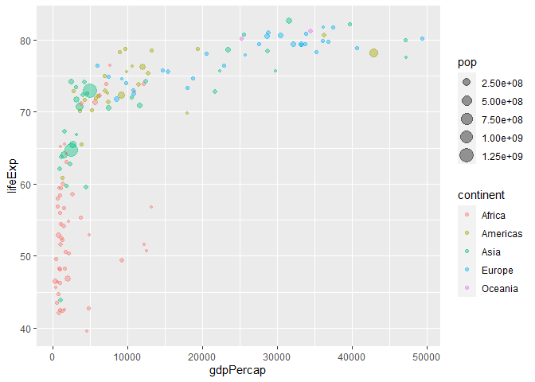

# Class 5: Data Visualization with ggplot2
Krysten Jones (A10553682)

## Using ggplot2

To use ggplot2, first we need to install it on our computers. To do this
we will use the function`install.packages()` We could put this in a code
chunk, but every time we click render it will install the package again.
Instead install in the consul (only need to do once)

Before we use any package functions, we have to load them up with a
\`library’ call, like below:

``` r
library(ggplot2)
```

First let’s examine the structure of our data frame. You can use the
head or tail functions here to view the first or last 6 rows
respectively

``` r
head(cars)
```

      speed dist
    1     4    2
    2     4   10
    3     7    4
    4     7   22
    5     8   16
    6     9   10

The structure function will give you even more information

``` r
str(cars)
```

    'data.frame':   50 obs. of  2 variables:
     $ speed: num  4 4 7 7 8 9 10 10 10 11 ...
     $ dist : num  2 10 4 22 16 10 18 26 34 17 ...

Plotting in ggplot: requires 3 different aspects. The first is the data,
than the aesthetics `aes()` than the geometry/graph type `geom()` - data
(the stuff we want to plot as a data.frame) - aesthetics (how the data
map to the plot/what it looks like) - geometry (how we want something
drawn)

``` r
ggplot(cars, aes(speed, dist)) + 
  geom_point() +
  geom_smooth()
```

    `geom_smooth()` using method = 'loess' and formula = 'y ~ x'


``` r
#best practice here to code on different lines, makes it easier to find errors later
```

`method = "lm"` asks for a trend line, the gray area around it is the
standard error of the mean (SEM) Will add things line by line, so if
want something overlaid, then add it at the end

``` r
ggplot(cars, aes(speed, dist)) + 
  geom_point() +
  geom_smooth(method ="lm", se=FALSE)
```

    `geom_smooth()` using formula = 'y ~ x'


`se = FALSE` will remove the standard error line

Now we’re going to add more labels. The `aes( )` function will decide
what DATA to put on the x and y axis. The `labs()` function is where you
can customize what you want each axis to say.

``` r
ggplot(cars, aes(speed, dist)) + 
  geom_point() +
  geom_smooth(method ="lm", se=FALSE) +
  labs(title="Speed and Stopping Distances of Cars",
       x="Speed (MPH)", 
       y="Stopping Distance (ft)",
       subtitle = "Increased Stopping Distance with Speed",
       caption="Dataset: 'cars'") +
       theme_bw()
```

    `geom_smooth()` using formula = 'y ~ x'


``` r
url <- "https://bioboot.github.io/bimm143_S20/class-material/up_down_expression.txt"
genes <- read.delim(url)
head(genes)
```

            Gene Condition1 Condition2      State
    1      A4GNT -3.6808610 -3.4401355 unchanging
    2       AAAS  4.5479580  4.3864126 unchanging
    3      AASDH  3.7190695  3.4787276 unchanging
    4       AATF  5.0784720  5.0151916 unchanging
    5       AATK  0.4711421  0.5598642 unchanging
    6 AB015752.4 -3.6808610 -3.5921390 unchanging

``` r
nrow(genes)
```

    [1] 5196

``` r
colnames(genes)
```

    [1] "Gene"       "Condition1" "Condition2" "State"     

``` r
ncol(genes)
```

    [1] 4

``` r
genes$State
```

       [1] "unchanging" "unchanging" "unchanging" "unchanging" "unchanging"
       [6] "unchanging" "unchanging" "unchanging" "unchanging" "up"        
      [11] "up"         "unchanging" "unchanging" "unchanging" "unchanging"
      [16] "unchanging" "unchanging" "unchanging" "unchanging" "unchanging"
      [21] "unchanging" "unchanging" "unchanging" "unchanging" "unchanging"
      [26] "unchanging" "unchanging" "unchanging" "unchanging" "unchanging"
      [31] "unchanging" "unchanging" "unchanging" "unchanging" "unchanging"
      [36] "unchanging" "unchanging" "unchanging" "unchanging" "unchanging"
      [41] "unchanging" "unchanging" "unchanging" "unchanging" "unchanging"
      [46] "unchanging" "unchanging" "unchanging" "unchanging" "unchanging"
      [51] "unchanging" "unchanging" "unchanging" "unchanging" "unchanging"
      [56] "unchanging" "unchanging" "unchanging" "unchanging" "unchanging"
      [61] "unchanging" "unchanging" "unchanging" "unchanging" "unchanging"
      [66] "unchanging" "unchanging" "unchanging" "unchanging" "unchanging"
      [71] "unchanging" "unchanging" "unchanging" "unchanging" "unchanging"
      [76] "unchanging" "unchanging" "unchanging" "unchanging" "unchanging"
      [81] "unchanging" "unchanging" "unchanging" "unchanging" "unchanging"
      [86] "unchanging" "unchanging" "unchanging" "unchanging" "unchanging"
      [91] "unchanging" "unchanging" "unchanging" "unchanging" "unchanging"
      [96] "unchanging" "unchanging" "unchanging" "unchanging" "unchanging"
     [101] "unchanging" "unchanging" "unchanging" "unchanging" "unchanging"
     [106] "unchanging" "unchanging" "unchanging" "unchanging" "unchanging"
     [111] "unchanging" "unchanging" "unchanging" "unchanging" "unchanging"
     [116] "unchanging" "unchanging" "unchanging" "unchanging" "unchanging"
     [121] "unchanging" "unchanging" "unchanging" "unchanging" "unchanging"
     [126] "unchanging" "unchanging" "unchanging" "unchanging" "unchanging"
     [131] "unchanging" "unchanging" "unchanging" "unchanging" "unchanging"
     [136] "unchanging" "unchanging" "unchanging" "unchanging" "unchanging"
     [141] "unchanging" "unchanging" "unchanging" "unchanging" "unchanging"
     [146] "unchanging" "unchanging" "unchanging" "unchanging" "unchanging"
     [151] "unchanging" "unchanging" "unchanging" "unchanging" "unchanging"
     [156] "unchanging" "unchanging" "unchanging" "unchanging" "unchanging"
     [161] "unchanging" "unchanging" "unchanging" "unchanging" "unchanging"
     [166] "unchanging" "unchanging" "unchanging" "unchanging" "unchanging"
     [171] "unchanging" "unchanging" "unchanging" "unchanging" "unchanging"
     [176] "unchanging" "unchanging" "unchanging" "unchanging" "unchanging"
     [181] "unchanging" "unchanging" "unchanging" "unchanging" "unchanging"
     [186] "unchanging" "unchanging" "unchanging" "unchanging" "unchanging"
     [191] "unchanging" "unchanging" "unchanging" "unchanging" "unchanging"
     [196] "unchanging" "unchanging" "unchanging" "unchanging" "unchanging"
     [201] "unchanging" "unchanging" "unchanging" "unchanging" "unchanging"
     [206] "unchanging" "unchanging" "unchanging" "unchanging" "unchanging"
     [211] "unchanging" "unchanging" "unchanging" "unchanging" "unchanging"
     [216] "unchanging" "unchanging" "unchanging" "unchanging" "unchanging"
     [221] "unchanging" "unchanging" "unchanging" "unchanging" "unchanging"
     [226] "unchanging" "unchanging" "unchanging" "unchanging" "unchanging"
     [231] "unchanging" "unchanging" "unchanging" "unchanging" "unchanging"
     [236] "unchanging" "unchanging" "unchanging" "unchanging" "unchanging"
     [241] "unchanging" "unchanging" "unchanging" "unchanging" "unchanging"
     [246] "unchanging" "unchanging" "unchanging" "unchanging" "unchanging"
     [251] "unchanging" "unchanging" "unchanging" "unchanging" "unchanging"
     [256] "unchanging" "unchanging" "unchanging" "unchanging" "unchanging"
     [261] "unchanging" "unchanging" "unchanging" "unchanging" "unchanging"
     [266] "unchanging" "unchanging" "unchanging" "unchanging" "unchanging"
     [271] "unchanging" "unchanging" "unchanging" "unchanging" "unchanging"
     [276] "unchanging" "unchanging" "unchanging" "unchanging" "unchanging"
     [281] "unchanging" "unchanging" "unchanging" "unchanging" "unchanging"
     [286] "unchanging" "unchanging" "unchanging" "unchanging" "unchanging"
     [291] "unchanging" "unchanging" "unchanging" "unchanging" "unchanging"
     [296] "unchanging" "unchanging" "unchanging" "unchanging" "unchanging"
     [301] "unchanging" "unchanging" "unchanging" "unchanging" "unchanging"
     [306] "unchanging" "unchanging" "unchanging" "unchanging" "unchanging"
     [311] "unchanging" "unchanging" "unchanging" "unchanging" "unchanging"
     [316] "unchanging" "unchanging" "unchanging" "unchanging" "unchanging"
     [321] "unchanging" "unchanging" "unchanging" "unchanging" "unchanging"
     [326] "unchanging" "unchanging" "unchanging" "unchanging" "unchanging"
     [331] "unchanging" "unchanging" "unchanging" "unchanging" "unchanging"
     [336] "unchanging" "unchanging" "unchanging" "unchanging" "unchanging"
     [341] "unchanging" "unchanging" "unchanging" "unchanging" "unchanging"
     [346] "unchanging" "unchanging" "unchanging" "unchanging" "unchanging"
     [351] "unchanging" "unchanging" "unchanging" "unchanging" "unchanging"
     [356] "unchanging" "unchanging" "unchanging" "unchanging" "unchanging"
     [361] "unchanging" "unchanging" "unchanging" "unchanging" "unchanging"
     [366] "unchanging" "unchanging" "unchanging" "unchanging" "unchanging"
     [371] "unchanging" "unchanging" "unchanging" "unchanging" "unchanging"
     [376] "unchanging" "unchanging" "down"       "unchanging" "unchanging"
     [381] "unchanging" "unchanging" "unchanging" "unchanging" "unchanging"
     [386] "unchanging" "unchanging" "unchanging" "unchanging" "unchanging"
     [391] "unchanging" "unchanging" "unchanging" "unchanging" "unchanging"
     [396] "down"       "unchanging" "unchanging" "unchanging" "unchanging"
     [401] "unchanging" "unchanging" "unchanging" "unchanging" "unchanging"
     [406] "unchanging" "unchanging" "unchanging" "unchanging" "unchanging"
     [411] "unchanging" "unchanging" "unchanging" "unchanging" "unchanging"
     [416] "unchanging" "unchanging" "unchanging" "unchanging" "up"        
     [421] "up"         "unchanging" "unchanging" "unchanging" "unchanging"
     [426] "unchanging" "unchanging" "unchanging" "unchanging" "unchanging"
     [431] "unchanging" "unchanging" "unchanging" "unchanging" "unchanging"
     [436] "unchanging" "unchanging" "unchanging" "unchanging" "unchanging"
     [441] "unchanging" "unchanging" "unchanging" "unchanging" "unchanging"
     [446] "unchanging" "unchanging" "unchanging" "unchanging" "unchanging"
     [451] "unchanging" "unchanging" "unchanging" "unchanging" "unchanging"
     [456] "unchanging" "unchanging" "unchanging" "unchanging" "unchanging"
     [461] "unchanging" "unchanging" "unchanging" "unchanging" "unchanging"
     [466] "unchanging" "unchanging" "unchanging" "unchanging" "unchanging"
     [471] "unchanging" "unchanging" "unchanging" "unchanging" "unchanging"
     [476] "unchanging" "unchanging" "unchanging" "unchanging" "unchanging"
     [481] "unchanging" "unchanging" "unchanging" "down"       "unchanging"
     [486] "unchanging" "unchanging" "unchanging" "unchanging" "unchanging"
     [491] "unchanging" "unchanging" "unchanging" "unchanging" "unchanging"
     [496] "up"         "unchanging" "unchanging" "unchanging" "up"        
     [501] "unchanging" "unchanging" "up"         "unchanging" "unchanging"
     [506] "unchanging" "unchanging" "unchanging" "unchanging" "unchanging"
     [511] "unchanging" "unchanging" "unchanging" "unchanging" "unchanging"
     [516] "unchanging" "unchanging" "unchanging" "unchanging" "unchanging"
     [521] "unchanging" "unchanging" "unchanging" "down"       "up"        
     [526] "unchanging" "unchanging" "unchanging" "unchanging" "unchanging"
     [531] "unchanging" "unchanging" "unchanging" "unchanging" "unchanging"
     [536] "unchanging" "unchanging" "unchanging" "unchanging" "unchanging"
     [541] "unchanging" "unchanging" "unchanging" "unchanging" "unchanging"
     [546] "unchanging" "unchanging" "unchanging" "unchanging" "unchanging"
     [551] "unchanging" "unchanging" "unchanging" "unchanging" "unchanging"
     [556] "unchanging" "unchanging" "unchanging" "unchanging" "unchanging"
     [561] "unchanging" "unchanging" "unchanging" "unchanging" "unchanging"
     [566] "unchanging" "unchanging" "unchanging" "unchanging" "unchanging"
     [571] "unchanging" "unchanging" "unchanging" "unchanging" "unchanging"
     [576] "unchanging" "unchanging" "unchanging" "unchanging" "unchanging"
     [581] "unchanging" "unchanging" "unchanging" "unchanging" "unchanging"
     [586] "unchanging" "unchanging" "unchanging" "unchanging" "unchanging"
     [591] "unchanging" "unchanging" "unchanging" "unchanging" "unchanging"
     [596] "unchanging" "unchanging" "unchanging" "unchanging" "unchanging"
     [601] "unchanging" "unchanging" "unchanging" "unchanging" "unchanging"
     [606] "unchanging" "unchanging" "unchanging" "unchanging" "unchanging"
     [611] "unchanging" "unchanging" "unchanging" "unchanging" "unchanging"
     [616] "unchanging" "unchanging" "unchanging" "unchanging" "unchanging"
     [621] "unchanging" "unchanging" "unchanging" "unchanging" "unchanging"
     [626] "unchanging" "unchanging" "unchanging" "unchanging" "unchanging"
     [631] "unchanging" "down"       "unchanging" "unchanging" "unchanging"
     [636] "unchanging" "unchanging" "unchanging" "unchanging" "unchanging"
     [641] "unchanging" "unchanging" "unchanging" "unchanging" "unchanging"
     [646] "unchanging" "unchanging" "unchanging" "unchanging" "unchanging"
     [651] "unchanging" "unchanging" "unchanging" "unchanging" "unchanging"
     [656] "unchanging" "unchanging" "unchanging" "unchanging" "unchanging"
     [661] "unchanging" "unchanging" "unchanging" "unchanging" "unchanging"
     [666] "unchanging" "down"       "down"       "unchanging" "unchanging"
     [671] "unchanging" "unchanging" "unchanging" "unchanging" "unchanging"
     [676] "unchanging" "unchanging" "unchanging" "unchanging" "unchanging"
     [681] "unchanging" "unchanging" "unchanging" "unchanging" "unchanging"
     [686] "unchanging" "unchanging" "unchanging" "unchanging" "unchanging"
     [691] "unchanging" "unchanging" "unchanging" "unchanging" "unchanging"
     [696] "unchanging" "unchanging" "unchanging" "unchanging" "unchanging"
     [701] "unchanging" "unchanging" "unchanging" "unchanging" "unchanging"
     [706] "unchanging" "unchanging" "unchanging" "unchanging" "unchanging"
     [711] "unchanging" "unchanging" "up"         "unchanging" "unchanging"
     [716] "unchanging" "unchanging" "down"       "unchanging" "unchanging"
     [721] "unchanging" "unchanging" "unchanging" "unchanging" "unchanging"
     [726] "unchanging" "unchanging" "unchanging" "unchanging" "unchanging"
     [731] "unchanging" "down"       "up"         "unchanging" "unchanging"
     [736] "up"         "unchanging" "unchanging" "unchanging" "unchanging"
     [741] "unchanging" "unchanging" "unchanging" "unchanging" "unchanging"
     [746] "unchanging" "unchanging" "unchanging" "unchanging" "unchanging"
     [751] "unchanging" "unchanging" "unchanging" "unchanging" "unchanging"
     [756] "unchanging" "unchanging" "unchanging" "unchanging" "unchanging"
     [761] "unchanging" "unchanging" "unchanging" "unchanging" "unchanging"
     [766] "unchanging" "unchanging" "unchanging" "unchanging" "down"      
     [771] "unchanging" "unchanging" "unchanging" "unchanging" "unchanging"
     [776] "unchanging" "unchanging" "unchanging" "unchanging" "unchanging"
     [781] "unchanging" "unchanging" "unchanging" "unchanging" "unchanging"
     [786] "unchanging" "unchanging" "unchanging" "unchanging" "unchanging"
     [791] "unchanging" "unchanging" "unchanging" "unchanging" "down"      
     [796] "unchanging" "unchanging" "unchanging" "unchanging" "unchanging"
     [801] "unchanging" "unchanging" "unchanging" "unchanging" "unchanging"
     [806] "unchanging" "unchanging" "unchanging" "unchanging" "unchanging"
     [811] "unchanging" "unchanging" "unchanging" "unchanging" "unchanging"
     [816] "unchanging" "unchanging" "unchanging" "unchanging" "unchanging"
     [821] "unchanging" "unchanging" "unchanging" "unchanging" "unchanging"
     [826] "unchanging" "unchanging" "unchanging" "unchanging" "unchanging"
     [831] "unchanging" "unchanging" "unchanging" "unchanging" "unchanging"
     [836] "unchanging" "unchanging" "unchanging" "unchanging" "unchanging"
     [841] "unchanging" "unchanging" "unchanging" "unchanging" "unchanging"
     [846] "unchanging" "unchanging" "unchanging" "unchanging" "unchanging"
     [851] "unchanging" "unchanging" "unchanging" "unchanging" "unchanging"
     [856] "unchanging" "unchanging" "unchanging" "unchanging" "unchanging"
     [861] "unchanging" "unchanging" "unchanging" "unchanging" "unchanging"
     [866] "unchanging" "unchanging" "unchanging" "unchanging" "unchanging"
     [871] "unchanging" "unchanging" "unchanging" "unchanging" "unchanging"
     [876] "unchanging" "unchanging" "unchanging" "unchanging" "unchanging"
     [881] "unchanging" "unchanging" "unchanging" "unchanging" "unchanging"
     [886] "unchanging" "unchanging" "unchanging" "unchanging" "unchanging"
     [891] "unchanging" "unchanging" "unchanging" "unchanging" "unchanging"
     [896] "unchanging" "unchanging" "unchanging" "unchanging" "unchanging"
     [901] "unchanging" "unchanging" "unchanging" "unchanging" "unchanging"
     [906] "unchanging" "unchanging" "unchanging" "unchanging" "unchanging"
     [911] "unchanging" "unchanging" "unchanging" "unchanging" "unchanging"
     [916] "unchanging" "unchanging" "unchanging" "unchanging" "unchanging"
     [921] "unchanging" "unchanging" "unchanging" "unchanging" "unchanging"
     [926] "unchanging" "unchanging" "unchanging" "unchanging" "unchanging"
     [931] "unchanging" "unchanging" "unchanging" "unchanging" "unchanging"
     [936] "unchanging" "unchanging" "unchanging" "unchanging" "unchanging"
     [941] "unchanging" "unchanging" "unchanging" "unchanging" "unchanging"
     [946] "unchanging" "unchanging" "unchanging" "up"         "unchanging"
     [951] "unchanging" "unchanging" "unchanging" "unchanging" "unchanging"
     [956] "unchanging" "unchanging" "unchanging" "unchanging" "unchanging"
     [961] "unchanging" "unchanging" "unchanging" "unchanging" "unchanging"
     [966] "unchanging" "unchanging" "unchanging" "unchanging" "up"        
     [971] "unchanging" "unchanging" "unchanging" "unchanging" "unchanging"
     [976] "down"       "unchanging" "unchanging" "unchanging" "unchanging"
     [981] "unchanging" "unchanging" "unchanging" "unchanging" "unchanging"
     [986] "unchanging" "unchanging" "unchanging" "unchanging" "unchanging"
     [991] "unchanging" "unchanging" "unchanging" "unchanging" "unchanging"
     [996] "unchanging" "unchanging" "unchanging" "unchanging" "unchanging"
    [1001] "unchanging" "unchanging" "unchanging" "unchanging" "unchanging"
    [1006] "unchanging" "unchanging" "unchanging" "unchanging" "unchanging"
    [1011] "unchanging" "unchanging" "unchanging" "unchanging" "unchanging"
    [1016] "unchanging" "unchanging" "unchanging" "unchanging" "unchanging"
    [1021] "unchanging" "unchanging" "unchanging" "unchanging" "unchanging"
    [1026] "unchanging" "unchanging" "unchanging" "unchanging" "unchanging"
    [1031] "unchanging" "unchanging" "unchanging" "unchanging" "unchanging"
    [1036] "unchanging" "unchanging" "unchanging" "unchanging" "unchanging"
    [1041] "unchanging" "unchanging" "unchanging" "unchanging" "unchanging"
    [1046] "unchanging" "down"       "unchanging" "unchanging" "up"        
    [1051] "unchanging" "unchanging" "unchanging" "unchanging" "unchanging"
    [1056] "unchanging" "up"         "unchanging" "unchanging" "unchanging"
    [1061] "unchanging" "up"         "unchanging" "unchanging" "unchanging"
    [1066] "unchanging" "up"         "up"         "unchanging" "unchanging"
    [1071] "down"       "unchanging" "unchanging" "unchanging" "unchanging"
    [1076] "unchanging" "unchanging" "unchanging" "unchanging" "unchanging"
    [1081] "down"       "unchanging" "unchanging" "unchanging" "unchanging"
    [1086] "unchanging" "unchanging" "unchanging" "unchanging" "unchanging"
    [1091] "unchanging" "unchanging" "unchanging" "unchanging" "unchanging"
    [1096] "unchanging" "unchanging" "unchanging" "unchanging" "unchanging"
    [1101] "unchanging" "unchanging" "unchanging" "unchanging" "unchanging"
    [1106] "unchanging" "unchanging" "down"       "unchanging" "unchanging"
    [1111] "unchanging" "unchanging" "unchanging" "unchanging" "unchanging"
    [1116] "unchanging" "unchanging" "unchanging" "unchanging" "unchanging"
    [1121] "unchanging" "unchanging" "unchanging" "unchanging" "unchanging"
    [1126] "unchanging" "down"       "unchanging" "unchanging" "unchanging"
    [1131] "unchanging" "unchanging" "unchanging" "up"         "unchanging"
    [1136] "unchanging" "unchanging" "unchanging" "unchanging" "unchanging"
    [1141] "unchanging" "unchanging" "unchanging" "unchanging" "unchanging"
    [1146] "unchanging" "unchanging" "unchanging" "unchanging" "down"      
    [1151] "up"         "down"       "down"       "unchanging" "unchanging"
    [1156] "down"       "unchanging" "up"         "unchanging" "unchanging"
    [1161] "unchanging" "unchanging" "unchanging" "unchanging" "unchanging"
    [1166] "unchanging" "unchanging" "up"         "unchanging" "unchanging"
    [1171] "unchanging" "unchanging" "unchanging" "unchanging" "unchanging"
    [1176] "unchanging" "unchanging" "unchanging" "unchanging" "unchanging"
    [1181] "unchanging" "unchanging" "up"         "unchanging" "unchanging"
    [1186] "up"         "unchanging" "unchanging" "unchanging" "unchanging"
    [1191] "unchanging" "unchanging" "unchanging" "unchanging" "unchanging"
    [1196] "unchanging" "unchanging" "unchanging" "unchanging" "unchanging"
    [1201] "unchanging" "unchanging" "unchanging" "unchanging" "unchanging"
    [1206] "unchanging" "unchanging" "unchanging" "unchanging" "unchanging"
    [1211] "unchanging" "unchanging" "unchanging" "unchanging" "unchanging"
    [1216] "unchanging" "unchanging" "unchanging" "unchanging" "unchanging"
    [1221] "unchanging" "unchanging" "unchanging" "unchanging" "unchanging"
    [1226] "unchanging" "unchanging" "unchanging" "unchanging" "unchanging"
    [1231] "unchanging" "unchanging" "unchanging" "unchanging" "unchanging"
    [1236] "unchanging" "unchanging" "unchanging" "unchanging" "unchanging"
    [1241] "unchanging" "unchanging" "unchanging" "unchanging" "unchanging"
    [1246] "unchanging" "unchanging" "unchanging" "unchanging" "unchanging"
    [1251] "unchanging" "unchanging" "unchanging" "unchanging" "unchanging"
    [1256] "unchanging" "unchanging" "unchanging" "unchanging" "unchanging"
    [1261] "unchanging" "unchanging" "unchanging" "unchanging" "unchanging"
    [1266] "unchanging" "unchanging" "unchanging" "unchanging" "unchanging"
    [1271] "unchanging" "unchanging" "unchanging" "up"         "unchanging"
    [1276] "unchanging" "unchanging" "unchanging" "unchanging" "unchanging"
    [1281] "unchanging" "unchanging" "unchanging" "unchanging" "unchanging"
    [1286] "unchanging" "unchanging" "unchanging" "unchanging" "unchanging"
    [1291] "unchanging" "unchanging" "unchanging" "unchanging" "unchanging"
    [1296] "unchanging" "unchanging" "unchanging" "unchanging" "unchanging"
    [1301] "unchanging" "unchanging" "unchanging" "unchanging" "unchanging"
    [1306] "unchanging" "unchanging" "unchanging" "unchanging" "unchanging"
    [1311] "unchanging" "unchanging" "unchanging" "unchanging" "unchanging"
    [1316] "unchanging" "unchanging" "unchanging" "unchanging" "unchanging"
    [1321] "unchanging" "unchanging" "unchanging" "unchanging" "unchanging"
    [1326] "unchanging" "unchanging" "unchanging" "unchanging" "unchanging"
    [1331] "unchanging" "unchanging" "up"         "unchanging" "unchanging"
    [1336] "unchanging" "unchanging" "unchanging" "unchanging" "unchanging"
    [1341] "unchanging" "unchanging" "unchanging" "unchanging" "unchanging"
    [1346] "unchanging" "unchanging" "unchanging" "unchanging" "unchanging"
    [1351] "unchanging" "unchanging" "unchanging" "unchanging" "unchanging"
    [1356] "up"         "unchanging" "up"         "unchanging" "unchanging"
    [1361] "unchanging" "unchanging" "unchanging" "up"         "unchanging"
    [1366] "unchanging" "unchanging" "unchanging" "unchanging" "unchanging"
    [1371] "unchanging" "unchanging" "unchanging" "unchanging" "unchanging"
    [1376] "unchanging" "unchanging" "unchanging" "unchanging" "unchanging"
    [1381] "unchanging" "unchanging" "unchanging" "unchanging" "unchanging"
    [1386] "unchanging" "unchanging" "unchanging" "unchanging" "unchanging"
    [1391] "unchanging" "unchanging" "unchanging" "unchanging" "unchanging"
    [1396] "unchanging" "unchanging" "unchanging" "unchanging" "unchanging"
    [1401] "unchanging" "unchanging" "unchanging" "unchanging" "unchanging"
    [1406] "unchanging" "unchanging" "unchanging" "unchanging" "unchanging"
    [1411] "unchanging" "unchanging" "unchanging" "unchanging" "unchanging"
    [1416] "unchanging" "unchanging" "unchanging" "unchanging" "unchanging"
    [1421] "unchanging" "unchanging" "unchanging" "unchanging" "unchanging"
    [1426] "unchanging" "unchanging" "unchanging" "unchanging" "unchanging"
    [1431] "unchanging" "unchanging" "unchanging" "unchanging" "unchanging"
    [1436] "unchanging" "unchanging" "unchanging" "unchanging" "unchanging"
    [1441] "unchanging" "down"       "unchanging" "unchanging" "unchanging"
    [1446] "unchanging" "unchanging" "unchanging" "unchanging" "unchanging"
    [1451] "unchanging" "unchanging" "unchanging" "unchanging" "unchanging"
    [1456] "unchanging" "unchanging" "unchanging" "unchanging" "unchanging"
    [1461] "up"         "up"         "unchanging" "unchanging" "unchanging"
    [1466] "unchanging" "unchanging" "unchanging" "unchanging" "unchanging"
    [1471] "unchanging" "unchanging" "unchanging" "unchanging" "unchanging"
    [1476] "unchanging" "unchanging" "unchanging" "unchanging" "unchanging"
    [1481] "unchanging" "unchanging" "unchanging" "unchanging" "unchanging"
    [1486] "unchanging" "unchanging" "unchanging" "unchanging" "unchanging"
    [1491] "unchanging" "up"         "down"       "unchanging" "unchanging"
    [1496] "unchanging" "unchanging" "unchanging" "unchanging" "unchanging"
    [1501] "down"       "down"       "unchanging" "unchanging" "unchanging"
    [1506] "unchanging" "unchanging" "unchanging" "unchanging" "unchanging"
    [1511] "unchanging" "unchanging" "unchanging" "unchanging" "unchanging"
    [1516] "unchanging" "unchanging" "unchanging" "unchanging" "unchanging"
    [1521] "unchanging" "unchanging" "up"         "unchanging" "unchanging"
    [1526] "unchanging" "unchanging" "unchanging" "unchanging" "unchanging"
    [1531] "unchanging" "unchanging" "unchanging" "unchanging" "unchanging"
    [1536] "up"         "unchanging" "unchanging" "unchanging" "unchanging"
    [1541] "unchanging" "unchanging" "unchanging" "unchanging" "unchanging"
    [1546] "up"         "unchanging" "unchanging" "unchanging" "unchanging"
    [1551] "unchanging" "unchanging" "unchanging" "unchanging" "unchanging"
    [1556] "unchanging" "unchanging" "unchanging" "unchanging" "unchanging"
    [1561] "unchanging" "unchanging" "unchanging" "unchanging" "unchanging"
    [1566] "unchanging" "unchanging" "unchanging" "unchanging" "unchanging"
    [1571] "unchanging" "unchanging" "unchanging" "unchanging" "unchanging"
    [1576] "unchanging" "unchanging" "unchanging" "unchanging" "unchanging"
    [1581] "unchanging" "unchanging" "unchanging" "unchanging" "unchanging"
    [1586] "unchanging" "unchanging" "unchanging" "unchanging" "unchanging"
    [1591] "unchanging" "unchanging" "unchanging" "unchanging" "unchanging"
    [1596] "unchanging" "unchanging" "unchanging" "unchanging" "unchanging"
    [1601] "unchanging" "unchanging" "unchanging" "unchanging" "unchanging"
    [1606] "unchanging" "unchanging" "unchanging" "unchanging" "unchanging"
    [1611] "unchanging" "unchanging" "unchanging" "unchanging" "unchanging"
    [1616] "unchanging" "unchanging" "unchanging" "unchanging" "unchanging"
    [1621] "unchanging" "unchanging" "unchanging" "unchanging" "unchanging"
    [1626] "unchanging" "unchanging" "unchanging" "unchanging" "unchanging"
    [1631] "unchanging" "unchanging" "unchanging" "unchanging" "unchanging"
    [1636] "unchanging" "unchanging" "unchanging" "unchanging" "unchanging"
    [1641] "unchanging" "unchanging" "unchanging" "unchanging" "unchanging"
    [1646] "unchanging" "unchanging" "unchanging" "unchanging" "unchanging"
    [1651] "unchanging" "unchanging" "unchanging" "unchanging" "unchanging"
    [1656] "unchanging" "unchanging" "unchanging" "up"         "unchanging"
    [1661] "up"         "unchanging" "unchanging" "unchanging" "unchanging"
    [1666] "unchanging" "unchanging" "unchanging" "unchanging" "unchanging"
    [1671] "unchanging" "unchanging" "unchanging" "unchanging" "unchanging"
    [1676] "unchanging" "unchanging" "unchanging" "unchanging" "unchanging"
    [1681] "unchanging" "unchanging" "unchanging" "unchanging" "unchanging"
    [1686] "unchanging" "unchanging" "unchanging" "unchanging" "unchanging"
    [1691] "up"         "unchanging" "unchanging" "unchanging" "unchanging"
    [1696] "unchanging" "unchanging" "unchanging" "unchanging" "unchanging"
    [1701] "unchanging" "unchanging" "unchanging" "unchanging" "up"        
    [1706] "unchanging" "unchanging" "unchanging" "unchanging" "unchanging"
    [1711] "unchanging" "up"         "unchanging" "unchanging" "unchanging"
    [1716] "unchanging" "unchanging" "unchanging" "unchanging" "unchanging"
    [1721] "unchanging" "unchanging" "down"       "unchanging" "unchanging"
    [1726] "unchanging" "unchanging" "unchanging" "unchanging" "unchanging"
    [1731] "up"         "unchanging" "unchanging" "unchanging" "unchanging"
    [1736] "unchanging" "unchanging" "unchanging" "unchanging" "unchanging"
    [1741] "unchanging" "unchanging" "unchanging" "unchanging" "unchanging"
    [1746] "unchanging" "unchanging" "unchanging" "unchanging" "unchanging"
    [1751] "unchanging" "unchanging" "unchanging" "up"         "unchanging"
    [1756] "unchanging" "unchanging" "unchanging" "down"       "down"      
    [1761] "unchanging" "unchanging" "down"       "unchanging" "unchanging"
    [1766] "unchanging" "unchanging" "unchanging" "unchanging" "unchanging"
    [1771] "unchanging" "up"         "unchanging" "unchanging" "unchanging"
    [1776] "unchanging" "unchanging" "unchanging" "unchanging" "unchanging"
    [1781] "unchanging" "unchanging" "unchanging" "unchanging" "unchanging"
    [1786] "unchanging" "unchanging" "up"         "unchanging" "unchanging"
    [1791] "unchanging" "unchanging" "unchanging" "unchanging" "unchanging"
    [1796] "unchanging" "unchanging" "unchanging" "unchanging" "unchanging"
    [1801] "unchanging" "unchanging" "unchanging" "unchanging" "unchanging"
    [1806] "unchanging" "unchanging" "unchanging" "unchanging" "unchanging"
    [1811] "unchanging" "unchanging" "unchanging" "unchanging" "unchanging"
    [1816] "unchanging" "unchanging" "unchanging" "up"         "unchanging"
    [1821] "up"         "up"         "unchanging" "unchanging" "unchanging"
    [1826] "unchanging" "unchanging" "unchanging" "unchanging" "unchanging"
    [1831] "unchanging" "unchanging" "unchanging" "up"         "unchanging"
    [1836] "unchanging" "unchanging" "unchanging" "unchanging" "unchanging"
    [1841] "unchanging" "unchanging" "unchanging" "unchanging" "unchanging"
    [1846] "unchanging" "unchanging" "unchanging" "unchanging" "unchanging"
    [1851] "unchanging" "unchanging" "unchanging" "unchanging" "unchanging"
    [1856] "unchanging" "unchanging" "unchanging" "unchanging" "unchanging"
    [1861] "unchanging" "unchanging" "unchanging" "unchanging" "unchanging"
    [1866] "unchanging" "unchanging" "unchanging" "up"         "unchanging"
    [1871] "unchanging" "unchanging" "unchanging" "unchanging" "up"        
    [1876] "unchanging" "unchanging" "unchanging" "unchanging" "unchanging"
    [1881] "unchanging" "unchanging" "unchanging" "unchanging" "unchanging"
    [1886] "unchanging" "unchanging" "unchanging" "unchanging" "unchanging"
    [1891] "unchanging" "unchanging" "unchanging" "unchanging" "unchanging"
    [1896] "unchanging" "unchanging" "unchanging" "unchanging" "unchanging"
    [1901] "unchanging" "unchanging" "unchanging" "unchanging" "unchanging"
    [1906] "unchanging" "unchanging" "unchanging" "unchanging" "unchanging"
    [1911] "unchanging" "unchanging" "unchanging" "unchanging" "unchanging"
    [1916] "unchanging" "unchanging" "unchanging" "unchanging" "unchanging"
    [1921] "unchanging" "up"         "unchanging" "unchanging" "up"        
    [1926] "up"         "unchanging" "unchanging" "unchanging" "unchanging"
    [1931] "unchanging" "unchanging" "unchanging" "unchanging" "unchanging"
    [1936] "up"         "unchanging" "unchanging" "unchanging" "unchanging"
    [1941] "unchanging" "unchanging" "unchanging" "unchanging" "unchanging"
    [1946] "unchanging" "unchanging" "unchanging" "unchanging" "unchanging"
    [1951] "unchanging" "unchanging" "unchanging" "unchanging" "unchanging"
    [1956] "unchanging" "unchanging" "unchanging" "unchanging" "unchanging"
    [1961] "unchanging" "unchanging" "unchanging" "unchanging" "unchanging"
    [1966] "unchanging" "unchanging" "up"         "unchanging" "unchanging"
    [1971] "unchanging" "unchanging" "unchanging" "unchanging" "unchanging"
    [1976] "unchanging" "unchanging" "unchanging" "unchanging" "unchanging"
    [1981] "up"         "unchanging" "unchanging" "unchanging" "unchanging"
    [1986] "unchanging" "unchanging" "unchanging" "unchanging" "unchanging"
    [1991] "unchanging" "unchanging" "unchanging" "unchanging" "down"      
    [1996] "up"         "up"         "unchanging" "unchanging" "unchanging"
    [2001] "unchanging" "unchanging" "unchanging" "unchanging" "unchanging"
    [2006] "unchanging" "unchanging" "unchanging" "unchanging" "unchanging"
    [2011] "unchanging" "unchanging" "unchanging" "unchanging" "unchanging"
    [2016] "unchanging" "unchanging" "unchanging" "unchanging" "unchanging"
    [2021] "unchanging" "unchanging" "unchanging" "unchanging" "unchanging"
    [2026] "unchanging" "unchanging" "unchanging" "unchanging" "unchanging"
    [2031] "unchanging" "unchanging" "unchanging" "unchanging" "unchanging"
    [2036] "unchanging" "unchanging" "unchanging" "unchanging" "unchanging"
    [2041] "unchanging" "unchanging" "unchanging" "unchanging" "unchanging"
    [2046] "unchanging" "unchanging" "unchanging" "unchanging" "unchanging"
    [2051] "unchanging" "unchanging" "unchanging" "unchanging" "unchanging"
    [2056] "unchanging" "unchanging" "unchanging" "unchanging" "unchanging"
    [2061] "unchanging" "unchanging" "unchanging" "unchanging" "unchanging"
    [2066] "unchanging" "unchanging" "unchanging" "unchanging" "unchanging"
    [2071] "unchanging" "unchanging" "unchanging" "unchanging" "unchanging"
    [2076] "unchanging" "unchanging" "unchanging" "unchanging" "unchanging"
    [2081] "unchanging" "unchanging" "unchanging" "unchanging" "unchanging"
    [2086] "up"         "unchanging" "unchanging" "unchanging" "unchanging"
    [2091] "unchanging" "unchanging" "unchanging" "unchanging" "unchanging"
    [2096] "unchanging" "unchanging" "unchanging" "unchanging" "unchanging"
    [2101] "unchanging" "unchanging" "unchanging" "unchanging" "unchanging"
    [2106] "unchanging" "unchanging" "unchanging" "unchanging" "unchanging"
    [2111] "up"         "unchanging" "unchanging" "unchanging" "unchanging"
    [2116] "unchanging" "unchanging" "unchanging" "unchanging" "unchanging"
    [2121] "unchanging" "unchanging" "unchanging" "up"         "unchanging"
    [2126] "unchanging" "unchanging" "unchanging" "unchanging" "unchanging"
    [2131] "unchanging" "unchanging" "unchanging" "unchanging" "unchanging"
    [2136] "unchanging" "unchanging" "unchanging" "unchanging" "unchanging"
    [2141] "unchanging" "unchanging" "unchanging" "unchanging" "unchanging"
    [2146] "unchanging" "unchanging" "unchanging" "unchanging" "unchanging"
    [2151] "unchanging" "unchanging" "unchanging" "up"         "unchanging"
    [2156] "unchanging" "unchanging" "unchanging" "unchanging" "unchanging"
    [2161] "unchanging" "unchanging" "unchanging" "unchanging" "unchanging"
    [2166] "unchanging" "unchanging" "unchanging" "unchanging" "unchanging"
    [2171] "up"         "up"         "unchanging" "unchanging" "unchanging"
    [2176] "unchanging" "down"       "unchanging" "unchanging" "unchanging"
    [2181] "unchanging" "unchanging" "unchanging" "unchanging" "unchanging"
    [2186] "unchanging" "unchanging" "unchanging" "unchanging" "unchanging"
    [2191] "unchanging" "unchanging" "unchanging" "unchanging" "unchanging"
    [2196] "unchanging" "unchanging" "unchanging" "unchanging" "unchanging"
    [2201] "unchanging" "unchanging" "unchanging" "unchanging" "unchanging"
    [2206] "unchanging" "unchanging" "unchanging" "unchanging" "unchanging"
    [2211] "unchanging" "unchanging" "unchanging" "unchanging" "unchanging"
    [2216] "unchanging" "unchanging" "unchanging" "unchanging" "unchanging"
    [2221] "unchanging" "unchanging" "unchanging" "unchanging" "unchanging"
    [2226] "unchanging" "unchanging" "unchanging" "unchanging" "unchanging"
    [2231] "unchanging" "unchanging" "unchanging" "unchanging" "unchanging"
    [2236] "unchanging" "unchanging" "unchanging" "unchanging" "unchanging"
    [2241] "unchanging" "unchanging" "unchanging" "unchanging" "unchanging"
    [2246] "unchanging" "unchanging" "unchanging" "unchanging" "unchanging"
    [2251] "up"         "unchanging" "up"         "unchanging" "unchanging"
    [2256] "unchanging" "unchanging" "unchanging" "unchanging" "unchanging"
    [2261] "unchanging" "unchanging" "unchanging" "unchanging" "unchanging"
    [2266] "unchanging" "unchanging" "unchanging" "unchanging" "unchanging"
    [2271] "unchanging" "unchanging" "down"       "unchanging" "unchanging"
    [2276] "unchanging" "unchanging" "unchanging" "unchanging" "unchanging"
    [2281] "unchanging" "unchanging" "unchanging" "unchanging" "unchanging"
    [2286] "unchanging" "unchanging" "unchanging" "unchanging" "unchanging"
    [2291] "unchanging" "unchanging" "unchanging" "unchanging" "unchanging"
    [2296] "unchanging" "unchanging" "unchanging" "unchanging" "unchanging"
    [2301] "unchanging" "unchanging" "unchanging" "unchanging" "unchanging"
    [2306] "unchanging" "unchanging" "unchanging" "unchanging" "unchanging"
    [2311] "unchanging" "unchanging" "unchanging" "unchanging" "unchanging"
    [2316] "unchanging" "unchanging" "unchanging" "unchanging" "unchanging"
    [2321] "unchanging" "unchanging" "unchanging" "unchanging" "unchanging"
    [2326] "unchanging" "unchanging" "unchanging" "unchanging" "down"      
    [2331] "up"         "up"         "unchanging" "unchanging" "unchanging"
    [2336] "unchanging" "unchanging" "unchanging" "unchanging" "unchanging"
    [2341] "unchanging" "unchanging" "unchanging" "unchanging" "unchanging"
    [2346] "unchanging" "unchanging" "unchanging" "unchanging" "unchanging"
    [2351] "unchanging" "unchanging" "unchanging" "unchanging" "unchanging"
    [2356] "unchanging" "unchanging" "unchanging" "unchanging" "unchanging"
    [2361] "unchanging" "unchanging" "unchanging" "unchanging" "unchanging"
    [2366] "unchanging" "unchanging" "unchanging" "unchanging" "unchanging"
    [2371] "unchanging" "unchanging" "unchanging" "unchanging" "unchanging"
    [2376] "unchanging" "unchanging" "unchanging" "unchanging" "unchanging"
    [2381] "down"       "unchanging" "unchanging" "unchanging" "unchanging"
    [2386] "unchanging" "unchanging" "unchanging" "unchanging" "unchanging"
    [2391] "up"         "unchanging" "unchanging" "unchanging" "unchanging"
    [2396] "unchanging" "unchanging" "unchanging" "unchanging" "unchanging"
    [2401] "unchanging" "unchanging" "unchanging" "unchanging" "unchanging"
    [2406] "unchanging" "unchanging" "unchanging" "unchanging" "unchanging"
    [2411] "unchanging" "unchanging" "unchanging" "unchanging" "unchanging"
    [2416] "unchanging" "unchanging" "unchanging" "unchanging" "unchanging"
    [2421] "unchanging" "unchanging" "unchanging" "unchanging" "unchanging"
    [2426] "unchanging" "unchanging" "unchanging" "unchanging" "unchanging"
    [2431] "unchanging" "unchanging" "unchanging" "unchanging" "unchanging"
    [2436] "unchanging" "unchanging" "unchanging" "unchanging" "unchanging"
    [2441] "unchanging" "unchanging" "unchanging" "unchanging" "unchanging"
    [2446] "unchanging" "unchanging" "unchanging" "unchanging" "unchanging"
    [2451] "unchanging" "unchanging" "unchanging" "unchanging" "unchanging"
    [2456] "unchanging" "up"         "unchanging" "unchanging" "unchanging"
    [2461] "unchanging" "unchanging" "unchanging" "unchanging" "unchanging"
    [2466] "unchanging" "unchanging" "unchanging" "unchanging" "unchanging"
    [2471] "up"         "up"         "unchanging" "unchanging" "up"        
    [2476] "down"       "unchanging" "unchanging" "unchanging" "up"        
    [2481] "unchanging" "unchanging" "unchanging" "unchanging" "up"        
    [2486] "unchanging" "unchanging" "unchanging" "unchanging" "unchanging"
    [2491] "unchanging" "up"         "unchanging" "unchanging" "unchanging"
    [2496] "unchanging" "unchanging" "unchanging" "unchanging" "unchanging"
    [2501] "unchanging" "unchanging" "unchanging" "unchanging" "unchanging"
    [2506] "unchanging" "unchanging" "unchanging" "unchanging" "unchanging"
    [2511] "unchanging" "unchanging" "down"       "unchanging" "unchanging"
    [2516] "unchanging" "unchanging" "unchanging" "down"       "unchanging"
    [2521] "unchanging" "unchanging" "unchanging" "unchanging" "unchanging"
    [2526] "unchanging" "unchanging" "unchanging" "unchanging" "unchanging"
    [2531] "unchanging" "unchanging" "unchanging" "unchanging" "unchanging"
    [2536] "unchanging" "up"         "unchanging" "unchanging" "unchanging"
    [2541] "unchanging" "unchanging" "unchanging" "unchanging" "unchanging"
    [2546] "unchanging" "down"       "unchanging" "unchanging" "unchanging"
    [2551] "unchanging" "unchanging" "unchanging" "unchanging" "unchanging"
    [2556] "unchanging" "unchanging" "unchanging" "down"       "unchanging"
    [2561] "unchanging" "unchanging" "unchanging" "unchanging" "unchanging"
    [2566] "unchanging" "unchanging" "unchanging" "unchanging" "unchanging"
    [2571] "unchanging" "unchanging" "unchanging" "unchanging" "unchanging"
    [2576] "unchanging" "unchanging" "unchanging" "unchanging" "unchanging"
    [2581] "down"       "unchanging" "unchanging" "unchanging" "unchanging"
    [2586] "unchanging" "unchanging" "unchanging" "unchanging" "unchanging"
    [2591] "unchanging" "unchanging" "unchanging" "unchanging" "unchanging"
    [2596] "unchanging" "unchanging" "unchanging" "unchanging" "unchanging"
    [2601] "unchanging" "unchanging" "unchanging" "unchanging" "up"        
    [2606] "unchanging" "unchanging" "unchanging" "unchanging" "unchanging"
    [2611] "unchanging" "unchanging" "unchanging" "unchanging" "unchanging"
    [2616] "unchanging" "unchanging" "up"         "unchanging" "unchanging"
    [2621] "unchanging" "unchanging" "unchanging" "unchanging" "unchanging"
    [2626] "unchanging" "unchanging" "unchanging" "unchanging" "unchanging"
    [2631] "unchanging" "unchanging" "unchanging" "unchanging" "up"        
    [2636] "unchanging" "unchanging" "unchanging" "unchanging" "unchanging"
    [2641] "unchanging" "unchanging" "unchanging" "unchanging" "unchanging"
    [2646] "unchanging" "unchanging" "unchanging" "unchanging" "unchanging"
    [2651] "unchanging" "unchanging" "unchanging" "unchanging" "unchanging"
    [2656] "unchanging" "unchanging" "unchanging" "unchanging" "unchanging"
    [2661] "unchanging" "unchanging" "unchanging" "unchanging" "unchanging"
    [2666] "unchanging" "unchanging" "unchanging" "unchanging" "unchanging"
    [2671] "unchanging" "unchanging" "unchanging" "unchanging" "unchanging"
    [2676] "unchanging" "unchanging" "unchanging" "unchanging" "unchanging"
    [2681] "unchanging" "unchanging" "unchanging" "up"         "unchanging"
    [2686] "unchanging" "unchanging" "unchanging" "unchanging" "unchanging"
    [2691] "unchanging" "unchanging" "unchanging" "unchanging" "unchanging"
    [2696] "unchanging" "unchanging" "unchanging" "unchanging" "unchanging"
    [2701] "unchanging" "unchanging" "unchanging" "unchanging" "unchanging"
    [2706] "unchanging" "unchanging" "unchanging" "unchanging" "unchanging"
    [2711] "unchanging" "unchanging" "unchanging" "unchanging" "unchanging"
    [2716] "unchanging" "unchanging" "unchanging" "unchanging" "unchanging"
    [2721] "unchanging" "unchanging" "unchanging" "unchanging" "unchanging"
    [2726] "unchanging" "unchanging" "unchanging" "unchanging" "unchanging"
    [2731] "unchanging" "unchanging" "unchanging" "unchanging" "unchanging"
    [2736] "unchanging" "unchanging" "unchanging" "unchanging" "unchanging"
    [2741] "unchanging" "unchanging" "unchanging" "unchanging" "unchanging"
    [2746] "unchanging" "unchanging" "unchanging" "unchanging" "unchanging"
    [2751] "unchanging" "unchanging" "unchanging" "unchanging" "down"      
    [2756] "unchanging" "unchanging" "unchanging" "unchanging" "unchanging"
    [2761] "unchanging" "unchanging" "unchanging" "unchanging" "unchanging"
    [2766] "unchanging" "unchanging" "unchanging" "unchanging" "unchanging"
    [2771] "unchanging" "unchanging" "down"       "unchanging" "unchanging"
    [2776] "down"       "unchanging" "unchanging" "unchanging" "unchanging"
    [2781] "unchanging" "unchanging" "up"         "unchanging" "unchanging"
    [2786] "unchanging" "unchanging" "unchanging" "unchanging" "unchanging"
    [2791] "unchanging" "unchanging" "unchanging" "unchanging" "unchanging"
    [2796] "up"         "unchanging" "unchanging" "unchanging" "unchanging"
    [2801] "unchanging" "unchanging" "unchanging" "unchanging" "unchanging"
    [2806] "unchanging" "unchanging" "unchanging" "up"         "unchanging"
    [2811] "down"       "unchanging" "unchanging" "unchanging" "unchanging"
    [2816] "unchanging" "unchanging" "down"       "unchanging" "up"        
    [2821] "unchanging" "unchanging" "unchanging" "unchanging" "unchanging"
    [2826] "unchanging" "unchanging" "unchanging" "unchanging" "unchanging"
    [2831] "unchanging" "unchanging" "unchanging" "unchanging" "unchanging"
    [2836] "unchanging" "unchanging" "unchanging" "unchanging" "unchanging"
    [2841] "unchanging" "unchanging" "unchanging" "unchanging" "unchanging"
    [2846] "unchanging" "unchanging" "unchanging" "unchanging" "unchanging"
    [2851] "unchanging" "unchanging" "unchanging" "unchanging" "unchanging"
    [2856] "unchanging" "unchanging" "unchanging" "up"         "unchanging"
    [2861] "unchanging" "unchanging" "unchanging" "unchanging" "unchanging"
    [2866] "unchanging" "unchanging" "up"         "unchanging" "unchanging"
    [2871] "unchanging" "unchanging" "unchanging" "unchanging" "unchanging"
    [2876] "unchanging" "unchanging" "unchanging" "unchanging" "unchanging"
    [2881] "unchanging" "unchanging" "unchanging" "unchanging" "unchanging"
    [2886] "unchanging" "unchanging" "down"       "unchanging" "unchanging"
    [2891] "unchanging" "unchanging" "unchanging" "unchanging" "unchanging"
    [2896] "unchanging" "unchanging" "unchanging" "unchanging" "unchanging"
    [2901] "unchanging" "unchanging" "unchanging" "unchanging" "unchanging"
    [2906] "unchanging" "unchanging" "unchanging" "unchanging" "unchanging"
    [2911] "unchanging" "unchanging" "unchanging" "unchanging" "unchanging"
    [2916] "unchanging" "unchanging" "unchanging" "unchanging" "unchanging"
    [2921] "unchanging" "unchanging" "unchanging" "up"         "down"      
    [2926] "unchanging" "unchanging" "unchanging" "unchanging" "unchanging"
    [2931] "unchanging" "unchanging" "unchanging" "unchanging" "unchanging"
    [2936] "unchanging" "unchanging" "unchanging" "unchanging" "unchanging"
    [2941] "unchanging" "unchanging" "unchanging" "unchanging" "unchanging"
    [2946] "unchanging" "unchanging" "unchanging" "unchanging" "unchanging"
    [2951] "unchanging" "unchanging" "unchanging" "unchanging" "unchanging"
    [2956] "unchanging" "unchanging" "unchanging" "unchanging" "unchanging"
    [2961] "unchanging" "unchanging" "unchanging" "unchanging" "unchanging"
    [2966] "unchanging" "unchanging" "unchanging" "unchanging" "unchanging"
    [2971] "unchanging" "unchanging" "unchanging" "unchanging" "unchanging"
    [2976] "unchanging" "unchanging" "unchanging" "unchanging" "unchanging"
    [2981] "unchanging" "unchanging" "unchanging" "unchanging" "unchanging"
    [2986] "unchanging" "unchanging" "unchanging" "unchanging" "unchanging"
    [2991] "unchanging" "unchanging" "unchanging" "unchanging" "unchanging"
    [2996] "unchanging" "unchanging" "down"       "unchanging" "unchanging"
    [3001] "unchanging" "unchanging" "unchanging" "unchanging" "unchanging"
    [3006] "unchanging" "unchanging" "unchanging" "unchanging" "unchanging"
    [3011] "unchanging" "unchanging" "unchanging" "unchanging" "unchanging"
    [3016] "unchanging" "unchanging" "unchanging" "unchanging" "unchanging"
    [3021] "unchanging" "unchanging" "unchanging" "unchanging" "unchanging"
    [3026] "unchanging" "unchanging" "unchanging" "unchanging" "unchanging"
    [3031] "unchanging" "unchanging" "unchanging" "down"       "unchanging"
    [3036] "unchanging" "unchanging" "unchanging" "up"         "unchanging"
    [3041] "unchanging" "unchanging" "down"       "unchanging" "unchanging"
    [3046] "unchanging" "unchanging" "unchanging" "unchanging" "unchanging"
    [3051] "unchanging" "unchanging" "unchanging" "unchanging" "unchanging"
    [3056] "unchanging" "unchanging" "unchanging" "unchanging" "unchanging"
    [3061] "unchanging" "unchanging" "unchanging" "unchanging" "unchanging"
    [3066] "unchanging" "unchanging" "unchanging" "up"         "unchanging"
    [3071] "unchanging" "unchanging" "unchanging" "unchanging" "unchanging"
    [3076] "unchanging" "unchanging" "unchanging" "unchanging" "unchanging"
    [3081] "unchanging" "unchanging" "unchanging" "unchanging" "unchanging"
    [3086] "unchanging" "unchanging" "unchanging" "unchanging" "unchanging"
    [3091] "unchanging" "unchanging" "unchanging" "unchanging" "unchanging"
    [3096] "unchanging" "unchanging" "unchanging" "unchanging" "unchanging"
    [3101] "unchanging" "unchanging" "unchanging" "unchanging" "unchanging"
    [3106] "unchanging" "down"       "unchanging" "up"         "unchanging"
    [3111] "unchanging" "unchanging" "unchanging" "unchanging" "up"        
    [3116] "unchanging" "unchanging" "unchanging" "unchanging" "unchanging"
    [3121] "unchanging" "unchanging" "up"         "unchanging" "unchanging"
    [3126] "unchanging" "unchanging" "unchanging" "unchanging" "unchanging"
    [3131] "unchanging" "unchanging" "unchanging" "unchanging" "unchanging"
    [3136] "unchanging" "unchanging" "unchanging" "unchanging" "unchanging"
    [3141] "unchanging" "unchanging" "unchanging" "unchanging" "unchanging"
    [3146] "unchanging" "unchanging" "unchanging" "unchanging" "unchanging"
    [3151] "unchanging" "unchanging" "unchanging" "unchanging" "unchanging"
    [3156] "down"       "unchanging" "unchanging" "unchanging" "unchanging"
    [3161] "unchanging" "unchanging" "unchanging" "unchanging" "unchanging"
    [3166] "unchanging" "unchanging" "unchanging" "unchanging" "unchanging"
    [3171] "unchanging" "unchanging" "unchanging" "unchanging" "unchanging"
    [3176] "unchanging" "unchanging" "unchanging" "unchanging" "unchanging"
    [3181] "unchanging" "unchanging" "unchanging" "unchanging" "unchanging"
    [3186] "unchanging" "unchanging" "unchanging" "unchanging" "unchanging"
    [3191] "unchanging" "unchanging" "unchanging" "unchanging" "unchanging"
    [3196] "unchanging" "unchanging" "unchanging" "unchanging" "unchanging"
    [3201] "unchanging" "unchanging" "unchanging" "unchanging" "unchanging"
    [3206] "unchanging" "unchanging" "unchanging" "unchanging" "unchanging"
    [3211] "unchanging" "unchanging" "unchanging" "unchanging" "unchanging"
    [3216] "unchanging" "unchanging" "unchanging" "unchanging" "unchanging"
    [3221] "unchanging" "unchanging" "unchanging" "unchanging" "unchanging"
    [3226] "unchanging" "unchanging" "unchanging" "unchanging" "unchanging"
    [3231] "unchanging" "unchanging" "unchanging" "unchanging" "unchanging"
    [3236] "unchanging" "unchanging" "unchanging" "unchanging" "unchanging"
    [3241] "unchanging" "unchanging" "unchanging" "unchanging" "unchanging"
    [3246] "unchanging" "unchanging" "unchanging" "unchanging" "unchanging"
    [3251] "unchanging" "unchanging" "unchanging" "unchanging" "unchanging"
    [3256] "unchanging" "unchanging" "unchanging" "unchanging" "unchanging"
    [3261] "unchanging" "unchanging" "unchanging" "unchanging" "unchanging"
    [3266] "unchanging" "unchanging" "unchanging" "unchanging" "unchanging"
    [3271] "unchanging" "unchanging" "unchanging" "unchanging" "unchanging"
    [3276] "unchanging" "unchanging" "unchanging" "unchanging" "unchanging"
    [3281] "unchanging" "unchanging" "unchanging" "unchanging" "unchanging"
    [3286] "unchanging" "unchanging" "unchanging" "unchanging" "unchanging"
    [3291] "unchanging" "unchanging" "unchanging" "unchanging" "unchanging"
    [3296] "unchanging" "unchanging" "unchanging" "unchanging" "unchanging"
    [3301] "unchanging" "unchanging" "unchanging" "unchanging" "unchanging"
    [3306] "unchanging" "unchanging" "unchanging" "unchanging" "unchanging"
    [3311] "down"       "unchanging" "unchanging" "unchanging" "unchanging"
    [3316] "unchanging" "unchanging" "unchanging" "unchanging" "unchanging"
    [3321] "unchanging" "unchanging" "unchanging" "unchanging" "unchanging"
    [3326] "unchanging" "unchanging" "unchanging" "unchanging" "unchanging"
    [3331] "unchanging" "unchanging" "unchanging" "unchanging" "unchanging"
    [3336] "unchanging" "unchanging" "unchanging" "unchanging" "unchanging"
    [3341] "unchanging" "unchanging" "unchanging" "unchanging" "unchanging"
    [3346] "unchanging" "unchanging" "unchanging" "unchanging" "unchanging"
    [3351] "unchanging" "unchanging" "unchanging" "unchanging" "unchanging"
    [3356] "unchanging" "unchanging" "unchanging" "unchanging" "unchanging"
    [3361] "unchanging" "unchanging" "unchanging" "unchanging" "unchanging"
    [3366] "unchanging" "unchanging" "unchanging" "unchanging" "unchanging"
    [3371] "unchanging" "unchanging" "unchanging" "unchanging" "unchanging"
    [3376] "unchanging" "unchanging" "unchanging" "unchanging" "unchanging"
    [3381] "unchanging" "unchanging" "unchanging" "unchanging" "unchanging"
    [3386] "unchanging" "unchanging" "unchanging" "unchanging" "unchanging"
    [3391] "unchanging" "unchanging" "unchanging" "unchanging" "unchanging"
    [3396] "unchanging" "unchanging" "unchanging" "unchanging" "unchanging"
    [3401] "unchanging" "unchanging" "unchanging" "unchanging" "unchanging"
    [3406] "unchanging" "unchanging" "unchanging" "unchanging" "unchanging"
    [3411] "unchanging" "unchanging" "unchanging" "unchanging" "unchanging"
    [3416] "unchanging" "unchanging" "unchanging" "unchanging" "unchanging"
    [3421] "unchanging" "unchanging" "unchanging" "unchanging" "unchanging"
    [3426] "unchanging" "unchanging" "unchanging" "unchanging" "unchanging"
    [3431] "unchanging" "unchanging" "unchanging" "unchanging" "unchanging"
    [3436] "unchanging" "unchanging" "unchanging" "unchanging" "unchanging"
    [3441] "unchanging" "unchanging" "unchanging" "unchanging" "unchanging"
    [3446] "unchanging" "unchanging" "unchanging" "unchanging" "unchanging"
    [3451] "unchanging" "unchanging" "unchanging" "unchanging" "unchanging"
    [3456] "unchanging" "unchanging" "unchanging" "unchanging" "unchanging"
    [3461] "unchanging" "unchanging" "unchanging" "unchanging" "unchanging"
    [3466] "unchanging" "unchanging" "unchanging" "unchanging" "unchanging"
    [3471] "unchanging" "unchanging" "unchanging" "unchanging" "unchanging"
    [3476] "unchanging" "unchanging" "unchanging" "unchanging" "unchanging"
    [3481] "unchanging" "unchanging" "unchanging" "unchanging" "unchanging"
    [3486] "unchanging" "unchanging" "unchanging" "unchanging" "unchanging"
    [3491] "unchanging" "unchanging" "unchanging" "unchanging" "unchanging"
    [3496] "unchanging" "unchanging" "unchanging" "unchanging" "unchanging"
    [3501] "unchanging" "unchanging" "unchanging" "unchanging" "unchanging"
    [3506] "unchanging" "unchanging" "unchanging" "unchanging" "unchanging"
    [3511] "unchanging" "unchanging" "unchanging" "unchanging" "unchanging"
    [3516] "unchanging" "unchanging" "unchanging" "unchanging" "unchanging"
    [3521] "unchanging" "unchanging" "unchanging" "unchanging" "unchanging"
    [3526] "unchanging" "unchanging" "unchanging" "unchanging" "unchanging"
    [3531] "unchanging" "unchanging" "unchanging" "unchanging" "unchanging"
    [3536] "unchanging" "unchanging" "unchanging" "unchanging" "unchanging"
    [3541] "unchanging" "unchanging" "unchanging" "unchanging" "unchanging"
    [3546] "unchanging" "unchanging" "unchanging" "unchanging" "unchanging"
    [3551] "unchanging" "unchanging" "unchanging" "unchanging" "unchanging"
    [3556] "unchanging" "unchanging" "unchanging" "unchanging" "unchanging"
    [3561] "unchanging" "unchanging" "unchanging" "unchanging" "unchanging"
    [3566] "unchanging" "unchanging" "unchanging" "unchanging" "unchanging"
    [3571] "unchanging" "unchanging" "unchanging" "unchanging" "up"        
    [3576] "unchanging" "unchanging" "unchanging" "unchanging" "unchanging"
    [3581] "unchanging" "unchanging" "unchanging" "unchanging" "unchanging"
    [3586] "unchanging" "unchanging" "unchanging" "unchanging" "unchanging"
    [3591] "unchanging" "unchanging" "unchanging" "unchanging" "unchanging"
    [3596] "unchanging" "unchanging" "unchanging" "unchanging" "unchanging"
    [3601] "unchanging" "unchanging" "unchanging" "unchanging" "unchanging"
    [3606] "unchanging" "unchanging" "unchanging" "unchanging" "unchanging"
    [3611] "unchanging" "unchanging" "unchanging" "unchanging" "unchanging"
    [3616] "unchanging" "unchanging" "unchanging" "unchanging" "unchanging"
    [3621] "unchanging" "unchanging" "unchanging" "unchanging" "unchanging"
    [3626] "unchanging" "unchanging" "unchanging" "unchanging" "unchanging"
    [3631] "unchanging" "unchanging" "unchanging" "unchanging" "unchanging"
    [3636] "unchanging" "unchanging" "unchanging" "unchanging" "unchanging"
    [3641] "unchanging" "unchanging" "unchanging" "unchanging" "unchanging"
    [3646] "unchanging" "unchanging" "unchanging" "unchanging" "unchanging"
    [3651] "unchanging" "unchanging" "unchanging" "unchanging" "unchanging"
    [3656] "unchanging" "unchanging" "unchanging" "unchanging" "unchanging"
    [3661] "unchanging" "unchanging" "unchanging" "unchanging" "unchanging"
    [3666] "unchanging" "unchanging" "unchanging" "unchanging" "unchanging"
    [3671] "unchanging" "unchanging" "unchanging" "unchanging" "unchanging"
    [3676] "unchanging" "unchanging" "unchanging" "unchanging" "unchanging"
    [3681] "unchanging" "unchanging" "unchanging" "unchanging" "unchanging"
    [3686] "unchanging" "unchanging" "unchanging" "unchanging" "unchanging"
    [3691] "unchanging" "unchanging" "unchanging" "unchanging" "unchanging"
    [3696] "unchanging" "unchanging" "unchanging" "unchanging" "unchanging"
    [3701] "unchanging" "unchanging" "unchanging" "unchanging" "unchanging"
    [3706] "unchanging" "unchanging" "unchanging" "unchanging" "unchanging"
    [3711] "unchanging" "unchanging" "unchanging" "unchanging" "unchanging"
    [3716] "unchanging" "unchanging" "unchanging" "unchanging" "unchanging"
    [3721] "unchanging" "unchanging" "unchanging" "unchanging" "unchanging"
    [3726] "unchanging" "unchanging" "unchanging" "unchanging" "unchanging"
    [3731] "unchanging" "unchanging" "unchanging" "unchanging" "unchanging"
    [3736] "unchanging" "unchanging" "unchanging" "unchanging" "unchanging"
    [3741] "unchanging" "unchanging" "unchanging" "unchanging" "unchanging"
    [3746] "unchanging" "unchanging" "unchanging" "unchanging" "unchanging"
    [3751] "unchanging" "unchanging" "unchanging" "unchanging" "unchanging"
    [3756] "unchanging" "unchanging" "unchanging" "unchanging" "unchanging"
    [3761] "unchanging" "unchanging" "unchanging" "unchanging" "unchanging"
    [3766] "unchanging" "unchanging" "unchanging" "unchanging" "unchanging"
    [3771] "unchanging" "unchanging" "unchanging" "unchanging" "unchanging"
    [3776] "unchanging" "unchanging" "unchanging" "unchanging" "unchanging"
    [3781] "unchanging" "unchanging" "unchanging" "unchanging" "unchanging"
    [3786] "unchanging" "unchanging" "unchanging" "unchanging" "unchanging"
    [3791] "unchanging" "unchanging" "unchanging" "unchanging" "unchanging"
    [3796] "unchanging" "unchanging" "unchanging" "unchanging" "unchanging"
    [3801] "unchanging" "unchanging" "unchanging" "unchanging" "unchanging"
    [3806] "unchanging" "unchanging" "unchanging" "unchanging" "unchanging"
    [3811] "unchanging" "unchanging" "unchanging" "unchanging" "unchanging"
    [3816] "unchanging" "unchanging" "unchanging" "unchanging" "unchanging"
    [3821] "unchanging" "unchanging" "unchanging" "unchanging" "unchanging"
    [3826] "unchanging" "unchanging" "unchanging" "unchanging" "unchanging"
    [3831] "unchanging" "unchanging" "unchanging" "unchanging" "unchanging"
    [3836] "unchanging" "unchanging" "unchanging" "unchanging" "unchanging"
    [3841] "unchanging" "unchanging" "unchanging" "unchanging" "unchanging"
    [3846] "unchanging" "unchanging" "unchanging" "unchanging" "unchanging"
    [3851] "unchanging" "unchanging" "unchanging" "unchanging" "unchanging"
    [3856] "unchanging" "unchanging" "unchanging" "unchanging" "unchanging"
    [3861] "unchanging" "unchanging" "unchanging" "unchanging" "unchanging"
    [3866] "unchanging" "unchanging" "unchanging" "unchanging" "unchanging"
    [3871] "unchanging" "unchanging" "unchanging" "unchanging" "unchanging"
    [3876] "unchanging" "unchanging" "unchanging" "unchanging" "unchanging"
    [3881] "unchanging" "unchanging" "unchanging" "unchanging" "unchanging"
    [3886] "unchanging" "unchanging" "unchanging" "unchanging" "unchanging"
    [3891] "unchanging" "unchanging" "unchanging" "unchanging" "unchanging"
    [3896] "unchanging" "unchanging" "unchanging" "unchanging" "unchanging"
    [3901] "unchanging" "unchanging" "unchanging" "unchanging" "unchanging"
    [3906] "unchanging" "unchanging" "unchanging" "unchanging" "unchanging"
    [3911] "unchanging" "unchanging" "unchanging" "unchanging" "unchanging"
    [3916] "unchanging" "unchanging" "unchanging" "unchanging" "unchanging"
    [3921] "unchanging" "unchanging" "unchanging" "unchanging" "unchanging"
    [3926] "unchanging" "unchanging" "unchanging" "unchanging" "unchanging"
    [3931] "unchanging" "unchanging" "unchanging" "unchanging" "unchanging"
    [3936] "unchanging" "unchanging" "unchanging" "unchanging" "unchanging"
    [3941] "unchanging" "unchanging" "unchanging" "unchanging" "unchanging"
    [3946] "unchanging" "unchanging" "unchanging" "unchanging" "unchanging"
    [3951] "unchanging" "unchanging" "unchanging" "unchanging" "unchanging"
    [3956] "unchanging" "unchanging" "unchanging" "unchanging" "unchanging"
    [3961] "unchanging" "unchanging" "unchanging" "unchanging" "unchanging"
    [3966] "unchanging" "unchanging" "unchanging" "unchanging" "unchanging"
    [3971] "unchanging" "unchanging" "unchanging" "unchanging" "unchanging"
    [3976] "unchanging" "unchanging" "unchanging" "unchanging" "unchanging"
    [3981] "unchanging" "unchanging" "unchanging" "unchanging" "unchanging"
    [3986] "unchanging" "unchanging" "unchanging" "unchanging" "up"        
    [3991] "unchanging" "unchanging" "unchanging" "unchanging" "unchanging"
    [3996] "unchanging" "unchanging" "unchanging" "unchanging" "unchanging"
    [4001] "unchanging" "unchanging" "unchanging" "unchanging" "unchanging"
    [4006] "unchanging" "unchanging" "unchanging" "unchanging" "unchanging"
    [4011] "unchanging" "unchanging" "unchanging" "unchanging" "unchanging"
    [4016] "unchanging" "unchanging" "unchanging" "unchanging" "unchanging"
    [4021] "unchanging" "unchanging" "unchanging" "unchanging" "unchanging"
    [4026] "unchanging" "unchanging" "unchanging" "unchanging" "unchanging"
    [4031] "unchanging" "unchanging" "unchanging" "up"         "unchanging"
    [4036] "unchanging" "unchanging" "unchanging" "unchanging" "unchanging"
    [4041] "unchanging" "unchanging" "unchanging" "unchanging" "unchanging"
    [4046] "unchanging" "unchanging" "unchanging" "unchanging" "unchanging"
    [4051] "unchanging" "unchanging" "unchanging" "unchanging" "unchanging"
    [4056] "unchanging" "unchanging" "unchanging" "unchanging" "unchanging"
    [4061] "unchanging" "unchanging" "unchanging" "unchanging" "unchanging"
    [4066] "unchanging" "unchanging" "unchanging" "unchanging" "unchanging"
    [4071] "unchanging" "unchanging" "unchanging" "unchanging" "unchanging"
    [4076] "unchanging" "unchanging" "unchanging" "unchanging" "unchanging"
    [4081] "unchanging" "unchanging" "unchanging" "unchanging" "unchanging"
    [4086] "unchanging" "unchanging" "unchanging" "unchanging" "unchanging"
    [4091] "unchanging" "unchanging" "unchanging" "unchanging" "unchanging"
    [4096] "unchanging" "unchanging" "unchanging" "unchanging" "unchanging"
    [4101] "unchanging" "unchanging" "unchanging" "unchanging" "unchanging"
    [4106] "unchanging" "unchanging" "unchanging" "unchanging" "unchanging"
    [4111] "unchanging" "unchanging" "unchanging" "unchanging" "unchanging"
    [4116] "unchanging" "unchanging" "unchanging" "unchanging" "unchanging"
    [4121] "unchanging" "unchanging" "unchanging" "unchanging" "unchanging"
    [4126] "unchanging" "unchanging" "unchanging" "unchanging" "unchanging"
    [4131] "unchanging" "unchanging" "unchanging" "unchanging" "unchanging"
    [4136] "unchanging" "unchanging" "unchanging" "unchanging" "unchanging"
    [4141] "unchanging" "unchanging" "unchanging" "unchanging" "unchanging"
    [4146] "unchanging" "unchanging" "unchanging" "unchanging" "unchanging"
    [4151] "unchanging" "unchanging" "unchanging" "unchanging" "unchanging"
    [4156] "unchanging" "unchanging" "unchanging" "unchanging" "unchanging"
    [4161] "unchanging" "unchanging" "unchanging" "unchanging" "unchanging"
    [4166] "unchanging" "unchanging" "unchanging" "unchanging" "unchanging"
    [4171] "unchanging" "unchanging" "unchanging" "unchanging" "unchanging"
    [4176] "unchanging" "unchanging" "unchanging" "unchanging" "unchanging"
    [4181] "unchanging" "unchanging" "unchanging" "unchanging" "unchanging"
    [4186] "unchanging" "unchanging" "unchanging" "unchanging" "unchanging"
    [4191] "unchanging" "unchanging" "unchanging" "unchanging" "unchanging"
    [4196] "unchanging" "unchanging" "unchanging" "unchanging" "unchanging"
    [4201] "unchanging" "unchanging" "unchanging" "unchanging" "unchanging"
    [4206] "unchanging" "unchanging" "unchanging" "unchanging" "unchanging"
    [4211] "unchanging" "unchanging" "unchanging" "unchanging" "unchanging"
    [4216] "unchanging" "unchanging" "unchanging" "unchanging" "unchanging"
    [4221] "unchanging" "unchanging" "unchanging" "unchanging" "unchanging"
    [4226] "unchanging" "unchanging" "unchanging" "unchanging" "unchanging"
    [4231] "unchanging" "unchanging" "unchanging" "unchanging" "unchanging"
    [4236] "unchanging" "unchanging" "unchanging" "unchanging" "unchanging"
    [4241] "unchanging" "unchanging" "unchanging" "unchanging" "unchanging"
    [4246] "unchanging" "unchanging" "unchanging" "unchanging" "unchanging"
    [4251] "unchanging" "unchanging" "unchanging" "unchanging" "unchanging"
    [4256] "unchanging" "unchanging" "unchanging" "unchanging" "unchanging"
    [4261] "unchanging" "unchanging" "unchanging" "unchanging" "unchanging"
    [4266] "unchanging" "unchanging" "unchanging" "unchanging" "unchanging"
    [4271] "unchanging" "unchanging" "unchanging" "unchanging" "unchanging"
    [4276] "unchanging" "unchanging" "unchanging" "unchanging" "unchanging"
    [4281] "unchanging" "unchanging" "unchanging" "unchanging" "unchanging"
    [4286] "unchanging" "unchanging" "unchanging" "unchanging" "unchanging"
    [4291] "unchanging" "up"         "unchanging" "unchanging" "unchanging"
    [4296] "unchanging" "unchanging" "unchanging" "unchanging" "unchanging"
    [4301] "unchanging" "unchanging" "unchanging" "unchanging" "unchanging"
    [4306] "unchanging" "unchanging" "unchanging" "unchanging" "unchanging"
    [4311] "unchanging" "unchanging" "unchanging" "unchanging" "unchanging"
    [4316] "unchanging" "unchanging" "unchanging" "unchanging" "unchanging"
    [4321] "unchanging" "unchanging" "unchanging" "unchanging" "up"        
    [4326] "unchanging" "unchanging" "unchanging" "unchanging" "down"      
    [4331] "unchanging" "unchanging" "unchanging" "unchanging" "unchanging"
    [4336] "unchanging" "unchanging" "unchanging" "up"         "up"        
    [4341] "unchanging" "unchanging" "unchanging" "up"         "unchanging"
    [4346] "unchanging" "unchanging" "unchanging" "unchanging" "unchanging"
    [4351] "unchanging" "unchanging" "unchanging" "unchanging" "down"      
    [4356] "unchanging" "unchanging" "unchanging" "unchanging" "unchanging"
    [4361] "unchanging" "unchanging" "down"       "down"       "unchanging"
    [4366] "unchanging" "unchanging" "unchanging" "unchanging" "unchanging"
    [4371] "unchanging" "unchanging" "unchanging" "unchanging" "unchanging"
    [4376] "unchanging" "unchanging" "unchanging" "unchanging" "unchanging"
    [4381] "unchanging" "unchanging" "unchanging" "unchanging" "unchanging"
    [4386] "unchanging" "unchanging" "unchanging" "up"         "unchanging"
    [4391] "unchanging" "unchanging" "unchanging" "unchanging" "unchanging"
    [4396] "unchanging" "unchanging" "unchanging" "unchanging" "unchanging"
    [4401] "up"         "unchanging" "unchanging" "unchanging" "unchanging"
    [4406] "unchanging" "unchanging" "unchanging" "unchanging" "up"        
    [4411] "unchanging" "unchanging" "unchanging" "unchanging" "unchanging"
    [4416] "unchanging" "unchanging" "unchanging" "unchanging" "unchanging"
    [4421] "unchanging" "unchanging" "unchanging" "unchanging" "unchanging"
    [4426] "unchanging" "unchanging" "unchanging" "unchanging" "up"        
    [4431] "unchanging" "unchanging" "unchanging" "unchanging" "unchanging"
    [4436] "unchanging" "unchanging" "unchanging" "unchanging" "unchanging"
    [4441] "unchanging" "unchanging" "unchanging" "unchanging" "unchanging"
    [4446] "unchanging" "unchanging" "unchanging" "unchanging" "unchanging"
    [4451] "unchanging" "unchanging" "unchanging" "unchanging" "unchanging"
    [4456] "unchanging" "unchanging" "unchanging" "unchanging" "unchanging"
    [4461] "unchanging" "unchanging" "unchanging" "unchanging" "unchanging"
    [4466] "unchanging" "unchanging" "unchanging" "down"       "unchanging"
    [4471] "unchanging" "unchanging" "unchanging" "unchanging" "unchanging"
    [4476] "unchanging" "unchanging" "unchanging" "unchanging" "unchanging"
    [4481] "unchanging" "unchanging" "up"         "unchanging" "unchanging"
    [4486] "unchanging" "unchanging" "unchanging" "unchanging" "up"        
    [4491] "unchanging" "unchanging" "down"       "unchanging" "unchanging"
    [4496] "unchanging" "unchanging" "unchanging" "unchanging" "up"        
    [4501] "unchanging" "unchanging" "unchanging" "unchanging" "unchanging"
    [4506] "unchanging" "unchanging" "unchanging" "unchanging" "unchanging"
    [4511] "unchanging" "unchanging" "unchanging" "unchanging" "unchanging"
    [4516] "unchanging" "unchanging" "unchanging" "down"       "unchanging"
    [4521] "unchanging" "unchanging" "unchanging" "unchanging" "unchanging"
    [4526] "unchanging" "unchanging" "unchanging" "unchanging" "unchanging"
    [4531] "unchanging" "unchanging" "unchanging" "unchanging" "unchanging"
    [4536] "unchanging" "unchanging" "unchanging" "unchanging" "unchanging"
    [4541] "unchanging" "unchanging" "unchanging" "up"         "unchanging"
    [4546] "down"       "unchanging" "unchanging" "unchanging" "unchanging"
    [4551] "unchanging" "unchanging" "unchanging" "unchanging" "unchanging"
    [4556] "unchanging" "up"         "unchanging" "unchanging" "unchanging"
    [4561] "unchanging" "unchanging" "unchanging" "unchanging" "unchanging"
    [4566] "unchanging" "unchanging" "unchanging" "unchanging" "unchanging"
    [4571] "unchanging" "unchanging" "unchanging" "unchanging" "unchanging"
    [4576] "unchanging" "unchanging" "up"         "unchanging" "unchanging"
    [4581] "unchanging" "unchanging" "unchanging" "unchanging" "unchanging"
    [4586] "unchanging" "unchanging" "unchanging" "down"       "unchanging"
    [4591] "unchanging" "unchanging" "up"         "unchanging" "unchanging"
    [4596] "unchanging" "unchanging" "unchanging" "unchanging" "unchanging"
    [4601] "unchanging" "unchanging" "unchanging" "unchanging" "unchanging"
    [4606] "unchanging" "unchanging" "down"       "unchanging" "unchanging"
    [4611] "unchanging" "unchanging" "unchanging" "unchanging" "unchanging"
    [4616] "unchanging" "unchanging" "unchanging" "down"       "unchanging"
    [4621] "unchanging" "unchanging" "unchanging" "up"         "up"        
    [4626] "unchanging" "unchanging" "unchanging" "unchanging" "unchanging"
    [4631] "unchanging" "unchanging" "unchanging" "unchanging" "unchanging"
    [4636] "unchanging" "unchanging" "unchanging" "unchanging" "unchanging"
    [4641] "unchanging" "unchanging" "unchanging" "unchanging" "unchanging"
    [4646] "unchanging" "unchanging" "unchanging" "unchanging" "up"        
    [4651] "unchanging" "unchanging" "unchanging" "unchanging" "unchanging"
    [4656] "unchanging" "unchanging" "unchanging" "unchanging" "unchanging"
    [4661] "unchanging" "unchanging" "up"         "unchanging" "unchanging"
    [4666] "unchanging" "unchanging" "unchanging" "unchanging" "unchanging"
    [4671] "unchanging" "unchanging" "unchanging" "unchanging" "unchanging"
    [4676] "unchanging" "up"         "unchanging" "unchanging" "unchanging"
    [4681] "unchanging" "unchanging" "unchanging" "unchanging" "unchanging"
    [4686] "unchanging" "unchanging" "unchanging" "unchanging" "unchanging"
    [4691] "down"       "down"       "unchanging" "unchanging" "unchanging"
    [4696] "unchanging" "unchanging" "unchanging" "unchanging" "unchanging"
    [4701] "unchanging" "unchanging" "unchanging" "unchanging" "unchanging"
    [4706] "unchanging" "unchanging" "unchanging" "unchanging" "unchanging"
    [4711] "unchanging" "unchanging" "unchanging" "unchanging" "unchanging"
    [4716] "unchanging" "unchanging" "unchanging" "up"         "unchanging"
    [4721] "down"       "unchanging" "unchanging" "unchanging" "unchanging"
    [4726] "unchanging" "unchanging" "unchanging" "unchanging" "unchanging"
    [4731] "unchanging" "up"         "unchanging" "unchanging" "unchanging"
    [4736] "unchanging" "unchanging" "unchanging" "unchanging" "unchanging"
    [4741] "unchanging" "up"         "unchanging" "unchanging" "unchanging"
    [4746] "unchanging" "unchanging" "unchanging" "unchanging" "unchanging"
    [4751] "unchanging" "unchanging" "unchanging" "unchanging" "unchanging"
    [4756] "unchanging" "unchanging" "unchanging" "unchanging" "unchanging"
    [4761] "unchanging" "unchanging" "unchanging" "unchanging" "unchanging"
    [4766] "unchanging" "unchanging" "unchanging" "unchanging" "unchanging"
    [4771] "unchanging" "unchanging" "unchanging" "unchanging" "unchanging"
    [4776] "unchanging" "unchanging" "unchanging" "unchanging" "unchanging"
    [4781] "unchanging" "unchanging" "unchanging" "unchanging" "unchanging"
    [4786] "unchanging" "unchanging" "down"       "unchanging" "unchanging"
    [4791] "unchanging" "unchanging" "unchanging" "unchanging" "unchanging"
    [4796] "unchanging" "unchanging" "unchanging" "unchanging" "unchanging"
    [4801] "up"         "unchanging" "unchanging" "unchanging" "unchanging"
    [4806] "unchanging" "unchanging" "unchanging" "unchanging" "unchanging"
    [4811] "unchanging" "unchanging" "unchanging" "unchanging" "unchanging"
    [4816] "unchanging" "unchanging" "unchanging" "unchanging" "unchanging"
    [4821] "unchanging" "unchanging" "unchanging" "unchanging" "unchanging"
    [4826] "unchanging" "unchanging" "unchanging" "unchanging" "unchanging"
    [4831] "unchanging" "unchanging" "unchanging" "unchanging" "unchanging"
    [4836] "unchanging" "unchanging" "unchanging" "unchanging" "unchanging"
    [4841] "unchanging" "unchanging" "unchanging" "unchanging" "unchanging"
    [4846] "unchanging" "unchanging" "unchanging" "unchanging" "unchanging"
    [4851] "unchanging" "unchanging" "unchanging" "unchanging" "unchanging"
    [4856] "unchanging" "unchanging" "unchanging" "unchanging" "unchanging"
    [4861] "unchanging" "unchanging" "unchanging" "unchanging" "unchanging"
    [4866] "unchanging" "unchanging" "unchanging" "unchanging" "unchanging"
    [4871] "unchanging" "unchanging" "unchanging" "unchanging" "unchanging"
    [4876] "unchanging" "unchanging" "unchanging" "unchanging" "up"        
    [4881] "unchanging" "unchanging" "unchanging" "unchanging" "unchanging"
    [4886] "unchanging" "unchanging" "unchanging" "unchanging" "unchanging"
    [4891] "unchanging" "unchanging" "unchanging" "unchanging" "unchanging"
    [4896] "unchanging" "unchanging" "unchanging" "unchanging" "unchanging"
    [4901] "unchanging" "unchanging" "unchanging" "unchanging" "unchanging"
    [4906] "unchanging" "unchanging" "unchanging" "unchanging" "unchanging"
    [4911] "unchanging" "unchanging" "unchanging" "unchanging" "unchanging"
    [4916] "unchanging" "unchanging" "unchanging" "unchanging" "unchanging"
    [4921] "unchanging" "unchanging" "unchanging" "unchanging" "unchanging"
    [4926] "unchanging" "unchanging" "unchanging" "unchanging" "unchanging"
    [4931] "unchanging" "unchanging" "unchanging" "unchanging" "unchanging"
    [4936] "down"       "unchanging" "unchanging" "unchanging" "unchanging"
    [4941] "unchanging" "unchanging" "unchanging" "unchanging" "unchanging"
    [4946] "unchanging" "unchanging" "unchanging" "unchanging" "unchanging"
    [4951] "unchanging" "unchanging" "unchanging" "unchanging" "unchanging"
    [4956] "unchanging" "unchanging" "down"       "unchanging" "up"        
    [4961] "up"         "unchanging" "unchanging" "unchanging" "unchanging"
    [4966] "unchanging" "unchanging" "unchanging" "unchanging" "unchanging"
    [4971] "unchanging" "unchanging" "unchanging" "unchanging" "unchanging"
    [4976] "unchanging" "unchanging" "unchanging" "unchanging" "unchanging"
    [4981] "unchanging" "unchanging" "unchanging" "unchanging" "unchanging"
    [4986] "unchanging" "unchanging" "unchanging" "unchanging" "unchanging"
    [4991] "unchanging" "unchanging" "unchanging" "unchanging" "unchanging"
    [4996] "unchanging" "unchanging" "unchanging" "unchanging" "unchanging"
    [5001] "unchanging" "unchanging" "unchanging" "unchanging" "unchanging"
    [5006] "unchanging" "unchanging" "unchanging" "unchanging" "unchanging"
    [5011] "unchanging" "down"       "unchanging" "unchanging" "down"      
    [5016] "unchanging" "unchanging" "unchanging" "unchanging" "unchanging"
    [5021] "unchanging" "unchanging" "unchanging" "unchanging" "unchanging"
    [5026] "unchanging" "up"         "unchanging" "unchanging" "unchanging"
    [5031] "unchanging" "unchanging" "unchanging" "unchanging" "unchanging"
    [5036] "unchanging" "unchanging" "unchanging" "unchanging" "unchanging"
    [5041] "unchanging" "unchanging" "unchanging" "unchanging" "unchanging"
    [5046] "unchanging" "unchanging" "unchanging" "unchanging" "unchanging"
    [5051] "unchanging" "unchanging" "unchanging" "unchanging" "unchanging"
    [5056] "unchanging" "unchanging" "unchanging" "unchanging" "unchanging"
    [5061] "unchanging" "unchanging" "unchanging" "unchanging" "unchanging"
    [5066] "unchanging" "unchanging" "unchanging" "unchanging" "unchanging"
    [5071] "unchanging" "unchanging" "unchanging" "unchanging" "unchanging"
    [5076] "unchanging" "unchanging" "unchanging" "unchanging" "unchanging"
    [5081] "unchanging" "unchanging" "unchanging" "unchanging" "unchanging"
    [5086] "unchanging" "unchanging" "unchanging" "unchanging" "unchanging"
    [5091] "unchanging" "up"         "unchanging" "unchanging" "unchanging"
    [5096] "unchanging" "unchanging" "unchanging" "unchanging" "unchanging"
    [5101] "unchanging" "unchanging" "unchanging" "unchanging" "unchanging"
    [5106] "unchanging" "unchanging" "unchanging" "unchanging" "unchanging"
    [5111] "unchanging" "unchanging" "unchanging" "unchanging" "unchanging"
    [5116] "unchanging" "unchanging" "unchanging" "unchanging" "unchanging"
    [5121] "unchanging" "unchanging" "unchanging" "unchanging" "unchanging"
    [5126] "unchanging" "unchanging" "unchanging" "unchanging" "unchanging"
    [5131] "unchanging" "unchanging" "unchanging" "unchanging" "unchanging"
    [5136] "up"         "unchanging" "unchanging" "unchanging" "unchanging"
    [5141] "unchanging" "unchanging" "unchanging" "unchanging" "unchanging"
    [5146] "unchanging" "unchanging" "unchanging" "unchanging" "unchanging"
    [5151] "unchanging" "unchanging" "unchanging" "unchanging" "unchanging"
    [5156] "unchanging" "unchanging" "unchanging" "unchanging" "unchanging"
    [5161] "unchanging" "unchanging" "unchanging" "unchanging" "unchanging"
    [5166] "unchanging" "unchanging" "unchanging" "unchanging" "unchanging"
    [5171] "unchanging" "unchanging" "unchanging" "unchanging" "unchanging"
    [5176] "unchanging" "unchanging" "unchanging" "unchanging" "unchanging"
    [5181] "unchanging" "unchanging" "unchanging" "unchanging" "unchanging"
    [5186] "unchanging" "unchanging" "unchanging" "unchanging" "unchanging"
    [5191] "unchanging" "unchanging" "unchanging" "unchanging" "unchanging"
    [5196] "unchanging"

``` r
table(genes$State)
```


          down unchanging         up 
            72       4997        127 

so there are 5169 rows, and 4 different columns including state. So the
above is saying from the genes data.frame, choose the “State” column.

``` r
sum(genes$State == "up")
```

    [1] 127

The above code will first go through the state column and turn
everything True or False, it will then sum it for you so you know how
many are upregulated vs downregulated. This is an alternative to table
above

`#/ eval: false` or `echo=false` in a code box will make R not run the
code in the code box. This is an alterantive to putting “\#” in front of
each line of cod you do not want run, but may still want included

``` r
round( table(genes$State)/nrow(genes) * 100, 2)
```


          down unchanging         up 
          1.39      96.17       2.44 

The above code is asking to use the dataframe genes, look at the state
column and divide by the total numbers of rows in the genes
data.frame.The Then multiply by 100 and finally round it to 2
significant figures (what the 2 in the code above is referring to).

``` r
p <- ggplot(genes, aes(Condition1, Condition2, col=State)) +
         geom_point()
p
```


``` r
p + scale_colour_manual( values=c("blue","gray","red") ) +
  labs(title = "Gene Expression Changes Upon Drug Treatment",
       x= "Control(no drug)",
       y= "Drug Treatment")
```


Order matters here, you can try different color combinations depending
on what you want to highlight.

We’re now going to use gapfinder dataset with the dplyr program. Just
like for ggplot, you’re going to want to install it from your console
(and not have it run as part of this file) so you don’t have to
re-install it everytime you change something on this
file.`install.packages("gapminder")` and `install.packages("dplyr")`

``` r
library(gapminder)
library(dplyr)
```


    Attaching package: 'dplyr'

    The following objects are masked from 'package:stats':

        filter, lag

    The following objects are masked from 'package:base':

        intersect, setdiff, setequal, union

``` r
gapminder_2007 <- gapminder %>% filter(year==2007)
ggplot(gapminder_2007, 
       aes(gdpPercap, lifeExp, color = continent, size = pop)) +
  geom_point(alpha=0.4)
```



``` r
ggplot(gapminder_2007) + 
  aes(x = gdpPercap, y = lifeExp, color = pop) +
  geom_point(alpha=0.8) 
```


Now we’ve plotted a gradient of color based on polulation instead of
using discrete categories

``` r
ggplot(gapminder_2007) + 
  geom_point(aes(x = gdpPercap, y = lifeExp, size = pop),
             alpha=0.5) + 
  scale_size_area(max_size = 10)
```


Here we are defining the size of our bubbles by population, but also
making them partially transparent so we can see our data better

``` r
gapminder_1957 <- gapminder %>% filter(year==1957)
```

Now:Use `scale_size_area()` so that the point sizes reflect the actual
population differences and set the max_size of each point to 15. Also,
set the opacity/transparency of each point to 70% using the `alpha=0.7`
parameter

``` r
ggplot(gapminder_1957, 
       aes(gdpPercap, lifeExp, color = continent, size = pop, alpha=0.7)) +
  geom_point() +
  scale_size_area(max_size = 15)
```


Now facet it (aka split into different graphs)

``` r
both <- gapminder %>% filter(year==1957 | year==2007)

ggplot(both) + 
  geom_point(aes(x = gdpPercap, y = lifeExp, color=continent,
                 size = pop), alpha=0.7) + 
  scale_size_area(max_size = 15) +
  facet_wrap(~year)
```


## Section 8: Bar Charts

``` r
gapminder_top5 <- gapminder %>% 
  filter(year==2007) %>% 
  arrange(desc(pop)) %>% 
  top_n(5, pop)

gapminder_top5
```

    # A tibble: 5 × 6
      country       continent  year lifeExp        pop gdpPercap
      <fct>         <fct>     <int>   <dbl>      <int>     <dbl>
    1 China         Asia       2007    73.0 1318683096     4959.
    2 India         Asia       2007    64.7 1110396331     2452.
    3 United States Americas   2007    78.2  301139947    42952.
    4 Indonesia     Asia       2007    70.6  223547000     3541.
    5 Brazil        Americas   2007    72.4  190010647     9066.

Life expectancy of the top 5 countries

``` r
ggplot(gapminder_top5) + 
  geom_col(aes(x = country, y = lifeExp, fill =continent))
```


Let’s try using a numerical value to color instead, so swich fill to
life expectancy

``` r
ggplot(gapminder_top5) + 
  geom_col(aes(x = country, y = pop, fill = lifeExp))
```


``` r
ggplot(gapminder_top5) + 
  geom_col(aes(x=reorder(country, -pop), y = pop, fill = gdpPercap))
```


The reorder function will allow you to reorder the bars based on what
you put in your arguments.
